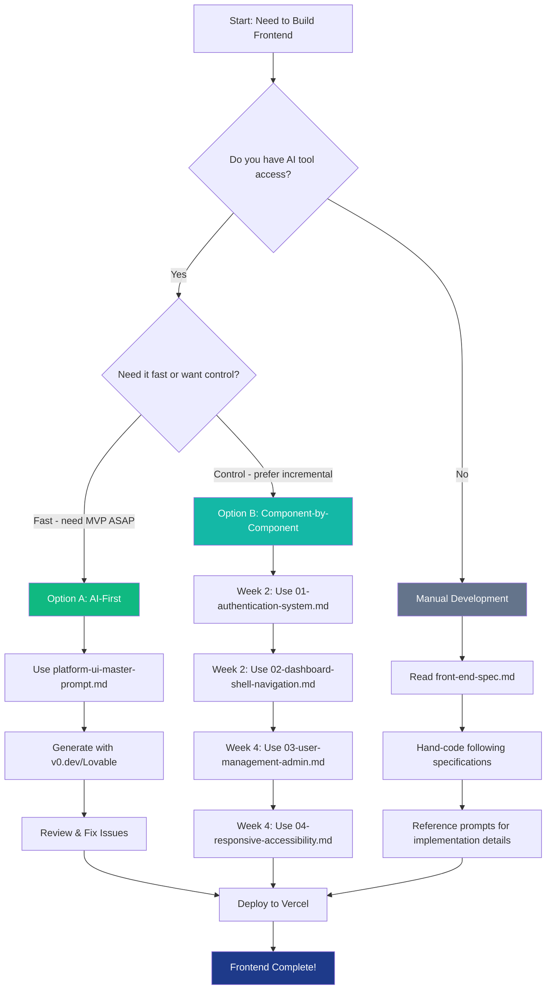

# XeroPulse AI Prompt Usage Guide

**Purpose:** This guide helps developers understand which AI prompts to use, when to use them, and how they relate to the PRD epics and development workflow.

**Last Updated:** October 15, 2025

---

## 📁 Available Prompt Files

| File | Purpose | Epic | Story | Estimated Time | Dependencies |
|------|---------|------|-------|----------------|--------------|
| **platform-ui-master-prompt.md** | Complete platform UI (all-in-one) | Epic 1-2 | 1.9, 2.1-2.4 | 2-3 days (AI) | None - Standalone |
| **01-authentication-system.md** | Login, password reset, session management | Epic 1 | 1.8 | 2-3 hours | None - Start here |
| **02-dashboard-shell-navigation.md** | Header, sidebar, layout, iframe embedding | Epic 1-2 | 1.9, 2.4 | 3-4 hours | Auth system (01) |
| **03-user-management-admin.md** | Admin panel for user CRUD operations | Epic 2 | 2.5 | 4-5 hours | Auth + Shell (01, 02) |
| **04-responsive-accessibility.md** | Mobile responsive + WCAG AA compliance | Epic 2 | 2.4 | 3-4 hours | All above (01-03) |

---

## 🗺️ Epic Mapping

### Epic 1: Foundation & Data Pipeline Infrastructure (Weeks 1-2)

**Backend Focus:** VPS setup, n8n, Superset, Xero API, first dashboard

**Frontend Stories:**
- **Story 1.8:** Implement Basic Authentication with Supabase Auth
  - **Use:** `01-authentication-system.md`
  - **Delivers:** Login page, password reset flow, middleware
  - **Timeline:** Week 2, Day 3-4

- **Story 1.9:** Build Minimal Next.js Portal with Dashboard Embedding
  - **Use:** `02-dashboard-shell-navigation.md`
  - **Delivers:** Header, sidebar, iframe container for Dashboard 1
  - **Timeline:** Week 2, Day 4-5

### Epic 2: MVP Dashboard Suite & Portal Launch (Weeks 3-4)

**Backend Focus:** Complete 3 MVP dashboards (Income, Budget, AR Aging)

**Frontend Stories:**
- **Story 2.3:** Implement Role-Based Access Control (RBAC) System
  - **Use:** `02-dashboard-shell-navigation.md` (already includes RBAC)
  - **Delivers:** Role-filtered navigation, access checks
  - **Timeline:** Week 3, Day 1-2

- **Story 2.4:** Build Full Next.js Portal with Navigation
  - **Use:** `02-dashboard-shell-navigation.md` + `04-responsive-accessibility.md`
  - **Delivers:** Complete 8-dashboard navigation, responsive design
  - **Timeline:** Week 3, Day 2-3

- **Story 2.5:** Implement User Management Admin Panel
  - **Use:** `03-user-management-admin.md`
  - **Delivers:** Admin page with add/edit/delete users
  - **Timeline:** Week 4, Day 1-2

### Epic 3: Complete Dashboard Suite with XPM Integration (Months 2-3)

**Backend Focus:** XPM API integration, 5 additional dashboards

**Frontend Stories:**
- **Story 3.10:** Update Portal Navigation for 8 Dashboards
  - **Use:** `02-dashboard-shell-navigation.md` (config update only)
  - **Delivers:** Sidebar with all 8 dashboards, grouped navigation
  - **Timeline:** Month 2, Week 3

### Epic 4: Platform Refinement & Advanced Features (Months 4-6)

**Backend Focus:** Performance optimization, data export, mobile views

**Frontend Stories:**
- Already covered in `04-responsive-accessibility.md`
- No new prompts needed (refinement phase)

---

## 🚀 Workflow Options

Choose the workflow that best fits your team's preferences and AI tool availability:

### Option A: AI-First (Fastest - Recommended for MVP)

**Best for:** Teams with access to v0.dev or Lovable.ai, need rapid prototyping

**Workflow:**
1. **Use Master Prompt** → Generate entire platform in one go
2. **Review & Refine** → Fix any AI hallucinations or mistakes
3. **Add Manual Fixes** → Customize Supabase integration, environment variables
4. **Deploy** → Push to Vercel, test end-to-end

**Timeline:**
- AI generation: 30 minutes
- Review & refinement: 4-6 hours
- Integration & testing: 4-6 hours
- **Total: 1-2 days**

**When to use:**
- ✅ You have v0.dev Pro or Lovable.ai access
- ✅ You need a working prototype ASAP
- ✅ You're comfortable reviewing and fixing AI-generated code
- ✅ Your backend (Supabase, Superset) is already set up

**How to use:**
```bash
# 1. Copy master prompt
cat docs/ai-prompts/platform-ui-master-prompt.md | pbcopy

# 2. Paste into v0.dev or Lovable.ai
# 3. Generate code
# 4. Download generated project
# 5. Fix environment variables in .env.local
# 6. Test authentication flow
# 7. Deploy to Vercel
```

---

### Option B: Component-by-Component (Most Control)

**Best for:** Teams that want incremental development, manual code review at each step

**Workflow:**

#### Week 2: Authentication Foundation
1. **Use Prompt:** `01-authentication-system.md`
2. **Generate:** Login, password reset, middleware with AI tool
3. **Test:** Login with test user, verify session persistence
4. **Commit:** `git commit -m "feat: implement authentication system"`

#### Week 2: Dashboard Shell
5. **Use Prompt:** `02-dashboard-shell-navigation.md`
6. **Generate:** Header, sidebar, layout, iframe container
7. **Test:** Navigate between dashboards, verify role-based filtering
8. **Commit:** `git commit -m "feat: add dashboard shell and navigation"`

#### Week 4: Admin Panel
9. **Use Prompt:** `03-user-management-admin.md`
10. **Generate:** User management page with CRUD operations
11. **Test:** Add/edit/delete users, verify role assignments
12. **Commit:** `git commit -m "feat: implement admin user management"`

#### Week 4: Mobile & Accessibility
13. **Use Prompt:** `04-responsive-accessibility.md`
14. **Refactor:** Add responsive breakpoints, ARIA labels, keyboard nav
15. **Test:** Test on mobile (375px), tablet (768px), desktop (1920px)
16. **Commit:** `git commit -m "feat: add responsive design and WCAG AA accessibility"`

**Timeline:**
- Component 01: 2-3 hours
- Component 02: 3-4 hours
- Component 03: 4-5 hours
- Component 04: 3-4 hours
- **Total: 12-16 hours (1.5-2 days)**

**When to use:**
- ✅ You want granular control over each component
- ✅ You're doing code reviews at each step
- ✅ You're learning the codebase as you build
- ✅ You want to catch issues early before they compound

---

### Option C: Manual Development (Traditional)

**Best for:** Teams without AI tool access, or prefer hand-coding

**Workflow:**
1. **Read:** `docs/front-end-spec.md` (UX specification)
2. **Reference:** Use prompt files as implementation guides (not for AI generation)
3. **Code:** Hand-write components following specifications
4. **Test:** Manual testing + automated tests

**Timeline:**
- Authentication: 1 day
- Dashboard shell: 1-2 days
- Admin panel: 1-2 days
- Responsive + Accessibility: 1 day
- **Total: 4-6 days**

**When to use:**
- ✅ No AI tool access or budget
- ✅ You prefer traditional development workflows
- ✅ You have strong frontend skills and want custom implementation
- ✅ You're building a learning experience for the team

---

## 🔀 Decision Flowchart



---

## 📋 Prompt Dependencies & Order

### Dependency Tree

```
None (Start Here)
│
├─► 01-authentication-system.md
│   │
│   └─► 02-dashboard-shell-navigation.md
│       │
│       ├─► 03-user-management-admin.md
│       │
│       └─► 04-responsive-accessibility.md
│
└─► platform-ui-master-prompt.md (includes all above)
```

### Must Build In Order (Components)

**❌ DON'T DO THIS:**
```
❌ Build admin panel first (03) → No auth system to protect it
❌ Build responsive (04) first → No components to make responsive
❌ Skip authentication (01) → No way to access dashboards
```

**✅ DO THIS:**
```
✅ 01 Authentication → 02 Dashboard Shell → 03 Admin Panel → 04 Responsive
✅ Foundation first, features second, polish last
```

### Can Build Independently (If Using Master Prompt)

**Master Prompt Standalone:**
- `platform-ui-master-prompt.md` can be used by itself
- It includes all components (01-04) in one cohesive prompt
- No need to use other prompts if using the master

**When to split from master:**
- You want to regenerate just one component (e.g., admin panel redesign)
- You're doing phased development (Epic 1 → Epic 2 → Epic 3)
- You hit AI token limits with master prompt

---

## 🎯 Practical Examples

### Example 1: MVP Sprint (Epic 1-2, Weeks 1-4)

**Goal:** Launch platform with 3 dashboards by October 31

**Team:** 1 fullstack developer

**Approach:** Option A (AI-First) to save time

**Week-by-Week Plan:**

**Week 1-2: Backend (Not covered by prompts)**
- Day 1-3: VPS setup, n8n, Xero API integration
- Day 4-7: Superset deployment, Dashboard 1 (Income vs Expenses)

**Week 2: Frontend Foundation (Use AI prompts)**
- **Day 8 (Morning):** Use `platform-ui-master-prompt.md` in v0.dev
  - Generate entire platform
  - Download code
- **Day 8 (Afternoon):** Review generated code
  - Fix Supabase connection strings
  - Update environment variables
  - Test login flow
- **Day 9:** Integration & Testing
  - Connect to Supabase production database
  - Embed Dashboard 1 iframe
  - Test with real Xero data
- **Day 10:** Deploy to Vercel
  - Set up environment variables
  - Configure custom domain
  - Test production deployment

**Week 3-4: Remaining Dashboards & UAT**
- Day 11-14: Build Dashboards 2, 7 (Superset)
- Day 15-16: User onboarding (use Admin Panel from generated code)
- Day 17-18: UAT with 5 users
- Day 19-20: Bug fixes, polish

**Result:** Platform launched on Day 20 (October 31) ✅

---

### Example 2: Phased Development (Epics 1-3, Months 1-3)

**Goal:** Build robust platform with iterative improvements

**Team:** 1 frontend dev, 1 backend dev

**Approach:** Option B (Component-by-Component) for quality control

**Month 1: Epic 1 - Foundation**

**Week 1-2: Backend Setup (Backend dev)**
- VPS, n8n, Superset, Xero API, Dashboard 1

**Week 2: Frontend Authentication (Frontend dev)**
- **Day 8:** Use `01-authentication-system.md`
  - Generate auth system with v0.dev
  - Review code, add TypeScript types
  - Write unit tests for auth helpers
- **Day 9:** Integration
  - Connect to Supabase staging
  - Test login/logout flows
  - Password reset end-to-end test
- **Day 10:** Code review & merge
  - PR review with backend dev
  - Fix feedback
  - Merge to `main`

**Week 2: Dashboard Shell (Frontend dev)**
- **Day 10:** Use `02-dashboard-shell-navigation.md`
  - Generate header, sidebar, layout
  - Review role-based filtering logic
  - Add unit tests for permission checks
- **Day 11:** Integration
  - Embed Dashboard 1 iframe
  - Test navigation
  - Verify RBAC (executive vs staff roles)
- **Day 12:** Code review & deploy to staging

**Month 2: Epic 2 - MVP Dashboards**

**Week 3: Dashboards 2, 7 (Backend dev)**
- Build remaining MVP dashboards in Superset

**Week 4: Admin Panel (Frontend dev)**
- **Day 16-17:** Use `03-user-management-admin.md`
  - Generate admin panel
  - Add search/filter functionality
  - Write integration tests
- **Day 18:** User onboarding
  - Admin adds 20 production users
  - Verify invitation emails
  - Test role assignments

**Week 4: Mobile & Accessibility (Frontend dev)**
- **Day 19:** Use `04-responsive-accessibility.md`
  - Add responsive breakpoints
  - Test on iPhone, iPad, desktop
  - Add ARIA labels
  - Keyboard navigation testing
- **Day 20:** Accessibility audit
  - Run Lighthouse (target 90+ score)
  - Fix any critical issues
  - Deploy to production

**Month 3: Epic 3 - Full Dashboard Suite**
- Backend: XPM integration + 5 more dashboards
- Frontend: Update `02-dashboard-shell-navigation.md` config for 8 dashboards

**Result:** Production-quality platform with all 8 dashboards ✅

---

### Example 3: Manual Development (No AI Tools)

**Goal:** Build platform without AI tools (learning project or budget constraints)

**Team:** Junior frontend developer

**Approach:** Option C (Manual Development)

**Learning Path:**

**Week 1: Study Phase**
- Day 1-2: Read `docs/front-end-spec.md` thoroughly
- Day 3-4: Review `docs/prd.md` for requirements
- Day 5: Set up Next.js 15 project, install dependencies

**Week 2: Authentication**
- Day 6-7: Hand-code login page following `01-authentication-system.md`
  - Refer to code examples for Supabase integration
  - Copy TypeScript interfaces
  - Implement middleware pattern from prompt
- Day 8: Test authentication flows
- Day 9: Code review with mentor
- Day 10: Fix feedback & merge

**Week 3: Dashboard Shell**
- Day 11-13: Hand-code header, sidebar, layout following `02-dashboard-shell-navigation.md`
  - Use dashboard config from prompt
  - Implement RBAC logic
  - Add iframe embedding
- Day 14: Test navigation & permissions
- Day 15: Code review & merge

**Week 4: Admin Panel**
- Day 16-18: Hand-code user management following `03-user-management-admin.md`
  - Build table component
  - Add modals for add/edit/delete
  - Implement API routes
- Day 19: Test CRUD operations
- Day 20: Code review & merge

**Week 5: Polish**
- Day 21-22: Add responsive design from `04-responsive-accessibility.md`
- Day 23-24: Accessibility improvements
- Day 25: Final testing & deploy

**Result:** Fully hand-coded platform, strong learning experience ✅

---

## 🔧 Integration Checklist

Before using any prompt, ensure you have:

### Prerequisites (All Workflows)

- ✅ **Supabase Project Created**
  - Database URL and anon key ready
  - `users` table created with schema:
    ```sql
    create table users (
      id uuid references auth.users primary key,
      email text unique not null,
      role text not null check (role in ('executive', 'manager', 'staff', 'admin')),
      created_at timestamp with time zone default now(),
      last_login timestamp with time zone
    );
    ```
  - Row-Level Security (RLS) policies configured

- ✅ **Environment Variables Ready**
  ```env
  NEXT_PUBLIC_SUPABASE_URL=your_supabase_url
  NEXT_PUBLIC_SUPABASE_ANON_KEY=your_anon_key
  NEXT_PUBLIC_SUPERSET_BASE_URL=your_superset_url
  ```

- ✅ **Superset Deployed** (for dashboard embedding)
  - At least Dashboard 1 exists with known ID
  - Embedded URL format confirmed

- ✅ **Design Assets** (optional but recommended)
  - XeroPulse logo (SVG or PNG)
  - Figma mockups (if creating custom designs)

### Post-Generation (AI Workflows)

After generating code with AI:

- ✅ **Review Generated Code**
  - Check for hardcoded values (replace with env variables)
  - Verify TypeScript types are correct
  - Look for AI hallucinations (non-existent libraries, incorrect APIs)

- ✅ **Test Core Flows**
  - Login with valid credentials → Success
  - Login with invalid credentials → Error message
  - Navigate between dashboards → Correct access control
  - Admin creates user → User appears in table

- ✅ **Security Review**
  - Middleware protects all `/dashboards/*` and `/admin/*` routes
  - API routes check user role before allowing actions
  - No credentials committed to Git

- ✅ **Accessibility Quick Check**
  - Tab through interface (keyboard navigation works)
  - Test on mobile (375px width, no horizontal scroll)
  - Run Lighthouse audit (aim for 90+ accessibility score)

---

## 🐛 Common Issues & Fixes

### Issue 1: AI Generated Non-Existent Supabase Methods

**Symptom:** Code references `supabase.auth.admin.createUser()` but it doesn't exist

**Fix:**
- Check Supabase docs for correct API: https://supabase.com/docs/reference/javascript/auth-admin-createuser
- Update code with correct method name
- This is common with AI - always verify against official docs

**Prevention:** Add this to your prompt:
```
IMPORTANT: Only use documented Supabase Auth APIs. Do not invent methods.
Reference: https://supabase.com/docs/reference/javascript/installing
```

---

### Issue 2: Master Prompt Exceeds Token Limits

**Symptom:** v0.dev or Lovable.ai says "Prompt too long"

**Fix:**
- Split into components using `01-authentication-system.md`, `02-dashboard-shell-navigation.md`, etc.
- Generate one component at a time
- Manually integrate components together

**Alternative:**
- Use Claude 3.5 Sonnet directly (200k token context)
- Ask it to generate code from master prompt
- Copy code into your project manually

---

### Issue 3: Role-Based Access Not Working

**Symptom:** Staff users can see executive dashboards

**Fix:**
1. Check middleware is checking `user.role` correctly
2. Verify `users` table has correct roles assigned
3. Ensure `DASHBOARD_CONFIG` in `lib/dashboard-config.ts` has correct `allowedRoles`
4. Check if sidebar is filtering dashboards based on role

**Debug:**
```typescript
// Add console.log in middleware
console.log('User role:', user.role);
console.log('Accessing dashboard:', dashboardId);
console.log('Allowed roles:', DASHBOARD_CONFIG[dashboardId]?.allowedRoles);
```

---

### Issue 4: Dashboard iframe Not Loading

**Symptom:** White screen where Superset dashboard should appear

**Fix:**
1. Check Superset URL is correct in `.env.local`
2. Verify Superset dashboard ID matches `DASHBOARD_CONFIG`
3. Check browser console for CORS errors
4. Ensure Superset allows iframe embedding (check `superset_config.py`)

**Debug:**
```typescript
// Test iframe URL directly in browser
const testUrl = `${SUPERSET_URL}/superset/dashboard/${dashboardId}/?standalone=true`;
console.log('Test this URL:', testUrl);
```

---

## 📚 Additional Resources

### Related Documents
- **Front-End Specification:** `docs/front-end-spec.md` - Complete UX design spec
- **Product Requirements:** `docs/prd.md` - Full PRD with epics and stories
- **Project Brief:** `docs/brief.md` - Original project overview

### External References
- **Next.js 15 Docs:** https://nextjs.org/docs
- **Supabase Auth Guide:** https://supabase.com/docs/guides/auth
- **Chakra UI Components:** https://chakra-ui.com/docs/components
- **Chakra UI MCP Server:** Available in Claude Code for instant component examples
- **AG-UI Enterprise:** https://www.ag-grid.com/ (for complex data grids)
- **WCAG 2.1 Guidelines:** https://www.w3.org/WAI/WCAG21/quickref/

### AI Tool Links
- **v0.dev:** https://v0.dev/ (Vercel's AI UI generator)
- **Lovable.ai:** https://lovable.ai/ (Full-stack AI generator)
- **Cursor:** https://cursor.sh/ (AI-powered IDE for manual coding)

---

## 🎯 Quick Reference

### Which Prompt Should I Use?

| If you want to... | Use this prompt | Epic/Story |
|-------------------|----------------|------------|
| Generate entire platform at once | `platform-ui-master-prompt.md` | Epic 1-2 |
| Build authentication first | `01-authentication-system.md` | Story 1.8 |
| Build dashboard layout & navigation | `02-dashboard-shell-navigation.md` | Story 1.9, 2.4 |
| Build admin user management | `03-user-management-admin.md` | Story 2.5 |
| Make everything mobile-friendly | `04-responsive-accessibility.md` | Story 2.4 |
| Understand overall UX design | `../front-end-spec.md` | All epics |

### Workflow Recommendation by Team

| Team Type | Recommended Workflow | Why |
|-----------|---------------------|-----|
| **Solo developer, tight deadline** | Option A (AI-First) | Fastest path to MVP |
| **Small team, quality focus** | Option B (Component-by-Component) | Balance speed & control |
| **Junior developers, learning** | Option C (Manual) | Best learning experience |
| **Large team, enterprise** | Option B with code reviews | Scalable, auditable |

---

## 📞 Need Help?

If you're stuck or need clarification:

1. **Check this README** - Most questions answered here
2. **Review front-end-spec.md** - Design decisions explained
3. **Check PRD** - Business requirements context
4. **Ask in project Slack/Discord** - Team support
5. **File an issue** - Document problems for future reference

---

**Document Version:** 1.0
**Last Updated:** October 15, 2025
**Maintained by:** UX Expert Team

---

✨ **Ready to build?** Choose your workflow above and start with the recommended prompt! ✨
