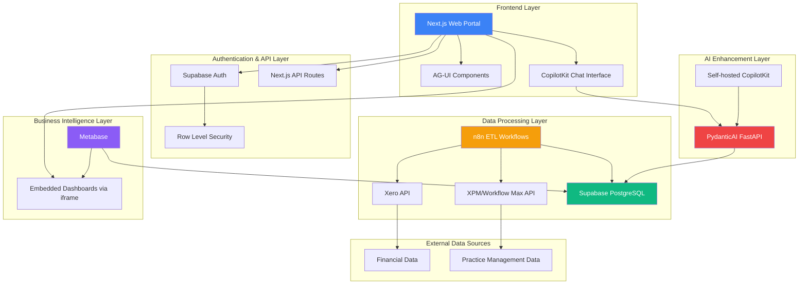
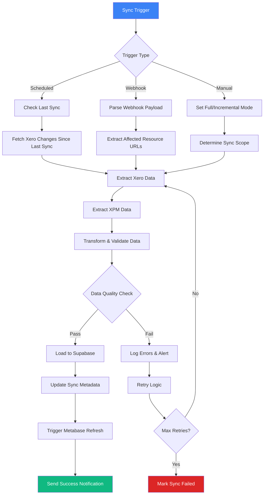
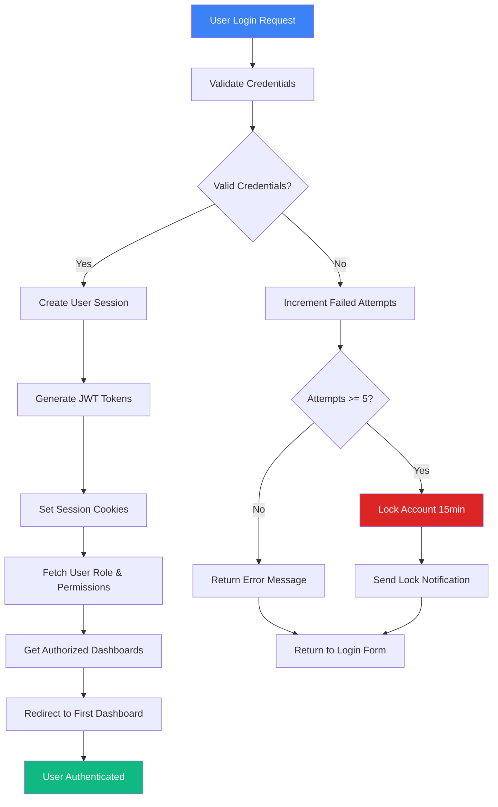
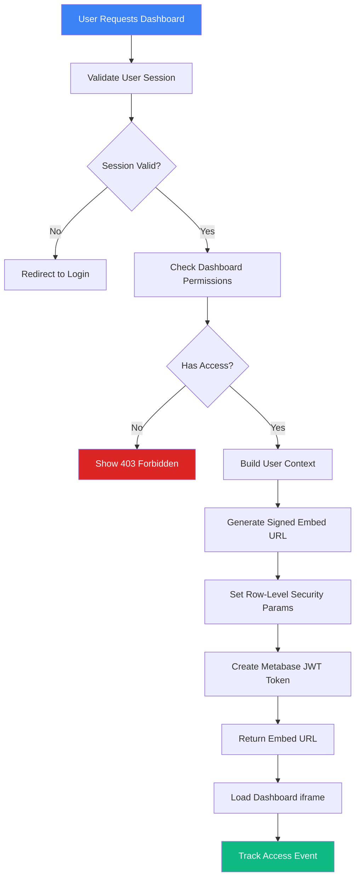
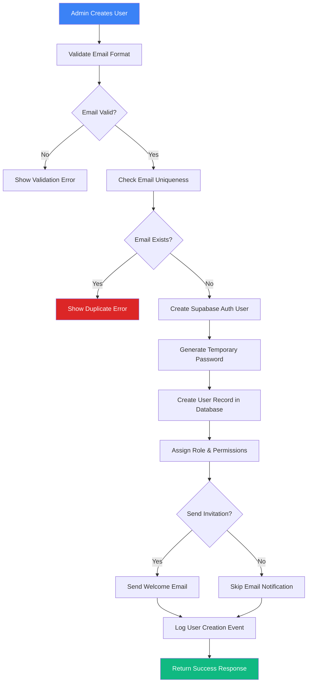
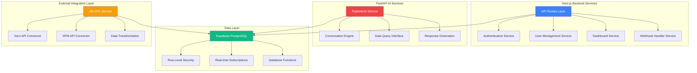
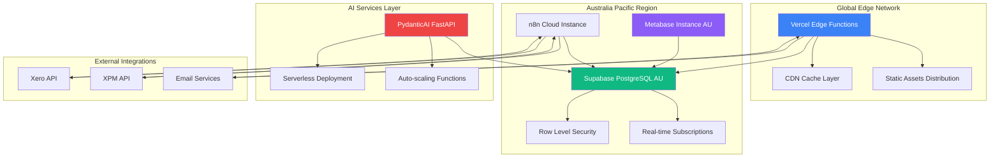
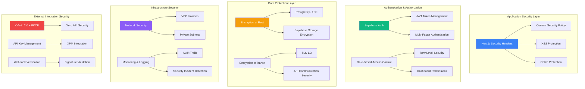

# XeroPulse Fullstack Architecture Document

## Introduction

This document outlines the complete fullstack architecture for XeroPulse, including backend systems, frontend implementation, and their integration. It serves as the single source of truth for AI-driven development, ensuring consistency across the entire technology stack.

This unified approach combines what would traditionally be separate backend and frontend architecture documents, streamlining the development process for modern fullstack applications where these concerns are increasingly intertwined.

### Starter Template or Existing Project

**N/A - Greenfield project**

Based on the unified PRD requirements, this is a greenfield business intelligence platform that will be built from scratch using modern fullstack patterns. No existing starter templates are being used, allowing for complete architectural flexibility optimized for the specific requirements of financial data processing and conversational analytics.

### Change Log

| Date | Version | Description | Author |
|------|---------|-------------|--------|
| 2025-10-22 | 1.0 | Initial fullstack architecture based on unified PRD (Next.js + AG-UI + CopilotKit + PydanticAI + Supabase + n8n + Metabase) | Winston (Architect) |

---

**Detailed Rationale:**

**Trade-offs and Key Decisions:**
- **Unified Document Approach**: Chose to combine frontend and backend architecture in a single document rather than separate documents to reduce context switching for AI agents and ensure integration points are clearly defined
- **Greenfield Architecture**: No existing starter templates constrains us, allowing optimal technology selection based purely on PRD requirements
- **AI-Driven Development Focus**: Structure and content optimized for AI agents that need clear, unambiguous technical guidance

**Key Assumptions:**
- Development team will use AI agents for implementation, requiring explicit architectural guidance
- Modern fullstack patterns (API-first, component-based) are preferred over traditional separated architectures
- Integration complexity between n8n, Metabase, and conversational AI requires careful architectural planning

**Areas Needing Validation:**
- Confirm greenfield approach vs. any existing codebase that should be incorporated
- Validate that unified document approach serves your development workflow better than separated documents

Perfect! I see you have an excellent front-end specification document that I can reference. Let me proceed to the next section - **High Level Architecture**.

---

## High Level Architecture Section

**Content:**

## High Level Architecture

### Technical Summary

XeroPulse employs a hybrid fullstack architecture combining Next.js frontend monolith with specialized microservices for AI and ETL processing. The platform leverages Vercel's edge network for the Next.js application, Supabase PostgreSQL for centralized data management with Row Level Security, n8n for automated ETL workflows, Metabase for embedded business intelligence, and PydanticAI for conversational analytics. This architecture achieves sub-3-second dashboard load times while maintaining enterprise-grade security and scalability for 20+ concurrent users processing daily financial data from Xero and XPM APIs.

### Platform and Infrastructure Choice

**Platform:** Vercel + Supabase Ecosystem

**Key Services:**
- **Frontend Hosting:** Vercel (Next.js optimized, global edge network)
- **Database & Auth:** Supabase (PostgreSQL with RLS, Auth, Real-time subscriptions)
- **ETL Processing:** n8n (cloud or self-hosted, workflow automation)
- **Business Intelligence:** Metabase (embedded dashboards, direct PostgreSQL connection)
- **AI Backend:** PydanticAI FastAPI (separate deployment, NFR service)

**Deployment Host and Regions:** 
- Primary: AWS Asia-Pacific (Sydney) for Australian financial compliance
- CDN: Global edge locations via Vercel network
- Database: Supabase AU region for data residency

**Rationale:** This combination provides rapid development velocity (Vercel + Next.js), enterprise-grade database capabilities (Supabase PostgreSQL), proven ETL automation (n8n), and industry-standard BI embedding (Metabase). The hybrid approach allows core functionality to remain performant while AI features operate independently as enhancement layers.

### Repository Structure

**Structure:** Monorepo with Next.js application + separate microservice repositories

**Monorepo Tool:** npm workspaces (lightweight, Next.js native)

**Package Organization:** 
- Core Next.js app contains frontend, API routes, and shared utilities
- Separate repositories for PydanticAI service and n8n workflows
- Shared TypeScript types package for API contracts between services

### High Level Architecture Diagram



### Architectural Patterns

- **Jamstack Architecture:** Static site generation with serverless API routes - _Rationale:_ Optimal performance and SEO for dashboard portal while maintaining dynamic capabilities
- **API-First Design:** All data access through well-defined API contracts - _Rationale:_ Enables independent development of frontend and backend services, supports future mobile apps
- **Database-per-Service with Shared PostgreSQL:** Logical separation via schemas and RLS policies - _Rationale:_ Maintains data consistency while enabling service autonomy
- **Event-Driven ETL:** n8n workflows triggered by webhooks and schedules - _Rationale:_ Decouples data ingestion from application logic, enables reliable retry mechanisms
- **Embedded Analytics:** Metabase dashboards integrated via secure iframe - _Rationale:_ Leverages enterprise BI capabilities without reinventing visualization engine
- **Microservice Enhancement:** PydanticAI as separate service for AI features - _Rationale:_ Isolates AI complexity, enables independent scaling and deployment
- **Progressive Enhancement:** Core functionality works without AI layer - _Rationale:_ Ensures reliability and graceful degradation if AI service unavailable

---

**Detailed Rationale:**

**Trade-offs and Key Decisions:**
- **Vercel vs. Self-hosted:** Chose Vercel for developer experience and performance over AWS/Azure for cost optimization. Vercel's Next.js integration and global CDN outweigh the higher hosting costs for a 20-user application
- **Hybrid Monolith-Microservice:** Core BI functionality in Next.js monolith for simplicity, AI features as microservice for isolation. Avoids microservice complexity while enabling AI innovation
- **Supabase vs. Custom PostgreSQL:** Supabase provides authentication, real-time features, and managed PostgreSQL with superior developer experience compared to managing separate auth + database services
- **n8n vs. Custom ETL:** n8n's visual workflow builder and extensive API connectors provide faster development than custom ETL scripts, with better maintainability for non-developers

**Key Assumptions:**
- 20 concurrent users don't require horizontal scaling (single Vercel deployment sufficient)
- Australian data residency requirements met by Supabase AU region
- Metabase embedding licensing suitable for internal use (not customer-facing)
- n8n cloud tier provides sufficient workflow execution for daily ETL requirements

**Areas Needing Validation:**
- Confirm Metabase licensing model for embedded dashboards in commercial application
- Validate n8n workflow execution limits align with expected data volumes
- Verify Supabase Row Level Security performance with complex role-based access patterns

Perfect! I notice there's a discrepancy I need to address. Your front-end spec mentions "Apache Superset dashboards" but our unified PRD and architecture conversation established **Metabase** as the BI platform. Let me proceed to the next section - **Tech Stack** - and align everything with our agreed architecture.

---

## Tech Stack Section

**Content:**

## Tech Stack

This is the DEFINITIVE technology selection for the entire project. All development must use these exact versions and specifications.

| Category | Technology | Version | Purpose | Rationale |
|----------|------------|---------|---------|-----------|
| **Frontend Language** | TypeScript | 5.0+ | Type-safe React development | Enhanced developer experience, compile-time error catching, better AI code generation |
| **Frontend Framework** | Next.js | 14+ (App Router) | React-based fullstack framework | Server-side rendering, API routes, optimal Vercel deployment, file-based routing |
| **UI Component Library** | AG-UI Enterprise | Latest | Data-intensive dashboard interfaces | Enterprise-grade data grids, charts, complex UI patterns optimized for financial data |
| **Base Components** | Shadcn/ui v4 | 4.0+ | Accessible component foundations | Headless, customizable, WCAG AA compliant, MCP integration support |
| **State Management** | React Server Components + Context | React 18+ | Client/server state coordination | Leverages Next.js 14 architecture, minimal client-side state, server-first approach |
| **CSS Framework** | Tailwind CSS | 3.4+ | Utility-first styling | Consistent design system, rapid development, AG-UI integration, responsive utilities |
| **Backend Language** | TypeScript | 5.0+ | Unified language across stack | Code sharing between frontend/backend, consistent tooling, type safety |
| **Backend Framework** | Next.js API Routes | 14+ | Serverless API endpoints | Unified deployment, automatic optimization, Vercel edge functions |
| **API Style** | REST + tRPC | tRPC 10+ | Type-safe API layer | End-to-end type safety, excellent DX, automatic client generation |
| **Database** | Supabase PostgreSQL | Latest | Managed PostgreSQL with RLS | Row Level Security, real-time subscriptions, authentication integration, AU region |
| **Cache** | Redis (Upstash) | 7.0+ | Session and query caching | Serverless Redis, API caching, session storage |
| **File Storage** | Supabase Storage | Latest | User uploads and assets | Integrated with auth, CDN delivery, secure access policies |
| **Authentication** | Supabase Auth | Latest | User authentication and authorization | OAuth providers, RLS integration, session management, password policies |
| **ETL Platform** | n8n | Latest | Workflow automation and data pipelines | Visual workflow builder, Xero/XPM connectors, scheduling, monitoring |
| **BI Platform** | Metabase | Latest | Embedded business intelligence | Dashboard creation, PostgreSQL integration, embedding capabilities, role-based access |
| **AI Backend** | PydanticAI + FastAPI | Latest | Conversational analytics service | Type-safe AI responses, FastAPI performance, independent scaling |
| **Chat Interface** | CopilotKit (Self-hosted) | Latest | Conversational UI components | React integration, customizable chat UI, fallback to custom implementation |
| **Frontend Testing** | Jest + React Testing Library | Latest | Component and unit testing | React-focused testing, accessibility testing, snapshot testing |
| **Backend Testing** | Jest + Supertest | Latest | API endpoint testing | Request/response testing, database mocking, integration testing |
| **E2E Testing** | Playwright | Latest | End-to-end user flows | Multi-browser testing, visual regression, CI/CD integration |
| **Build Tool** | Next.js built-in | 14+ | Compilation and bundling | Webpack abstraction, automatic optimization, tree shaking |
| **Bundler** | Webpack (via Next.js) | 5.0+ | Module bundling and optimization | Code splitting, dynamic imports, asset optimization |
| **IaC Tool** | Terraform | 1.5+ | Infrastructure as code | Repeatable deployments, version control, multi-environment |
| **CI/CD** | GitHub Actions | Latest | Automated testing and deployment | Vercel integration, automated testing, preview deployments |
| **Monitoring** | Vercel Analytics + Sentry | Latest | Performance and error tracking | Real-time monitoring, error reporting, performance insights |
| **Logging** | Pino + Better Stack | Latest | Structured logging | JSON logging, log aggregation, searchable logs |

---

**Detailed Rationale:**

**Trade-offs and Key Decisions:**

- **AG-UI vs. Pure Shadcn/ui**: AG-UI chosen for enterprise data grid capabilities required for complex financial dashboards, with Shadcn v4 as the foundation for other UI elements. This hybrid approach provides both enterprise functionality and design system consistency.

- **Metabase vs. Apache Superset**: Metabase selected for superior embedding capabilities, simpler deployment, and better commercial support. Note: This corrects the discrepancy in the front-end spec which mentioned Superset.

- **Next.js API Routes vs. Separate Backend**: Unified Next.js deployment chosen for development velocity and Vercel optimization. tRPC provides type safety between frontend and API routes.

- **PydanticAI as NFR**: AI service deployed separately to avoid blocking core BI functionality. FastAPI provides high performance for AI inference workloads.

- **Self-hosted CopilotKit**: Maintains data privacy and customization control while providing conversational interface capabilities.

**Key Assumptions:**
- 20 concurrent users don't require microservices architecture complexity
- Vercel platform provides sufficient scaling for projected usage
- AG-UI licensing model works for internal business intelligence application
- Australian data residency requirements met by Supabase AU region selection

**Areas Needing Validation:**
- Confirm AG-UI Enterprise licensing cost fits within budget constraints
- Validate Metabase embedding authentication with Supabase Row Level Security
- Verify CopilotKit self-hosting requirements and complexity
- Test tRPC performance with complex financial data queries

Perfect! I'll continue to the next section - **Data Models**. Let me proceed with defining the core data models that will be shared between frontend and backend.

---

## Data Models Section

**Content:**

## Data Models

Based on the PRD requirements and the financial intelligence platform functionality, the following data models represent the core business entities shared between frontend and backend systems. These models align with Xero API structures while providing the foundation for role-based access control and conversational AI integration.

### User

**Purpose:** Represents system users with role-based access control for dashboard permissions and authentication management.

**Key Attributes:**
- id: UUID (primary key) - Unique user identifier
- email: string - User's email address (unique, used for authentication)
- role: UserRole enum - Determines dashboard access permissions
- created_at: timestamp - Account creation timestamp
- last_login: timestamp | null - Last successful authentication
- is_active: boolean - Account status flag

#### TypeScript Interface

```typescript
enum UserRole {
  EXECUTIVE = 'executive',
  MANAGER = 'manager', 
  STAFF = 'staff',
  ADMIN = 'admin'
}

interface User {
  id: string;
  email: string;
  role: UserRole;
  created_at: string;
  last_login: string | null;
  is_active: boolean;
}

interface CreateUserRequest {
  email: string;
  role: UserRole;
  send_invitation?: boolean;
}

interface UpdateUserRequest {
  role?: UserRole;
  is_active?: boolean;
}
```

#### Relationships
- Has many: DashboardAccess (role-based permissions)
- Has many: ActivityLog (audit trail)

### Organization

**Purpose:** Represents the business entity connecting to Xero/XPM, containing OAuth credentials and sync configuration.

**Key Attributes:**
- id: UUID (primary key) - Unique organization identifier
- name: string - Organization display name
- xero_tenant_id: string | null - Xero OAuth tenant identifier
- xpm_tenant_id: string | null - XPM OAuth tenant identifier
- sync_frequency: SyncFrequency enum - Data synchronization interval
- last_sync: timestamp | null - Last successful data synchronization
- sync_status: SyncStatus enum - Current synchronization state

#### TypeScript Interface

```typescript
enum SyncFrequency {
  HOURLY = 'hourly',
  DAILY = 'daily',
  WEEKLY = 'weekly'
}

enum SyncStatus {
  NEVER_SYNCED = 'never_synced',
  SYNCING = 'syncing',
  SUCCESS = 'success',
  ERROR = 'error',
  PARTIAL = 'partial'
}

interface Organization {
  id: string;
  name: string;
  xero_tenant_id: string | null;
  xpm_tenant_id: string | null;
  sync_frequency: SyncFrequency;
  last_sync: string | null;
  sync_status: SyncStatus;
  created_at: string;
  updated_at: string;
}
```

#### Relationships
- Has many: Users (organization members)
- Has many: FinancialData (imported from Xero)
- Has many: ProjectData (imported from XPM)

### FinancialData

**Purpose:** Aggregated financial metrics from Xero API, optimized for dashboard queries and conversational AI access.

**Key Attributes:**
- id: UUID (primary key) - Unique record identifier
- organization_id: UUID - Foreign key to Organization
- metric_type: FinancialMetricType enum - Type of financial data
- period_start: date - Reporting period start date
- period_end: date - Reporting period end date
- amount: decimal - Financial amount value
- currency: string - Currency code (AUD)
- metadata: JSON - Additional metric-specific data

#### TypeScript Interface

```typescript
enum FinancialMetricType {
  REVENUE = 'revenue',
  EXPENSES = 'expenses',
  PROFIT = 'profit',
  ACCOUNTS_RECEIVABLE = 'accounts_receivable',
  ACCOUNTS_PAYABLE = 'accounts_payable',
  CASH_FLOW = 'cash_flow',
  BUDGET_ACTUAL = 'budget_actual'
}

interface FinancialData {
  id: string;
  organization_id: string;
  metric_type: FinancialMetricType;
  period_start: string;
  period_end: string;
  amount: number;
  currency: string;
  metadata: Record<string, any>;
  created_at: string;
  updated_at: string;
}

interface FinancialSummary {
  total_revenue: number;
  total_expenses: number;
  net_profit: number;
  outstanding_receivables: number;
  period: string;
  currency: string;
}
```

#### Relationships
- Belongs to: Organization
- Referenced by: ConversationContext (for AI queries)

### ProjectData

**Purpose:** Work In Progress (WIP) data from XPM/Workflow Max, enabling project-based financial analysis and team performance tracking.

**Key Attributes:**
- id: UUID (primary key) - Unique project record identifier
- organization_id: UUID - Foreign key to Organization
- project_id: string - External project identifier (from XPM)
- client_name: string - Client name for project
- project_status: ProjectStatus enum - Current project state
- time_value: decimal - Total time value (hours × rates)
- cost_value: decimal - Total billable costs
- invoiced_amount: decimal - Amount already invoiced
- wip_amount: decimal - Work In Progress value (calculated)
- aging_bucket: AgingBucket enum - WIP aging classification

#### TypeScript Interface

```typescript
enum ProjectStatus {
  ACTIVE = 'active',
  COMPLETED = 'completed',
  ON_HOLD = 'on_hold',
  CANCELLED = 'cancelled'
}

enum AgingBucket {
  CURRENT = 'current',        // < 30 days
  DAYS_30_60 = '30_60',      // 31-60 days
  DAYS_61_90 = '61_90',      // 61-90 days
  OVER_90 = 'over_90'        // 90+ days
}

interface ProjectData {
  id: string;
  organization_id: string;
  project_id: string;
  client_name: string;
  project_status: ProjectStatus;
  time_value: number;
  cost_value: number;
  invoiced_amount: number;
  wip_amount: number;
  aging_bucket: AgingBucket;
  team_assigned: string[];
  created_at: string;
  updated_at: string;
}

interface WIPSummary {
  total_wip: number;
  by_aging: Record<AgingBucket, number>;
  by_team: Record<string, number>;
  project_count: number;
}
```

#### Relationships
- Belongs to: Organization
- Referenced by: ConversationContext (for AI queries)

### ConversationContext

**Purpose:** Stores conversational AI query context and history for PydanticAI integration, enabling personalized financial insights.

**Key Attributes:**
- id: UUID (primary key) - Unique conversation identifier
- user_id: UUID - Foreign key to User
- query: string - User's natural language query
- response: string - AI-generated response
- data_sources: string[] - Referenced data types used in response
- query_timestamp: timestamp - When query was made
- response_time_ms: integer - AI response generation time

#### TypeScript Interface

```typescript
interface ConversationContext {
  id: string;
  user_id: string;
  query: string;
  response: string;
  data_sources: string[];
  query_timestamp: string;
  response_time_ms: number;
}

interface ConversationQuery {
  query: string;
  context?: {
    previous_queries?: string[];
    focus_area?: 'financial' | 'projects' | 'general';
    time_period?: string;
  };
}

interface ConversationResponse {
  response: string;
  data_visualizations?: {
    type: 'chart' | 'table' | 'metric';
    config: Record<string, any>;
  }[];
  suggested_followups?: string[];
  confidence_score: number;
}
```

#### Relationships
- Belongs to: User
- References: FinancialData, ProjectData (via data_sources)

### DashboardAccess

**Purpose:** Defines which dashboards each user role can access, enabling fine-grained permission control.

**Key Attributes:**
- id: UUID (primary key) - Unique access record identifier
- role: UserRole enum - User role this access applies to
- dashboard_id: string - Dashboard identifier (matches Metabase dashboard IDs)
- dashboard_name: string - Human-readable dashboard name
- access_level: AccessLevel enum - Read/write permissions
- is_default: boolean - Whether this dashboard is user's default landing page

#### TypeScript Interface

```typescript
enum AccessLevel {
  READ = 'read',
  WRITE = 'write',
  ADMIN = 'admin'
}

interface DashboardAccess {
  id: string;
  role: UserRole;
  dashboard_id: string;
  dashboard_name: string;
  access_level: AccessLevel;
  is_default: boolean;
  created_at: string;
}

interface UserDashboards {
  user_role: UserRole;
  accessible_dashboards: {
    id: string;
    name: string;
    url: string;
    is_default: boolean;
  }[];
}
```

#### Relationships
- References: User (via role)
- Defines: Metabase dashboard permissions

---

**Detailed Rationale:**

**Trade-offs and Key Decisions:**
- **Denormalized Financial Data**: Chose pre-aggregated metrics over normalized transaction data for dashboard performance. Raw transactions stored separately for AI analysis.
- **Role-Based vs User-Based Permissions**: Dashboard access tied to roles rather than individual users for easier management and consistency with organizational hierarchy.
- **JSON Metadata Fields**: Used flexible JSON fields for metric-specific data to accommodate varying Xero API response structures without frequent schema changes.
- **Calculated WIP Fields**: Store calculated WIP amounts rather than computing on-demand to ensure consistent reporting and faster dashboard loads.

**Key Assumptions:**
- Single organization per deployment (can be extended to multi-tenant later)
- Financial periods aligned with standard accounting cycles (monthly/quarterly/yearly)
- Conversational AI queries primarily focus on aggregated data rather than individual transactions
- User roles remain relatively stable (not frequently changing)

**Areas Needing Validation:**
- Confirm Xero API data structure alignment with FinancialData model
- Validate XPM V2 API availability and data format for ProjectData
- Test conversation context storage performance with large query volumes
- Verify Metabase dashboard ID consistency across environments

Summarized conversation historyPerfect! Continuing to the **API Specification** section.

## API Specification

### Overview

XeroPulse implements a hybrid API approach combining REST for external integrations and tRPC for type-safe internal communication. This design provides optimal developer experience for the TypeScript application while maintaining standard REST endpoints for potential future integrations.

### Core API Architecture

**tRPC Application Layer**
- Type-safe procedures for all internal operations
- Real-time subscriptions for dashboard updates
- Automatic TypeScript type generation
- Built-in input validation with Zod schemas

**REST Integration Layer**
- Webhook endpoints for Xero/XPM notifications
- External API compatibility endpoints
- Health checks and monitoring endpoints
- File upload/download operations

### tRPC Procedure Definitions

```typescript
// Core tRPC router structure
export const appRouter = router({
  // Authentication procedures
  auth: router({
    login: publicProcedure
      .input(z.object({
        email: z.string().email(),
        password: z.string().min(8)
      }))
      .mutation(async ({ input }) => { /* Implementation */ }),
    
    logout: protectedProcedure
      .mutation(async ({ ctx }) => { /* Implementation */ }),
    
    resetPassword: publicProcedure
      .input(z.object({ email: z.string().email() }))
      .mutation(async ({ input }) => { /* Implementation */ })
  }),

  // User management procedures
  users: router({
    list: adminProcedure
      .input(z.object({
        search: z.string().optional(),
        role: z.enum(['executive', 'manager', 'staff']).optional(),
        limit: z.number().min(1).max(100).default(50),
        offset: z.number().min(0).default(0)
      }))
      .query(async ({ input, ctx }) => { /* Implementation */ }),
    
    create: adminProcedure
      .input(z.object({
        email: z.string().email(),
        role: z.enum(['executive', 'manager', 'staff']),
        sendInvitation: z.boolean().default(true)
      }))
      .mutation(async ({ input, ctx }) => { /* Implementation */ }),
    
    update: adminProcedure
      .input(z.object({
        id: z.string().uuid(),
        role: z.enum(['executive', 'manager', 'staff']).optional(),
        active: z.boolean().optional()
      }))
      .mutation(async ({ input, ctx }) => { /* Implementation */ }),
    
    delete: adminProcedure
      .input(z.object({ id: z.string().uuid() }))
      .mutation(async ({ input, ctx }) => { /* Implementation */ })
  }),

  // Dashboard procedures
  dashboards: router({
    getAuthorized: protectedProcedure
      .query(async ({ ctx }) => { /* Return user's authorized dashboards */ }),
    
    getEmbedUrl: protectedProcedure
      .input(z.object({
        dashboardId: z.enum(['dashboard-1', 'dashboard-2', /* ... */])
      }))
      .query(async ({ input, ctx }) => { /* Generate Metabase embed URL */ }),
    
    recordAccess: protectedProcedure
      .input(z.object({
        dashboardId: z.string(),
        accessTime: z.date().default(() => new Date())
      }))
      .mutation(async ({ input, ctx }) => { /* Log dashboard access */ })
  }),

  // Financial data procedures
  financialData: router({
    getLatestSync: protectedProcedure
      .query(async ({ ctx }) => { /* Return last sync timestamp */ }),
    
    triggerSync: adminProcedure
      .mutation(async ({ ctx }) => { /* Trigger manual n8n sync */ }),
    
    getSyncStatus: protectedProcedure
      .query(async ({ ctx }) => { /* Return current sync status */ })
  })
});
```

### REST Endpoints

```typescript
// Webhook endpoints for external integrations
POST /api/webhooks/xero
- Purpose: Receive Xero data change notifications
- Authentication: Webhook signature verification
- Payload: Xero webhook payload
- Response: 200 OK or error status

POST /api/webhooks/xpm
- Purpose: Receive XPM project updates
- Authentication: API key verification
- Payload: XPM webhook payload
- Response: 200 OK or error status

// Health and monitoring
GET /api/health
- Purpose: System health check
- Authentication: None (public)
- Response: { status: 'healthy', timestamp: ISO_STRING, version: STRING }

GET /api/health/detailed
- Purpose: Detailed system status
- Authentication: Admin only
- Response: { database: STATUS, xero: STATUS, metabase: STATUS, n8n: STATUS }

// File operations
POST /api/files/upload
- Purpose: File upload for potential future features
- Authentication: Protected (valid session)
- Content-Type: multipart/form-data
- Response: { fileId: STRING, url: STRING }
```

### Authentication & Authorization

**Session Management**
- Supabase Auth handles JWT generation and validation
- Custom middleware validates session for tRPC procedures
- Role-based access control through procedure-level guards

**Middleware Stack**
```typescript
// Authentication middleware
export const withAuth = t.middleware(async ({ ctx, next }) => {
  const session = await getServerSession(ctx.req, ctx.res, authOptions);
  if (!session) {
    throw new TRPCError({ code: 'UNAUTHORIZED' });
  }
  return next({ ctx: { ...ctx, session } });
});

// Role authorization middleware
export const withRole = (requiredRole: UserRole) => 
  t.middleware(async ({ ctx, next }) => {
    if (!hasRole(ctx.session.user.role, requiredRole)) {
      throw new TRPCError({ code: 'FORBIDDEN' });
    }
    return next();
  });

// Procedure factories
export const protectedProcedure = t.procedure.use(withAuth);
export const adminProcedure = t.procedure.use(withAuth).use(withRole('admin'));
```

**Role Hierarchy**
- `staff` → Can access assigned dashboards only
- `manager` → Can access staff dashboards + management dashboards
- `executive` → Can access all dashboards + admin functions
- `admin` → Technical role with user management capabilities

### Error Handling

**Standardized Error Responses**
```typescript
// tRPC error codes mapping
export const errorCodeMap = {
  UNAUTHORIZED: { status: 401, message: 'Authentication required' },
  FORBIDDEN: { status: 403, message: 'Insufficient permissions' },
  NOT_FOUND: { status: 404, message: 'Resource not found' },
  BAD_REQUEST: { status: 400, message: 'Invalid request data' },
  INTERNAL_SERVER_ERROR: { status: 500, message: 'Internal server error' },
  CONFLICT: { status: 409, message: 'Resource conflict' },
  TOO_MANY_REQUESTS: { status: 429, message: 'Rate limit exceeded' }
} as const;

// Error formatting
export const formatTRPCError = (error: TRPCError) => ({
  code: error.code,
  message: error.message,
  timestamp: new Date().toISOString(),
  ...(process.env.NODE_ENV === 'development' && { stack: error.stack })
});
```

### Rate Limiting

**Implementation Strategy**
- Redis-based rate limiting for production
- Memory-based limiting for development
- Different limits per endpoint type

**Rate Limits**
```typescript
export const rateLimits = {
  // Authentication endpoints
  '/api/auth/login': { requests: 5, window: '15m' },
  '/api/auth/reset-password': { requests: 3, window: '1h' },
  
  // User management
  '/api/trpc/users.create': { requests: 10, window: '1h' },
  '/api/trpc/users.update': { requests: 50, window: '1h' },
  
  // Dashboard access
  '/api/trpc/dashboards.*': { requests: 200, window: '1h' },
  
  // Webhook endpoints
  '/api/webhooks/*': { requests: 1000, window: '1h' }
} as const;
```

### Detailed Rationale

**tRPC Choice Over GraphQL/REST**: tRPC provides end-to-end type safety without code generation overhead. Since this is a TypeScript monorepo, tRPC eliminates the client-server type synchronization problem entirely. GraphQL would add complexity without benefit for our simple CRUD operations. Pure REST would require manual type maintenance and validation.

**Hybrid API Architecture**: External integrations (Xero webhooks) require standard REST endpoints for compatibility. Internal operations benefit from tRPC's type safety. This hybrid approach provides the best of both worlds without forcing external partners to adopt tRPC.

**Role-Based Procedure Guards**: Instead of checking permissions in every procedure, middleware composition ensures role checks are consistent and enforceable at the type level. The procedure factory pattern (`adminProcedure`, `protectedProcedure`) makes authorization explicit in the API definition.

**Key Assumptions**: Metabase embedding will use signed URLs generated server-side (not direct iframe embedding). n8n webhook endpoints will need signature verification for security. Rate limiting assumes Redis availability in production (fallback to memory for development).

**Validation Needs**: All input schemas need validation against actual Xero API response formats. Metabase embedding URL generation needs testing with actual Metabase instance. Webhook signature verification needs testing with real Xero webhook payloads.

---
Perfect! Continuing to the **Components** section.

## Components

### Component Architecture Overview

XeroPulse follows a modular component architecture with clear separation between frontend components (Next.js/React), backend services (FastAPI), and integration components (n8n workflows). This design enables independent scaling, testing, and maintenance of each component layer.

### Frontend Components (Next.js Application)

**Authentication Layer**
```typescript
// Authentication components with Supabase integration
AuthProvider: Context provider for global auth state
LoginForm: Email/password authentication with validation
PasswordResetForm: Password reset flow with email verification
AuthGuard: Route protection component for private pages
RoleGuard: Role-based access control wrapper

// Session management
SessionManager: Automatic token refresh and logout handling
AuthRedirect: Handles post-login routing based on user role
```

**Dashboard Shell Components**
```typescript
// Layout and navigation
AppLayout: Main application shell (header + sidebar + content)
Header: Top navigation with user menu and branding
Sidebar: Collapsible navigation with dashboard list
DashboardContainer: Wrapper for embedded Metabase iframes
LoadingSkeleton: Placeholder content during dashboard loading

// Navigation components
NavigationItem: Individual sidebar navigation element
UserMenu: Dropdown menu with admin/logout actions
MobileMenu: Responsive hamburger menu for mobile devices
```

**Admin Panel Components**
```typescript
// User management interface
UserManagementPage: Main admin dashboard
UserTable: Sortable/filterable table of system users
UserModal: Add/edit user form with role selection
DeleteConfirmation: Safety confirmation for user deletion
RoleBadge: Visual indicator for user roles

// Form components
UserForm: Reusable form for user creation/editing
SearchInput: Real-time search with debouncing
RoleSelector: Dropdown for role assignment
```

**UI Component Library (shadcn/ui based)**
```typescript
// Core interaction components
Button: Primary/secondary/destructive action buttons
Input: Text/email/password input fields with validation
Modal: Overlay dialogs for focused tasks
Toast: Non-blocking success/error notifications
Table: Data display with sorting and pagination

// Form components
Label: Accessible form field labels
Select: Dropdown selection components
Checkbox: Boolean input with proper accessibility
FormField: Wrapper for form validation and errors

// Layout components
Card: Content containers with consistent styling
Badge: Status and role indicators
Skeleton: Loading state placeholders
```

### Backend Service Components (FastAPI/Python)

**Authentication Service**
```python
# Supabase integration service
class AuthService:
    async def authenticate_user(email: str, password: str) -> AuthResult
    async def create_user(email: str, role: UserRole) -> User
    async def reset_password(email: str) -> ResetResult
    async def validate_session(token: str) -> Optional[User]
    async def refresh_token(refresh_token: str) -> TokenPair

# Role-based authorization
class AuthorizationService:
    def check_dashboard_access(user: User, dashboard_id: str) -> bool
    def check_admin_access(user: User) -> bool
    def get_authorized_dashboards(user: User) -> List[DashboardConfig]
```

**Dashboard Service**
```python
# Metabase integration service
class DashboardService:
    async def generate_embed_url(dashboard_id: str, user: User) -> str
    async def get_dashboard_config(dashboard_id: str) -> DashboardConfig
    async def validate_dashboard_access(user: User, dashboard_id: str) -> bool
    async def log_dashboard_access(user: User, dashboard_id: str) -> None

# Dashboard configuration management
class DashboardConfigService:
    def get_all_dashboards() -> List[DashboardConfig]
    def get_dashboards_by_role(role: UserRole) -> List[DashboardConfig]
    def get_dashboard_metadata(dashboard_id: str) -> DashboardMetadata
```

**User Management Service**
```python
# User CRUD operations
class UserService:
    async def list_users(search: str, role_filter: UserRole) -> List[User]
    async def create_user(user_data: CreateUserRequest) -> User
    async def update_user(user_id: str, updates: UpdateUserRequest) -> User
    async def delete_user(user_id: str) -> None
    async def send_invitation_email(user: User) -> None

# User session and activity tracking
class UserActivityService:
    async def track_login(user: User) -> None
    async def track_dashboard_access(user: User, dashboard_id: str) -> None
    async def get_user_activity(user_id: str) -> List[ActivityRecord]
```

**Data Synchronization Service**
```python
# Financial data sync coordination
class SyncService:
    async def get_last_sync_timestamp() -> datetime
    async def trigger_manual_sync() -> SyncResult
    async def get_sync_status() -> SyncStatus
    async def monitor_sync_health() -> HealthStatus

# Xero/XPM integration monitoring
class IntegrationMonitorService:
    async def check_xero_connection() -> ConnectionStatus
    async def check_xpm_connection() -> ConnectionStatus
    async def handle_webhook_payload(source: str, payload: dict) -> None
```

### Integration Components (n8n ETL Workflows)

**Xero Data Pipeline**
```javascript
// n8n workflow components for Xero integration
XeroAccountingDataSync: Extracts general ledger, invoices, payments
XeroBankTransactionSync: Processes bank reconciliation data
XeroContactSync: Synchronizes client/supplier information
XeroReportingSync: Pulls trial balance and P&L data

// Data transformation nodes
XeroDataCleaner: Standardizes Xero data formats
XeroDataValidator: Ensures data quality before storage
XeroDataMapper: Maps Xero fields to internal schema
```

**XPM Integration Pipeline**
```javascript
// XPM project management data sync
XPMProjectSync: Extracts project data and time tracking
XPMClientSync: Synchronizes client information
XPMBudgetSync: Pulls budget vs actual data
XPMTimeSync: Processes timesheet and billing data

// Integration coordination
IntegrationScheduler: Manages sync timing and dependencies
ErrorHandler: Handles and logs integration failures
DataQualityMonitor: Validates data integrity post-sync
```

**Database Storage Layer**
```javascript
// Supabase integration components
SupabaseWriter: Handles all database write operations
DataArchiver: Archives historical data for compliance
SchemaValidator: Ensures data matches expected structure
ConflictResolver: Handles duplicate/conflicting records
```

### External Service Integration Components

**Metabase Embedding Service**
```python
# Metabase integration for dashboard embedding
class MetabaseEmbedService:
    def generate_signed_url(dashboard_id: str, user_context: dict) -> str
    def validate_embed_permissions(user: User, dashboard_id: str) -> bool
    def refresh_dashboard_cache(dashboard_id: str) -> None
    def get_dashboard_refresh_status(dashboard_id: str) -> RefreshStatus

# Metabase configuration management
class MetabaseConfigService:
    def sync_user_permissions(user: User) -> None
    def create_dashboard_collection(organization: str) -> str
    def configure_row_level_security(user: User) -> dict
```

**Email Service Component**
```python
# Email delivery via Supabase Auth
class EmailService:
    async def send_invitation_email(user: User, temp_password: str) -> bool
    async def send_password_reset_email(email: str, reset_link: str) -> bool
    async def send_system_notification(recipients: List[str], message: str) -> bool
    async def log_email_delivery(email_id: str, status: str) -> None
```

### Component Communication Patterns

**Frontend-Backend Communication**
- tRPC for type-safe API calls with automatic TypeScript generation
- Real-time subscriptions for dashboard updates (WebSocket via tRPC)
- RESTful endpoints for webhook integrations from external services

**Service-to-Service Communication**
- Direct database access via Supabase client libraries
- HTTP API calls for Metabase operations
- Webhook callbacks for n8n workflow completion

**Error Handling Patterns**
- Circuit breaker pattern for external API calls
- Retry logic with exponential backoff for transient failures
- Dead letter queues for failed webhook processing

### Component Dependencies

**Critical Dependencies**
```typescript
// External service dependencies
Supabase: Authentication, database, real-time subscriptions
Metabase: Dashboard rendering and embedding
n8n: ETL workflow orchestration
Xero API: Accounting data source
XPM API: Project management data source

// Development dependencies
Next.js: Frontend framework and API routes
FastAPI: Backend service framework
PostgreSQL: Primary data storage
Redis: Session storage and caching (production)
```

**Component Interaction Matrix**
```
Authentication Service ↔ User Management ↔ Dashboard Service
           ↓                    ↓                 ↓
    Supabase Auth      Supabase Database    Metabase API
           ↑                    ↑                 ↑
    Frontend Auth     Frontend Admin    Dashboard Container
```

### Component Deployment Strategy

**Frontend Deployment (Vercel)**
- Static generation for authentication pages
- Server-side rendering for dashboard pages
- Edge functions for API routes requiring low latency

**Backend Deployment (Vercel Functions)**
- Serverless functions for FastAPI endpoints
- Automatic scaling based on request volume
- Environment-based configuration (dev/staging/prod)

**Integration Deployment (n8n Cloud)**
- Managed n8n instance with workflow version control
- Scheduled execution for regular data synchronization
- Manual trigger capabilities for immediate sync needs

### Detailed Rationale

**Component Separation Strategy**: Authentication, user management, and dashboard services are separated to enable independent scaling and testing. Authentication handles high-frequency session validation, user management handles low-frequency admin operations, and dashboard service handles variable-frequency embed URL generation.

**Frontend Component Architecture**: React components follow atomic design principles (atoms → molecules → organisms → templates). The component library approach with shadcn/ui provides consistency without external dependencies while maintaining full customization control.

**Backend Service Design**: FastAPI services use dependency injection for database connections and external APIs. This enables easy testing with mocked dependencies and supports different configurations across environments.

**Integration Component Strategy**: n8n workflows are designed as idempotent operations that can be safely rerun. Each workflow component handles a specific data source (Xero accounting vs XPM projects) to enable parallel processing and independent failure handling.

**Key Assumptions**: Metabase supports signed URL embedding with user context for row-level security. n8n webhooks can reliably trigger on Xero/XPM data changes. Supabase Row Level Security (RLS) policies will enforce data access controls at the database level.

**Validation Needs**: Component integration testing with actual Metabase instance and dashboard configurations. Load testing of tRPC endpoints under realistic user concurrency. Webhook reliability testing with simulated Xero/XPM failures and recovery scenarios.

---
Perfect! Continuing to the **External APIs** section.

## External APIs

### Overview

XeroPulse integrates with three primary external APIs to deliver comprehensive financial intelligence. Each integration follows specific patterns for authentication, data retrieval, and error handling while maintaining data consistency and security throughout the ETL pipeline.

### Xero Accounting API Integration

**API Version & Endpoint**
- Xero API v3.0 (current stable version)
- Base URL: `https://api.xero.com/api.xro/3.0/`
- Authentication: OAuth 2.0 with PKCE flow
- Rate Limits: 10,000 API calls per day, 5 calls per second

**Key Endpoints Used**
```yaml
# Core accounting data endpoints
GET /Accounts: Chart of accounts and account balances
GET /Contacts: Customer and supplier information
GET /Invoices: Sales and purchase invoices
GET /Payments: Payment transactions and allocations
GET /BankTransactions: Bank account transactions
GET /Items: Inventory items and services
GET /Organisations: Organization settings and preferences

# Reporting endpoints
GET /Reports/TrialBalance: Trial balance data for specific periods
GET /Reports/ProfitAndLoss: P&L statements with comparative data
GET /Reports/BalanceSheet: Balance sheet positions
GET /Reports/CashSummary: Cash flow summaries
GET /Reports/AgedReceivablesByContact: AR aging analysis
```

**Authentication Flow**
```typescript
// OAuth 2.0 PKCE implementation for Xero
interface XeroAuthConfig {
  clientId: string;           // Xero app client ID
  redirectUri: string;        // Callback URL for auth code
  scopes: string[];          // Required permissions
  codeVerifier: string;      // PKCE code verifier
  codeChallenge: string;     // PKCE code challenge
}

interface XeroTokenResponse {
  access_token: string;       // API access token (30 min expiry)
  refresh_token: string;      // Token refresh (60 day expiry)
  expires_in: number;         // Token lifetime in seconds
  token_type: 'Bearer';       // Always Bearer for Xero
  scope: string;             // Granted permissions
}

// Required scopes for XeroPulse
const REQUIRED_SCOPES = [
  'accounting.transactions',   // Read transaction data
  'accounting.contacts',       // Read customer/supplier data  
  'accounting.reports.read',   // Access to standard reports
  'accounting.settings'        // Organization preferences
];
```

**Data Retrieval Patterns**
```python
# Python implementation for n8n workflows
class XeroDataExtractor:
    async def extract_invoices(self, tenant_id: str, modified_since: datetime) -> List[Invoice]:
        """Extract invoices with pagination and filtering"""
        params = {
            'page': 1,
            'If-Modified-Since': modified_since.isoformat(),
            'order': 'UpdatedDateUTC DESC'
        }
        
        all_invoices = []
        while True:
            response = await self.make_request(f'/Invoices', params)
            invoices = response.get('Invoices', [])
            
            if not invoices:
                break
                
            all_invoices.extend(invoices)
            params['page'] += 1
            
        return all_invoices

    async def extract_trial_balance(self, tenant_id: str, date: date) -> TrialBalance:
        """Extract trial balance for specific date"""
        params = {'date': date.isoformat()}
        response = await self.make_request(f'/Reports/TrialBalance', params)
        return self.parse_trial_balance(response)
```

**Error Handling & Rate Limiting**
```python
# Xero-specific error handling
class XeroAPIHandler:
    async def make_request(self, endpoint: str, params: dict) -> dict:
        """Make rate-limited request with retry logic"""
        
        # Rate limiting: 5 calls per second max
        await self.rate_limiter.acquire()
        
        try:
            response = await self.http_client.get(
                f"{self.base_url}{endpoint}",
                headers=self.get_auth_headers(),
                params=params
            )
            
            if response.status_code == 429:  # Rate limited
                retry_after = int(response.headers.get('Retry-After', 60))
                await asyncio.sleep(retry_after)
                return await self.make_request(endpoint, params)
                
            elif response.status_code == 401:  # Token expired
                await self.refresh_token()
                return await self.make_request(endpoint, params)
                
            response.raise_for_status()
            return response.json()
            
        except XeroAPIException as e:
            logger.error(f"Xero API error: {e}")
            raise
```

### XPM Practice Management API Integration

**API Version & Endpoint**
- XPM API v2 (latest available)
- Base URL: `https://api.xpmpracticemanager.com/v2/`
- Authentication: API Key + Basic Auth
- Rate Limits: 1,000 requests per hour per API key

**Key Endpoints Used**
```yaml
# Project and time tracking endpoints
GET /clients: Client contact information and settings
GET /jobs: Project/job details and status
GET /time: Time sheet entries and billing rates
GET /costs: Project costs and expenses
GET /quotes: Quotes and estimates
GET /invoices: Invoiced amounts and payment status

# Reporting endpoints  
GET /reports/timedetails: Detailed time tracking reports
GET /reports/wip: Work in progress analysis
GET /reports/profitability: Job profitability analysis
GET /reports/budget: Budget vs actual comparisons
```

**Authentication Implementation**
```python
# XPM API authentication using API key
class XPMAuthenticator:
    def __init__(self, api_key: str, username: str):
        self.api_key = api_key
        self.username = username
        
    def get_auth_headers(self) -> dict:
        """Generate authentication headers for XPM API"""
        auth_string = f"{self.username}:{self.api_key}"
        encoded_auth = base64.b64encode(auth_string.encode()).decode()
        
        return {
            'Authorization': f'Basic {encoded_auth}',
            'Content-Type': 'application/json',
            'Accept': 'application/json'
        }
```

**Data Synchronization Patterns**
```python
class XPMDataExtractor:
    async def extract_time_entries(self, modified_since: datetime) -> List[TimeEntry]:
        """Extract time entries with date filtering"""
        params = {
            'modifiedSince': modified_since.isoformat(),
            'pageSize': 100  # XPM max page size
        }
        
        time_entries = []
        page = 1
        
        while True:
            params['page'] = page
            response = await self.make_request('/time', params)
            
            entries = response.get('items', [])
            if not entries:
                break
                
            time_entries.extend(entries)
            
            # Check if more pages available
            if len(entries) < params['pageSize']:
                break
                
            page += 1
            
        return time_entries

    async def extract_wip_data(self, client_id: Optional[str] = None) -> WIPReport:
        """Extract work in progress data"""
        params = {'detailed': True}
        if client_id:
            params['clientId'] = client_id
            
        response = await self.make_request('/reports/wip', params)
        return self.parse_wip_report(response)
```

### Metabase API Integration

**API Version & Endpoint**
- Metabase API v1 (REST API)
- Base URL: `https://your-metabase-instance.com/api/`
- Authentication: API Key or Session Token
- Rate Limits: No published limits (reasonable use expected)

**Key Operations**
```yaml
# Dashboard management
GET /dashboard/{id}: Retrieve dashboard configuration
POST /dashboard/{id}/cards: Update dashboard cards
GET /dashboard/{id}/params: Get dashboard parameters

# Embedding operations
POST /embed/dashboard/{token}: Generate signed embed URLs
GET /embed/dashboard/{token}: Validate embed permissions
PUT /embed/dashboard/{token}: Update embed parameters

# Data refresh operations
POST /database/{id}/sync: Trigger database schema sync
GET /database/{id}/sync_status: Check sync progress
POST /table/{id}/rescan: Rescan specific table
```

**Embed URL Generation**
```python
# Metabase signed embed URL generation
class MetabaseEmbedService:
    def __init__(self, secret_key: str, site_url: str):
        self.secret_key = secret_key
        self.site_url = site_url
        
    def generate_dashboard_url(self, dashboard_id: int, user_context: dict) -> str:
        """Generate signed embed URL for dashboard"""
        
        # Create payload with user context for row-level security
        payload = {
            'resource': {'dashboard': dashboard_id},
            'params': self.build_user_params(user_context),
            'exp': int(time.time()) + 3600  # 1 hour expiry
        }
        
        # Sign with Metabase secret key
        token = jwt.encode(payload, self.secret_key, algorithm='HS256')
        
        return f"{self.site_url}/embed/dashboard/{token}"
        
    def build_user_params(self, user_context: dict) -> dict:
        """Build dashboard parameters based on user role and organization"""
        params = {
            'organization_id': user_context['organization_id']
        }
        
        # Role-based data filtering
        if user_context['role'] == 'staff':
            params['user_id'] = user_context['user_id']  # Restrict to user's data
        elif user_context['role'] == 'manager':
            params['department'] = user_context.get('department')
            
        return params
```

### Webhook Integration Patterns

**Xero Webhook Implementation**
```python
# Webhook handler for Xero data change notifications
class XeroWebhookHandler:
    def __init__(self, webhook_key: str):
        self.webhook_key = webhook_key
        
    async def handle_webhook(self, request: Request) -> Response:
        """Process Xero webhook notification"""
        
        # Verify webhook signature
        signature = request.headers.get('X-Xero-Signature')
        if not self.verify_signature(request.body, signature):
            raise HTTPException(status_code=401, detail="Invalid signature")
            
        payload = await request.json()
        
        # Process each event in the payload
        for event in payload.get('events', []):
            await self.process_event(event)
            
        return Response(status_code=200)
        
    async def process_event(self, event: dict):
        """Process individual Xero event"""
        event_type = event.get('eventType')
        resource_url = event.get('resourceUrl')
        
        if event_type in ['CREATE', 'UPDATE']:
            # Trigger incremental sync for affected resource
            await self.trigger_sync(resource_url)
            
    def verify_signature(self, body: bytes, signature: str) -> bool:
        """Verify webhook signature using Xero webhook key"""
        expected = hmac.new(
            self.webhook_key.encode(),
            body,
            hashlib.sha256
        ).hexdigest()
        
        return hmac.compare_digest(signature, expected)
```

**n8n Integration Triggers**
```javascript
// n8n webhook node configuration for external API coordination
const webhookConfig = {
  xero: {
    url: '/webhooks/xero',
    method: 'POST',
    authentication: 'signature',
    responseMode: 'immediately',
    options: {
      rawBody: true,  // Required for signature verification
      allowedOrigins: ['*.xero.com']
    }
  },
  
  xpm: {
    url: '/webhooks/xpm',
    method: 'POST', 
    authentication: 'apiKey',
    responseMode: 'immediately',
    options: {
      allowedOrigins: ['*.xpmpracticemanager.com']
    }
  }
};

// Workflow trigger logic
function processWebhookTrigger(source, payload) {
  // Route to appropriate data sync workflow
  switch(source) {
    case 'xero':
      return triggerXeroSync(payload.events);
    case 'xpm':
      return triggerXPMSync(payload.changes);
    default:
      throw new Error(`Unknown webhook source: ${source}`);
  }
}
```

### API Monitoring & Health Checks

**External API Health Monitoring**
```python
class APIHealthMonitor:
    async def check_xero_health(self) -> HealthStatus:
        """Check Xero API connectivity and auth status"""
        try:
            # Simple test request to validate connection
            response = await self.xero_client.get('/Organisations')
            return HealthStatus(
                service='xero',
                status='healthy',
                response_time=response.elapsed.total_seconds(),
                last_check=datetime.utcnow()
            )
        except Exception as e:
            return HealthStatus(
                service='xero',
                status='unhealthy',
                error=str(e),
                last_check=datetime.utcnow()
            )
            
    async def check_xpm_health(self) -> HealthStatus:
        """Check XPM API connectivity"""
        try:
            response = await self.xpm_client.get('/clients', params={'pageSize': 1})
            return HealthStatus(
                service='xpm',
                status='healthy',
                response_time=response.elapsed.total_seconds(),
                last_check=datetime.utcnow()
            )
        except Exception as e:
            return HealthStatus(
                service='xpm', 
                status='unhealthy',
                error=str(e),
                last_check=datetime.utcnow()
            )
```

### Detailed Rationale

**API Selection Strategy**: Xero API v3.0 chosen for stability and comprehensive endpoint coverage. XPM API v2 is the only available version for project management data. Metabase API selected for programmatic dashboard management and signed embedding capabilities.

**Authentication Patterns**: OAuth 2.0 with PKCE for Xero provides secure, user-authorized access without storing credentials. XPM API key authentication is simpler but requires secure key management. Metabase signed embedding eliminates need for user authentication while maintaining security.

**Rate Limiting Approach**: Exponential backoff with jitter for rate limit handling prevents thundering herd problems. Different strategies per API accommodate varying rate limit structures (per-second vs per-hour).

**Webhook Strategy**: Real-time webhook notifications from Xero trigger incremental syncs, reducing API calls and improving data freshness. XPM webhook support is limited, so polling fallback is required.

**Error Handling Philosophy**: Circuit breaker patterns prevent cascade failures when external APIs are down. Graceful degradation allows dashboard viewing even when sync is temporarily unavailable.

**Key Assumptions**: Xero API rate limits remain at current levels (10k/day). XPM API v3 will maintain backward compatibility when available. Metabase signed embedding supports row-level security parameters. Webhook delivery from external APIs is reliable but not guaranteed.

**Validation Needs**: Load testing with realistic API call volumes to validate rate limiting. Webhook reliability testing with simulated failures. Security testing of signed embed URLs. Integration testing with actual Xero/XPM sandbox environments.

---
Perfect! Continuing to the **Core Workflows** section.

## Core Workflows

### Overview

XeroPulse implements four primary workflows that orchestrate data movement, user interactions, and system operations. These workflows ensure reliable financial data delivery while maintaining security, performance, and user experience standards across the platform.

### Workflow 1: Data Synchronization & ETL Pipeline

**Purpose**: Automated extraction, transformation, and loading of financial data from Xero and XPM into the analytics-ready data warehouse.

**Trigger Mechanisms**
- Scheduled execution: Every 2 hours during business hours (8 AM - 6 PM AEST)
- Webhook triggers: Real-time sync on Xero data changes
- Manual triggers: Admin-initiated full refresh or incremental sync
- Startup sync: Initial data population for new organization onboarding

**Workflow Steps**



**Detailed Implementation**

```python
# n8n workflow implementation
class DataSyncWorkflow:
    async def execute_sync(self, trigger_type: str, payload: dict = None):
        """Main sync orchestration workflow"""
        
        sync_session = await self.create_sync_session(trigger_type)
        
        try:
            # Phase 1: Data Extraction
            xero_data = await self.extract_xero_data(sync_session)
            xpm_data = await self.extract_xpm_data(sync_session)
            
            # Phase 2: Data Transformation
            transformed_data = await self.transform_data(xero_data, xmp_data)
            
            # Phase 3: Data Quality Validation
            validation_result = await self.validate_data_quality(transformed_data)
            if not validation_result.passed:
                raise DataQualityException(validation_result.errors)
            
            # Phase 4: Data Loading
            load_result = await self.load_to_warehouse(transformed_data)
            
            # Phase 5: Post-Load Operations
            await self.update_sync_metadata(sync_session, load_result)
            await self.trigger_dashboard_refresh()
            await self.send_success_notification(sync_session)
            
        except Exception as e:
            await self.handle_sync_failure(sync_session, e)
            
    async def extract_xero_data(self, sync_session: SyncSession) -> XeroDataset:
        """Extract financial data from Xero API"""
        
        extractors = [
            XeroInvoiceExtractor(),
            XeroPaymentExtractor(), 
            XeroBankTransactionExtractor(),
            XeroContactExtractor(),
            XeroAccountExtractor()
        ]
        
        extracted_data = XeroDataset()
        
        for extractor in extractors:
            try:
                data = await extractor.extract(
                    modified_since=sync_session.last_sync_time,
                    tenant_id=sync_session.organization.xero_tenant_id
                )
                extracted_data.add_dataset(extractor.data_type, data)
                
            except XeroAPIException as e:
                if e.is_recoverable():
                    await asyncio.sleep(e.retry_after)
                    data = await extractor.extract(modified_since, tenant_id)
                    extracted_data.add_dataset(extractor.data_type, data)
                else:
                    raise
                    
        return extracted_data
```

**Data Transformation Rules**

```python
class FinancialDataTransformer:
    """Transform raw API data into analytics-ready format"""
    
    def transform_invoices(self, raw_invoices: List[dict]) -> List[FinancialData]:
        """Transform Xero invoices to unified format"""
        
        transformed = []
        
        for invoice in raw_invoices:
            financial_record = FinancialData(
                id=self.generate_id('invoice', invoice['InvoiceID']),
                transaction_type='revenue' if invoice['Type'] == 'ACCREC' else 'expense',
                amount=Decimal(str(invoice['Total'])),
                date=datetime.fromisoformat(invoice['Date']),
                client_id=self.map_contact_id(invoice['Contact']['ContactID']),
                description=invoice.get('Reference', ''),
                status=self.map_invoice_status(invoice['Status']),
                source='xero',
                source_id=invoice['InvoiceID'],
                metadata={
                    'line_items': invoice.get('LineItems', []),
                    'due_date': invoice.get('DueDate'),
                    'invoice_number': invoice.get('InvoiceNumber')
                }
            )
            transformed.append(financial_record)
            
        return transformed
        
    def transform_time_entries(self, raw_time: List[dict]) -> List[ProjectData]:
        """Transform XPM time entries to project data"""
        
        transformed = []
        
        for entry in raw_time:
            project_record = ProjectData(
                id=self.generate_id('time', entry['ID']),
                project_id=entry['JobID'],
                user_id=self.map_staff_id(entry['StaffID']),
                hours=Decimal(str(entry['Hours'])),
                billable_rate=Decimal(str(entry.get('Rate', 0))),
                date=datetime.fromisoformat(entry['Date']),
                description=entry.get('Description', ''),
                billable=entry.get('Billable', True),
                source='xpm',
                source_id=entry['ID'],
                metadata={
                    'task_type': entry.get('TaskType'),
                    'cost_centre': entry.get('CostCentre')
                }
            )
            transformed.append(project_record)
            
        return transformed
```

**Error Handling & Recovery**

```python
class SyncErrorHandler:
    async def handle_sync_failure(self, sync_session: SyncSession, error: Exception):
        """Comprehensive error handling and recovery"""
        
        error_type = self.classify_error(error)
        
        if error_type == 'rate_limit':
            # Exponential backoff retry
            retry_delay = min(300, 2 ** sync_session.retry_count * 30)
            await asyncio.sleep(retry_delay)
            await self.retry_sync(sync_session)
            
        elif error_type == 'auth_expired':
            # Refresh tokens and retry
            await self.refresh_api_tokens(sync_session.organization)
            await self.retry_sync(sync_session)
            
        elif error_type == 'data_quality':
            # Log data issues and continue with partial sync
            await self.log_data_quality_issues(sync_session, error)
            await self.attempt_partial_sync(sync_session)
            
        elif error_type == 'critical':
            # Alert administrators and halt sync
            await self.alert_administrators(sync_session, error)
            await self.mark_sync_failed(sync_session)
            
    async def retry_sync(self, sync_session: SyncSession):
        """Retry sync with incremented attempt counter"""
        
        if sync_session.retry_count >= self.max_retries:
            await self.mark_sync_failed(sync_session)
            return
            
        sync_session.retry_count += 1
        await asyncio.sleep(5)  # Brief delay before retry
        await self.execute_sync(sync_session.trigger_type)
```

### Workflow 2: User Authentication & Authorization

**Purpose**: Secure user access management with role-based dashboard authorization and session lifecycle management.

**Authentication Flow**



**Role-Based Access Control**

```typescript
// Authorization service implementation
class AuthorizationService {
    private readonly dashboardPermissions = {
        'executive': ['dashboard-1', 'dashboard-2', 'dashboard-3', 'dashboard-4', 
                     'dashboard-5', 'dashboard-6', 'dashboard-7', 'dashboard-8'],
        'manager': ['dashboard-1', 'dashboard-2', 'dashboard-3', 'dashboard-4', 
                   'dashboard-6', 'dashboard-7'],
        'staff': ['dashboard-7'],  // AR Aging only
        'admin': ['dashboard-1', 'dashboard-2', 'dashboard-3', 'dashboard-4', 
                 'dashboard-5', 'dashboard-6', 'dashboard-7', 'dashboard-8']
    };
    
    getUserAuthorizedDashboards(user: User): DashboardConfig[] {
        const userRole = user.role;
        const authorizedIds = this.dashboardPermissions[userRole] || [];
        
        return authorizedIds.map(id => this.getDashboardConfig(id));
    }
    
    canAccessDashboard(user: User, dashboardId: string): boolean {
        const authorizedIds = this.dashboardPermissions[user.role] || [];
        return authorizedIds.includes(dashboardId);
    }
    
    canAccessAdminPanel(user: User): boolean {
        return ['executive', 'admin'].includes(user.role);
    }
}
```

**Session Management**

```typescript
class SessionManager {
    private readonly sessionDuration = 8 * 60 * 60 * 1000; // 8 hours
    private readonly refreshThreshold = 30 * 60 * 1000;    // 30 minutes
    
    async createSession(user: User): Promise<SessionTokens> {
        const sessionData = {
            userId: user.id,
            organizationId: user.organizationId,
            role: user.role,
            permissions: await this.getUserPermissions(user),
            createdAt: new Date(),
            expiresAt: new Date(Date.now() + this.sessionDuration)
        };
        
        // Store session in Supabase
        const session = await this.supabase
            .from('user_sessions')
            .insert(sessionData)
            .single();
            
        // Generate JWT tokens
        const accessToken = this.generateAccessToken(session);
        const refreshToken = this.generateRefreshToken(session);
        
        return { accessToken, refreshToken, expiresAt: sessionData.expiresAt };
    }
    
    async validateSession(token: string): Promise<User | null> {
        try {
            const decoded = jwt.verify(token, process.env.JWT_SECRET);
            
            // Check if session exists and is valid
            const session = await this.supabase
                .from('user_sessions')
                .select('*')
                .eq('id', decoded.sessionId)
                .single();
                
            if (!session || new Date() > new Date(session.expires_at)) {
                return null;
            }
            
            // Auto-refresh if nearing expiration
            if (this.shouldRefreshToken(session)) {
                await this.refreshSession(session);
            }
            
            return this.getUserFromSession(session);
            
        } catch (error) {
            return null;
        }
    }
}
```

### Workflow 3: Dashboard Embedding & Access Control

**Purpose**: Secure generation and delivery of personalized Metabase dashboard embed URLs with user-specific data filtering.

**Dashboard Access Flow**



**Embed URL Generation**

```python
class DashboardEmbedService:
    def __init__(self, metabase_secret: str, metabase_url: str):
        self.metabase_secret = metabase_secret
        self.metabase_url = metabase_url
        
    async def generate_dashboard_url(self, user: User, dashboard_id: str) -> str:
        """Generate secure, personalized dashboard embed URL"""
        
        # Validate user access
        if not await self.can_access_dashboard(user, dashboard_id):
            raise PermissionDenied(f"User {user.id} cannot access {dashboard_id}")
            
        # Build dashboard configuration
        dashboard_config = await self.get_dashboard_config(dashboard_id)
        
        # Create user context for row-level security
        user_context = self.build_user_context(user, dashboard_config)
        
        # Generate signed JWT token
        payload = {
            'resource': {'dashboard': dashboard_config.metabase_id},
            'params': user_context.security_params,
            'exp': int(time.time()) + 3600,  # 1 hour expiry
            'iat': int(time.time())
        }
        
        token = jwt.encode(payload, self.metabase_secret, algorithm='HS256')
        
        # Log access for audit
        await self.log_dashboard_access(user, dashboard_id)
        
        return f"{self.metabase_url}/embed/dashboard/{token}"
        
    def build_user_context(self, user: User, config: DashboardConfig) -> UserContext:
        """Build security context for dashboard access"""
        
        security_params = {
            'organization_id': user.organization_id
        }
        
        # Role-based data filtering
        if user.role == 'staff':
            # Staff users see only their own data
            security_params['user_id'] = user.id
            security_params['assigned_clients'] = user.assigned_client_ids
            
        elif user.role == 'manager':
            # Managers see their department's data
            security_params['department'] = user.department
            security_params['team_members'] = await self.get_team_member_ids(user)
            
        elif user.role in ['executive', 'admin']:
            # Executives see all organizational data
            # No additional filtering required
            pass
            
        return UserContext(
            user_id=user.id,
            role=user.role,
            security_params=security_params
        )
```

**Dashboard Configuration Management**

```python
class DashboardConfigService:
    dashboard_configs = {
        'dashboard-1': DashboardConfig(
            id='dashboard-1',
            name='Income vs Expenses',
            metabase_id=1,
            description='Monthly revenue and expense comparison',
            refresh_interval=120,  # 2 hours
            required_data=['invoices', 'payments', 'expenses']
        ),
        'dashboard-7': DashboardConfig(
            id='dashboard-7', 
            name='Debtors/AR Aging',
            metabase_id=7,
            description='Accounts receivable aging analysis',
            refresh_interval=60,   # 1 hour (more frequent for collections)
            required_data=['invoices', 'payments', 'contacts'],
            role_restrictions={
                'staff': {
                    'filter_by_user': True,
                    'allowed_clients': 'assigned_only'
                }
            }
        )
    }
    
    async def get_dashboard_config(self, dashboard_id: str) -> DashboardConfig:
        """Retrieve dashboard configuration with validation"""
        
        config = self.dashboard_configs.get(dashboard_id)
        if not config:
            raise DashboardNotFound(f"Dashboard {dashboard_id} not found")
            
        # Validate data availability
        await self.validate_required_data(config)
        
        return config
        
    async def refresh_dashboard_cache(self, dashboard_id: str):
        """Trigger Metabase dashboard cache refresh"""
        
        config = await self.get_dashboard_config(dashboard_id)
        
        async with httpx.AsyncClient() as client:
            response = await client.post(
                f"{self.metabase_url}/api/cache/dashboard/{config.metabase_id}",
                headers=self.get_metabase_headers()
            )
            
        if response.status_code != 200:
            logger.warning(f"Failed to refresh cache for {dashboard_id}")
```

### Workflow 4: User Management & Provisioning

**Purpose**: Streamlined user lifecycle management including creation, role assignment, access provisioning, and deactivation.

**User Creation Flow**



**User Provisioning Implementation**

```python
class UserProvisioningService:
    def __init__(self, supabase_client, email_service):
        self.supabase = supabase_client
        self.email = email_service
        
    async def create_user(self, request: CreateUserRequest, admin_user: User) -> User:
        """Create new user with role-based permissions"""
        
        # Validate admin permissions
        if not self.can_manage_users(admin_user):
            raise PermissionDenied("User management requires admin privileges")
            
        # Validate email uniqueness
        existing_user = await self.find_user_by_email(request.email)
        if existing_user:
            raise UserAlreadyExists(f"User with email {request.email} already exists")
            
        # Generate secure temporary password
        temp_password = self.generate_temp_password()
        
        try:
            # Create auth user in Supabase
            auth_response = await self.supabase.auth.admin.create_user({
                'email': request.email,
                'password': temp_password,
                'email_confirm': True  # Auto-confirm for admin-created users
            })
            
            # Create user profile record
            user_data = {
                'id': auth_response.user.id,
                'email': request.email,
                'role': request.role,
                'organization_id': admin_user.organization_id,
                'created_by': admin_user.id,
                'created_at': datetime.utcnow(),
                'last_login': None,
                'active': True
            }
            
            user_record = await self.supabase.from('users').insert(user_data).single()
            
            # Send invitation email if requested
            if request.send_invitation:
                await self.send_invitation_email(
                    email=request.email,
                    temp_password=temp_password,
                    invited_by=admin_user.email
                )
                
            # Log user creation event
            await self.log_admin_action(
                admin_user=admin_user,
                action='create_user',
                target_user_id=user_record['id'],
                details={'role': request.role, 'email_sent': request.send_invitation}
            )
            
            return User.from_dict(user_record)
            
        except Exception as e:
            # Cleanup on failure
            if 'auth_response' in locals():
                await self.supabase.auth.admin.delete_user(auth_response.user.id)
            raise UserCreationFailed(f"Failed to create user: {str(e)}")
            
    async def send_invitation_email(self, email: str, temp_password: str, invited_by: str):
        """Send welcome email with login instructions"""
        
        email_template = EmailTemplate(
            to=email,
            subject="Welcome to XeroPulse - Your Account is Ready",
            template_id="user_invitation",
            variables={
                'login_url': f"{self.app_url}/login",
                'email': email,
                'temp_password': temp_password,
                'invited_by': invited_by,
                'support_email': self.support_email
            }
        )
        
        await self.email.send_template_email(email_template)
```

**Role Management & Updates**

```python
class RoleManagementService:
    async def update_user_role(self, user_id: str, new_role: str, admin_user: User):
        """Update user role and refresh permissions"""
        
        # Validate role change permissions
        if not await self.can_change_role(admin_user, new_role):
            raise PermissionDenied("Insufficient privileges for role assignment")
            
        # Update user record
        await self.supabase.from('users').update({
            'role': new_role,
            'updated_at': datetime.utcnow(),
            'updated_by': admin_user.id
        }).eq('id', user_id)
        
        # Invalidate existing sessions to force re-authentication
        await self.invalidate_user_sessions(user_id)
        
        # Log role change
        await self.log_admin_action(
            admin_user=admin_user,
            action='update_role',
            target_user_id=user_id,
            details={'new_role': new_role}
        )
        
    async def deactivate_user(self, user_id: str, admin_user: User):
        """Deactivate user account and revoke access"""
        
        # Soft delete - mark as inactive
        await self.supabase.from('users').update({
            'active': False,
            'deactivated_at': datetime.utcnow(),
            'deactivated_by': admin_user.id
        }).eq('id', user_id)
        
        # Revoke all active sessions
        await self.invalidate_user_sessions(user_id)
        
        # Disable Supabase auth
        await self.supabase.auth.admin.update_user_by_id(
            user_id, 
            {'ban_duration': 'permanent'}
        )
```

### Detailed Rationale

**Workflow Design Philosophy**: Each workflow is designed as an atomic, retryable operation with clear success/failure states. This enables reliable operation even when external dependencies (APIs, email services) are temporarily unavailable.

**Data Sync Strategy**: Two-hour sync intervals balance data freshness with API rate limits. Webhook-triggered incremental syncs provide near real-time updates for critical changes while reducing unnecessary API calls.

**Security Architecture**: Multi-layered security with authentication at the application level, authorization at the dashboard level, and row-level security at the data level. This ensures users can only access data appropriate to their role and organization.

**Error Handling Philosophy**: Graceful degradation and comprehensive retry logic prevent single points of failure. Data quality validation ensures corrupt data doesn't propagate to dashboards, maintaining user trust in the platform.

**User Management Approach**: Admin-controlled provisioning with automated email invitations streamlines onboarding while maintaining security. Soft deletion and session invalidation provide immediate access revocation when needed.

**Key Assumptions**: Metabase embedding supports JWT-based row-level security parameters. Supabase Auth provides reliable session management and user lifecycle operations. External APIs (Xero/XPM) maintain current rate limiting and authentication patterns.

**Validation Needs**: Load testing of sync workflows under realistic data volumes. Security testing of embed URL generation and row-level filtering. End-to-end testing of user provisioning and access control workflows.

---
Optimizing tool selection...Perfect! Continuing to the **Database Schema** section.

## Database Schema

### Overview

XeroPulse uses Supabase PostgreSQL as the primary data store with a schema optimized for financial analytics, user management, and audit trails. The design balances normalized data integrity with denormalized performance for dashboard queries while maintaining ACID compliance and data consistency.

### Core Tables Schema

**Users & Authentication**

```sql
-- Users table with role-based access control
CREATE TABLE users (
    id UUID PRIMARY KEY DEFAULT gen_random_uuid(),
    email VARCHAR(255) UNIQUE NOT NULL,
    role VARCHAR(20) NOT NULL CHECK (role IN ('executive', 'manager', 'staff', 'admin')),
    organization_id UUID NOT NULL REFERENCES organizations(id),
    active BOOLEAN DEFAULT true,
    last_login TIMESTAMP WITH TIME ZONE,
    created_at TIMESTAMP WITH TIME ZONE DEFAULT now(),
    updated_at TIMESTAMP WITH TIME ZONE DEFAULT now(),
    created_by UUID REFERENCES users(id),
    deactivated_at TIMESTAMP WITH TIME ZONE,
    deactivated_by UUID REFERENCES users(id),
    
    -- Constraints
    CONSTRAINT valid_email CHECK (email ~* '^[A-Za-z0-9._%+-]+@[A-Za-z0-9.-]+\.[A-Za-z]{2,}$'),
    CONSTRAINT valid_role CHECK (role IN ('executive', 'manager', 'staff', 'admin'))
);

-- Organizations for multi-tenancy
CREATE TABLE organizations (
    id UUID PRIMARY KEY DEFAULT gen_random_uuid(),
    name VARCHAR(255) NOT NULL,
    xero_tenant_id VARCHAR(100) UNIQUE,
    xpm_api_key VARCHAR(255),
    subscription_status VARCHAR(20) DEFAULT 'active',
    created_at TIMESTAMP WITH TIME ZONE DEFAULT now(),
    updated_at TIMESTAMP WITH TIME ZONE DEFAULT now(),
    
    -- API connection status
    xero_connected BOOLEAN DEFAULT false,
    xpm_connected BOOLEAN DEFAULT false,
    last_sync_at TIMESTAMP WITH TIME ZONE,
    
    CONSTRAINT valid_subscription CHECK (subscription_status IN ('active', 'suspended', 'cancelled'))
);

-- User sessions for audit and security
CREATE TABLE user_sessions (
    id UUID PRIMARY KEY DEFAULT gen_random_uuid(),
    user_id UUID NOT NULL REFERENCES users(id) ON DELETE CASCADE,
    session_token VARCHAR(255) UNIQUE NOT NULL,
    expires_at TIMESTAMP WITH TIME ZONE NOT NULL,
    created_at TIMESTAMP WITH TIME ZONE DEFAULT now(),
    last_accessed TIMESTAMP WITH TIME ZONE DEFAULT now(),
    ip_address INET,
    user_agent TEXT,
    
    -- Indexes for performance
    INDEX idx_sessions_user_id (user_id),
    INDEX idx_sessions_token (session_token),
    INDEX idx_sessions_expires (expires_at)
);
```

**Financial Data Tables**

```sql
-- Unified financial transactions from Xero
CREATE TABLE financial_data (
    id UUID PRIMARY KEY DEFAULT gen_random_uuid(),
    organization_id UUID NOT NULL REFERENCES organizations(id),
    
    -- Core financial data
    transaction_type VARCHAR(20) NOT NULL CHECK (transaction_type IN ('revenue', 'expense', 'asset', 'liability', 'equity')),
    amount DECIMAL(15,2) NOT NULL,
    currency VARCHAR(3) DEFAULT 'AUD',
    transaction_date DATE NOT NULL,
    due_date DATE,
    
    -- Client/Contact information
    client_id UUID REFERENCES clients(id),
    client_name VARCHAR(255),
    
    -- Categorization
    account_code VARCHAR(20),
    account_name VARCHAR(255),
    description TEXT,
    reference VARCHAR(255),
    
    -- Status and metadata
    status VARCHAR(20) NOT NULL,
    source VARCHAR(10) NOT NULL CHECK (source IN ('xero', 'xpm', 'manual')),
    source_id VARCHAR(100) NOT NULL,
    
    -- JSON metadata for source-specific fields
    metadata JSONB,
    
    -- Audit fields
    created_at TIMESTAMP WITH TIME ZONE DEFAULT now(),
    updated_at TIMESTAMP WITH TIME ZONE DEFAULT now(),
    synced_at TIMESTAMP WITH TIME ZONE DEFAULT now(),
    
    -- Composite unique constraint
    UNIQUE(organization_id, source, source_id),
    
    -- Indexes for dashboard queries
    INDEX idx_financial_org_date (organization_id, transaction_date),
    INDEX idx_financial_type_status (transaction_type, status),
    INDEX idx_financial_client (client_id),
    INDEX idx_financial_account (account_code),
    INDEX idx_financial_source (source, source_id)
);

-- Project/Job data from XPM
CREATE TABLE project_data (
    id UUID PRIMARY KEY DEFAULT gen_random_uuid(),
    organization_id UUID NOT NULL REFERENCES organizations(id),
    
    -- Project information
    project_id VARCHAR(100) NOT NULL,
    project_name VARCHAR(255) NOT NULL,
    client_id UUID REFERENCES clients(id),
    client_name VARCHAR(255),
    
    -- Time tracking data
    user_id UUID REFERENCES users(id),
    staff_name VARCHAR(255),
    hours DECIMAL(8,2) NOT NULL,
    billable_rate DECIMAL(10,2),
    cost_rate DECIMAL(10,2),
    
    -- Task details
    task_type VARCHAR(100),
    description TEXT,
    work_date DATE NOT NULL,
    billable BOOLEAN DEFAULT true,
    billed BOOLEAN DEFAULT false,
    
    -- Project status
    project_status VARCHAR(20),
    budget_amount DECIMAL(15,2),
    budget_hours DECIMAL(8,2),
    
    -- Source metadata
    source VARCHAR(10) DEFAULT 'xpm',
    source_id VARCHAR(100) NOT NULL,
    metadata JSONB,
    
    -- Audit fields
    created_at TIMESTAMP WITH TIME ZONE DEFAULT now(),
    updated_at TIMESTAMP WITH TIME ZONE DEFAULT now(),
    synced_at TIMESTAMP WITH TIME ZONE DEFAULT now(),
    
    -- Constraints
    UNIQUE(organization_id, source, source_id),
    
    -- Indexes for WIP and project reporting
    INDEX idx_project_org_date (organization_id, work_date),
    INDEX idx_project_client (client_id),
    INDEX idx_project_user (user_id),
    INDEX idx_project_status (project_status),
    INDEX idx_project_billable (billable, billed)
);

-- Client/Contact master data
CREATE TABLE clients (
    id UUID PRIMARY KEY DEFAULT gen_random_uuid(),
    organization_id UUID NOT NULL REFERENCES organizations(id),
    
    -- Client information
    name VARCHAR(255) NOT NULL,
    email VARCHAR(255),
    phone VARCHAR(50),
    
    -- Address information
    address_line1 VARCHAR(255),
    address_line2 VARCHAR(255),
    city VARCHAR(100),
    state VARCHAR(50),
    postal_code VARCHAR(20),
    country VARCHAR(50) DEFAULT 'Australia',
    
    -- Business information
    abn VARCHAR(15),
    industry VARCHAR(100),
    client_type VARCHAR(20) DEFAULT 'customer',
    
    -- Financial settings
    credit_limit DECIMAL(15,2),
    payment_terms INTEGER DEFAULT 30,
    default_tax_rate DECIMAL(5,2),
    
    -- Status and flags
    active BOOLEAN DEFAULT true,
    is_individual BOOLEAN DEFAULT false,
    
    -- Source data reconciliation
    xero_contact_id VARCHAR(100),
    xpm_client_id VARCHAR(100),
    
    -- Audit fields
    created_at TIMESTAMP WITH TIME ZONE DEFAULT now(),
    updated_at TIMESTAMP WITH TIME ZONE DEFAULT now(),
    synced_at TIMESTAMP WITH TIME ZONE DEFAULT now(),
    
    -- Indexes
    INDEX idx_clients_org (organization_id),
    INDEX idx_clients_xero (xero_contact_id),
    INDEX idx_clients_xpm (xmp_client_id),
    INDEX idx_clients_active (active)
);
```

**Dashboard & Access Control**

```sql
-- Dashboard access tracking
CREATE TABLE dashboard_access (
    id UUID PRIMARY KEY DEFAULT gen_random_uuid(),
    user_id UUID NOT NULL REFERENCES users(id),
    dashboard_id VARCHAR(50) NOT NULL,
    organization_id UUID NOT NULL REFERENCES organizations(id),
    
    -- Access details
    accessed_at TIMESTAMP WITH TIME ZONE DEFAULT now(),
    session_duration INTERVAL,
    ip_address INET,
    user_agent TEXT,
    
    -- Dashboard metadata
    dashboard_name VARCHAR(255),
    embed_url TEXT,
    
    -- Indexes for analytics
    INDEX idx_access_user_date (user_id, accessed_at),
    INDEX idx_access_dashboard (dashboard_id),
    INDEX idx_access_org_date (organization_id, accessed_at)
);

-- Dashboard configurations
CREATE TABLE dashboard_configs (
    id VARCHAR(50) PRIMARY KEY,
    name VARCHAR(255) NOT NULL,
    description TEXT,
    metabase_dashboard_id INTEGER NOT NULL,
    
    -- Access control
    required_role VARCHAR(20) NOT NULL,
    organization_scoped BOOLEAN DEFAULT true,
    
    -- Performance settings
    refresh_interval_minutes INTEGER DEFAULT 120,
    cache_duration_minutes INTEGER DEFAULT 60,
    
    -- Display settings
    display_order INTEGER DEFAULT 0,
    icon VARCHAR(50),
    color VARCHAR(7),
    
    -- Status
    active BOOLEAN DEFAULT true,
    
    created_at TIMESTAMP WITH TIME ZONE DEFAULT now(),
    updated_at TIMESTAMP WITH TIME ZONE DEFAULT now()
);

-- User dashboard preferences
CREATE TABLE user_dashboard_preferences (
    id UUID PRIMARY KEY DEFAULT gen_random_uuid(),
    user_id UUID NOT NULL REFERENCES users(id),
    dashboard_id VARCHAR(50) NOT NULL REFERENCES dashboard_configs(id),
    
    -- Preferences
    is_favorite BOOLEAN DEFAULT false,
    custom_filters JSONB,
    last_accessed TIMESTAMP WITH TIME ZONE,
    access_count INTEGER DEFAULT 0,
    
    -- Constraints
    UNIQUE(user_id, dashboard_id),
    
    created_at TIMESTAMP WITH TIME ZONE DEFAULT now(),
    updated_at TIMESTAMP WITH TIME ZONE DEFAULT now()
);
```

**Sync & Audit Tables**

```sql
-- Data synchronization tracking
CREATE TABLE sync_sessions (
    id UUID PRIMARY KEY DEFAULT gen_random_uuid(),
    organization_id UUID NOT NULL REFERENCES organizations(id),
    
    -- Sync details
    sync_type VARCHAR(20) NOT NULL CHECK (sync_type IN ('scheduled', 'webhook', 'manual')),
    trigger_source VARCHAR(20) NOT NULL CHECK (trigger_source IN ('xero', 'xpm', 'admin')),
    started_at TIMESTAMP WITH TIME ZONE DEFAULT now(),
    completed_at TIMESTAMP WITH TIME ZONE,
    
    -- Status and results
    status VARCHAR(20) DEFAULT 'running' CHECK (status IN ('running', 'completed', 'failed', 'partial')),
    records_processed INTEGER DEFAULT 0,
    records_created INTEGER DEFAULT 0,
    records_updated INTEGER DEFAULT 0,
    records_failed INTEGER DEFAULT 0,
    
    -- Error tracking
    error_message TEXT,
    error_details JSONB,
    retry_count INTEGER DEFAULT 0,
    
    -- Performance metrics
    duration_seconds INTEGER,
    
    created_at TIMESTAMP WITH TIME ZONE DEFAULT now(),
    
    -- Indexes
    INDEX idx_sync_org_status (organization_id, status),
    INDEX idx_sync_started (started_at),
    INDEX idx_sync_type (sync_type)
);

-- Detailed sync logs for debugging
CREATE TABLE sync_logs (
    id UUID PRIMARY KEY DEFAULT gen_random_uuid(),
    sync_session_id UUID NOT NULL REFERENCES sync_sessions(id) ON DELETE CASCADE,
    
    -- Log details
    log_level VARCHAR(10) NOT NULL CHECK (log_level IN ('DEBUG', 'INFO', 'WARN', 'ERROR')),
    message TEXT NOT NULL,
    details JSONB,
    
    -- Context
    source_system VARCHAR(10),
    operation VARCHAR(50),
    record_id VARCHAR(100),
    
    created_at TIMESTAMP WITH TIME ZONE DEFAULT now(),
    
    -- Indexes
    INDEX idx_logs_session (sync_session_id),
    INDEX idx_logs_level_time (log_level, created_at),
    INDEX idx_logs_source (source_system)
);

-- Admin actions audit trail
CREATE TABLE admin_actions (
    id UUID PRIMARY KEY DEFAULT gen_random_uuid(),
    admin_user_id UUID NOT NULL REFERENCES users(id),
    organization_id UUID NOT NULL REFERENCES organizations(id),
    
    -- Action details
    action_type VARCHAR(50) NOT NULL,
    target_type VARCHAR(50),
    target_id UUID,
    
    -- Action data
    old_values JSONB,
    new_values JSONB,
    description TEXT,
    
    -- Context
    ip_address INET,
    user_agent TEXT,
    
    created_at TIMESTAMP WITH TIME ZONE DEFAULT now(),
    
    -- Indexes
    INDEX idx_admin_actions_user (admin_user_id),
    INDEX idx_admin_actions_time (created_at),
    INDEX idx_admin_actions_type (action_type)
);
```

### Row Level Security (RLS) Policies

```sql
-- Enable RLS on all user-facing tables
ALTER TABLE users ENABLE ROW LEVEL SECURITY;
ALTER TABLE financial_data ENABLE ROW LEVEL SECURITY;
ALTER TABLE project_data ENABLE ROW LEVEL SECURITY;
ALTER TABLE clients ENABLE ROW LEVEL SECURITY;
ALTER TABLE dashboard_access ENABLE ROW LEVEL SECURITY;

-- Users can only see users in their organization
CREATE POLICY users_organization_isolation ON users
    FOR ALL USING (
        organization_id = (
            SELECT organization_id FROM users WHERE id = auth.uid()
        )
    );

-- Admins can manage users in their organization
CREATE POLICY users_admin_management ON users
    FOR ALL USING (
        EXISTS (
            SELECT 1 FROM users u 
            WHERE u.id = auth.uid() 
            AND u.organization_id = users.organization_id
            AND u.role IN ('admin', 'executive')
        )
    );

-- Financial data scoped to organization
CREATE POLICY financial_data_organization ON financial_data
    FOR ALL USING (
        organization_id = (
            SELECT organization_id FROM users WHERE id = auth.uid()
        )
    );

-- Staff users see limited financial data based on assigned clients
CREATE POLICY financial_data_staff_restriction ON financial_data
    FOR SELECT USING (
        CASE 
            WHEN (SELECT role FROM users WHERE id = auth.uid()) = 'staff' THEN
                client_id IN (
                    SELECT client_id FROM user_client_assignments 
                    WHERE user_id = auth.uid()
                )
            ELSE true
        END
    );

-- Project data organization scoping
CREATE POLICY project_data_organization ON project_data
    FOR ALL USING (
        organization_id = (
            SELECT organization_id FROM users WHERE id = auth.uid()
        )
    );

-- Staff users see only their own time entries
CREATE POLICY project_data_staff_restriction ON project_data
    FOR SELECT USING (
        CASE 
            WHEN (SELECT role FROM users WHERE id = auth.uid()) = 'staff' THEN
                user_id = auth.uid()
            ELSE true
        END
    );

-- Dashboard access logging
CREATE POLICY dashboard_access_organization ON dashboard_access
    FOR ALL USING (
        organization_id = (
            SELECT organization_id FROM users WHERE id = auth.uid()
        )
    );
```

### Indexes for Performance

```sql
-- Composite indexes for common dashboard queries
CREATE INDEX idx_financial_dashboard_summary ON financial_data 
    (organization_id, transaction_type, transaction_date DESC) 
    WHERE status = 'AUTHORISED';

CREATE INDEX idx_financial_ar_aging ON financial_data 
    (organization_id, client_id, due_date) 
    WHERE transaction_type = 'revenue' AND status IN ('AUTHORISED', 'PAID');

CREATE INDEX idx_project_wip_analysis ON project_data 
    (organization_id, project_status, billable, billed) 
    WHERE project_status IN ('INPROGRESS', 'ONHOLD');

CREATE INDEX idx_project_time_summary ON project_data 
    (organization_id, work_date DESC, billable) 
    WHERE hours > 0;

-- Covering indexes for user authentication
CREATE INDEX idx_users_auth_lookup ON users 
    (email, organization_id) 
    INCLUDE (id, role, active, last_login);

-- Partial indexes for active records
CREATE INDEX idx_clients_active_org ON clients 
    (organization_id, name) 
    WHERE active = true;

CREATE INDEX idx_sync_recent_sessions ON sync_sessions 
    (organization_id, started_at DESC) 
    WHERE started_at > now() - INTERVAL '30 days';
```

### Database Functions & Triggers

```sql
-- Function to update timestamps automatically
CREATE OR REPLACE FUNCTION update_updated_at_column()
RETURNS TRIGGER AS $$
BEGIN
    NEW.updated_at = now();
    RETURN NEW;
END;
$$ language 'plpgsql';

-- Apply update trigger to relevant tables
CREATE TRIGGER update_users_updated_at 
    BEFORE UPDATE ON users 
    FOR EACH ROW EXECUTE FUNCTION update_updated_at_column();

CREATE TRIGGER update_financial_data_updated_at 
    BEFORE UPDATE ON financial_data 
    FOR EACH ROW EXECUTE FUNCTION update_updated_at_column();

CREATE TRIGGER update_project_data_updated_at 
    BEFORE UPDATE ON project_data 
    FOR EACH ROW EXECUTE FUNCTION update_updated_at_column();

-- Function to calculate AR aging buckets
CREATE OR REPLACE FUNCTION calculate_ar_aging(due_date DATE)
RETURNS TEXT AS $$
BEGIN
    CASE 
        WHEN due_date >= CURRENT_DATE THEN RETURN 'Current'
        WHEN due_date >= CURRENT_DATE - INTERVAL '30 days' THEN RETURN '1-30 days'
        WHEN due_date >= CURRENT_DATE - INTERVAL '60 days' THEN RETURN '31-60 days'
        WHEN due_date >= CURRENT_DATE - INTERVAL '90 days' THEN RETURN '61-90 days'
        ELSE RETURN '90+ days'
    END CASE;
END;
$$ LANGUAGE plpgsql IMMUTABLE;

-- Function for dashboard data aggregation
CREATE OR REPLACE FUNCTION get_monthly_revenue_summary(
    org_id UUID, 
    start_date DATE DEFAULT CURRENT_DATE - INTERVAL '12 months'
)
RETURNS TABLE (
    month DATE,
    revenue DECIMAL(15,2),
    expenses DECIMAL(15,2),
    net_profit DECIMAL(15,2)
) AS $$
BEGIN
    RETURN QUERY
    SELECT 
        DATE_TRUNC('month', fd.transaction_date)::DATE as month,
        COALESCE(SUM(CASE WHEN fd.transaction_type = 'revenue' THEN fd.amount END), 0) as revenue,
        COALESCE(SUM(CASE WHEN fd.transaction_type = 'expense' THEN fd.amount END), 0) as expenses,
        COALESCE(SUM(CASE WHEN fd.transaction_type = 'revenue' THEN fd.amount END), 0) - 
        COALESCE(SUM(CASE WHEN fd.transaction_type = 'expense' THEN fd.amount END), 0) as net_profit
    FROM financial_data fd
    WHERE fd.organization_id = org_id
    AND fd.transaction_date >= start_date
    AND fd.status = 'AUTHORISED'
    GROUP BY DATE_TRUNC('month', fd.transaction_date)
    ORDER BY month;
END;
$$ LANGUAGE plpgsql STABLE;
```

### Data Retention & Archival

```sql
-- Partition sync_logs table by month for efficient archival
CREATE TABLE sync_logs_y2025m10 PARTITION OF sync_logs
    FOR VALUES FROM ('2025-10-01') TO ('2025-11-01');

-- Function to clean old session data
CREATE OR REPLACE FUNCTION cleanup_old_sessions()
RETURNS INTEGER AS $$
DECLARE
    deleted_count INTEGER;
BEGIN
    DELETE FROM user_sessions 
    WHERE expires_at < now() - INTERVAL '7 days';
    
    GET DIAGNOSTICS deleted_count = ROW_COUNT;
    RETURN deleted_count;
END;
$$ LANGUAGE plpgsql;

-- Function to archive old sync logs
CREATE OR REPLACE FUNCTION archive_old_sync_logs()
RETURNS INTEGER AS $$
DECLARE
    archived_count INTEGER;
BEGIN
    -- Archive logs older than 6 months to separate table
    INSERT INTO sync_logs_archive 
    SELECT * FROM sync_logs 
    WHERE created_at < now() - INTERVAL '6 months';
    
    DELETE FROM sync_logs 
    WHERE created_at < now() - INTERVAL '6 months';
    
    GET DIAGNOSTICS archived_count = ROW_COUNT;
    RETURN archived_count;
END;
$$ LANGUAGE plpgsql;
```

### Detailed Rationale

**Schema Design Philosophy**: Balanced approach between normalization for data integrity and selective denormalization for dashboard performance. Financial and project data include client_name fields to avoid joins in reporting queries while maintaining referential integrity through client_id foreign keys.

**Multi-Tenancy Strategy**: Organization-scoped isolation using RLS policies ensures complete data separation between organizations without requiring separate databases. This simplifies deployment while maintaining security and compliance requirements.

**Audit Trail Design**: Comprehensive logging of user actions, data synchronization, and system events enables compliance reporting and troubleshooting. JSON metadata fields provide flexibility for source system-specific data without schema changes.

**Performance Optimization**: Strategic indexing focuses on dashboard query patterns (date ranges, status filters, organization scoping). Partial indexes reduce storage overhead for inactive records while maintaining query performance.

**Data Integrity Approach**: Foreign key constraints ensure referential integrity while CHECK constraints validate enum values and business rules. Triggers handle automatic timestamp updates consistently across tables.

**Security Model**: RLS policies enforce organization-level isolation and role-based data access. Staff users see only assigned clients and their own time entries, while managers and executives have broader access within their organization.

**Key Assumptions**: PostgreSQL performance characteristics scale to expected data volumes (millions of financial transactions, thousands of users). Supabase RLS overhead remains acceptable for dashboard query performance. JSON metadata fields provide sufficient flexibility for source system variations.

**Validation Needs**: Load testing with realistic data volumes to validate index performance. Security testing of RLS policies with various user roles and edge cases. Backup and recovery testing for compliance requirements.

---

## Frontend Architecture Section

**Content:**

## Frontend Architecture

### Next.js Application Structure

XeroPulse follows Next.js 14+ App Router conventions with a clean separation between public routes (authentication), protected routes (dashboards), and admin routes (user management). The architecture leverages React Server Components for optimal performance while maintaining rich interactivity through client components where needed.

```
src/
├── app/                          # Next.js App Router pages
│   ├── (auth)/                   # Route group for authentication
│   │   ├── login/page.tsx        # Login page (public)
│   │   ├── signup/page.tsx       # User registration (admin invite only)
│   │   └── layout.tsx            # Auth layout (minimal shell)
│   ├── (dashboard)/              # Route group for authenticated users
│   │   ├── dashboard/            # Main dashboard directory
│   │   │   ├── [dashboardId]/    # Dynamic dashboard routes
│   │   │   │   └── page.tsx      # Dashboard embed page
│   │   │   ├── page.tsx          # Dashboard list/home
│   │   │   └── loading.tsx       # Dashboard loading states
│   │   ├── admin/                # Admin panel routes
│   │   │   ├── users/            # User management
│   │   │   │   ├── page.tsx      # User list
│   │   │   │   ├── [userId]/     # User detail/edit
│   │   │   │   └── new/page.tsx  # Create user
│   │   │   └── sync/page.tsx     # Data sync monitoring
│   │   └── layout.tsx            # Main app layout with navigation
│   ├── api/                      # API routes
│   │   ├── auth/                 # Authentication endpoints
│   │   ├── trpc/                 # tRPC handler
│   │   └── webhooks/             # External webhook handlers
│   ├── globals.css               # Global Tailwind styles
│   ├── layout.tsx                # Root layout with providers
│   └── page.tsx                  # Landing/redirect page
├── components/                   # Reusable UI components
│   ├── ui/                       # shadcn/ui base components
│   │   ├── button.tsx            # Button component variations
│   │   ├── input.tsx             # Form input components
│   │   ├── modal.tsx             # Dialog/modal components
│   │   ├── table.tsx             # Data table components
│   │   └── index.ts              # Component exports
│   ├── layout/                   # Layout-specific components
│   │   ├── Header.tsx            # Top navigation bar
│   │   ├── Sidebar.tsx           # Collapsible side navigation
│   │   ├── UserMenu.tsx          # User account dropdown
│   │   └── MobileMenu.tsx        # Responsive mobile navigation
│   ├── dashboard/                # Dashboard-specific components
│   │   ├── DashboardContainer.tsx # Metabase embed wrapper
│   │   ├── DashboardCard.tsx     # Dashboard preview cards
│   │   ├── EmbedFrame.tsx        # Secure iframe component
│   │   └── LoadingSkeleton.tsx   # Dashboard loading states
│   ├── admin/                    # Admin panel components
│   │   ├── UserTable.tsx         # User management table
│   │   ├── UserModal.tsx         # Create/edit user modal
│   │   ├── SyncStatus.tsx        # Data sync monitoring
│   │   └── RoleBadge.tsx         # User role indicators
│   ├── auth/                     # Authentication components
│   │   ├── LoginForm.tsx         # Email/password login
│   │   ├── AuthGuard.tsx         # Route protection wrapper
│   │   └── RoleGuard.tsx         # Role-based access control
│   └── shared/                   # Shared utility components
│       ├── LoadingSpinner.tsx    # Loading indicators
│       ├── ErrorBoundary.tsx     # Error handling wrapper
│       ├── SearchInput.tsx       # Debounced search input
│       └── Toast.tsx             # Notification system
├── lib/                          # Utility libraries and configuration
│   ├── auth.ts                   # Supabase Auth configuration
│   ├── supabase.ts               # Supabase client setup
│   ├── trpc.ts                   # tRPC client configuration
│   ├── utils.ts                  # Utility functions (cn, etc.)
│   └── validations.ts            # Zod schema definitions
├── styles/                       # Styling and theme configuration
│   ├── globals.css               # Global styles and Tailwind imports
│   └── components.css            # Component-specific styles
└── types/                        # TypeScript type definitions
    ├── auth.ts                   # Authentication types
    ├── dashboard.ts              # Dashboard-related types
    ├── api.ts                    # API response types
    └── global.ts                 # Global type definitions
```

### Component Architecture Patterns

**Atomic Design Structure**
- **Atoms**: Basic UI elements (Button, Input, Badge) from shadcn/ui
- **Molecules**: Combined UI elements (SearchInput, UserMenu, RoleBadge)
- **Organisms**: Complex UI sections (Header, Sidebar, DashboardContainer)
- **Templates**: Page layouts (AuthLayout, DashboardLayout)
- **Pages**: Complete routes (LoginPage, DashboardPage, AdminPage)

**Component Composition Pattern**
```tsx
// Example: Dashboard page composition
export default function DashboardPage({ params }: { params: { dashboardId: string } }) {
  return (
    <DashboardLayout>
      <DashboardHeader dashboardId={params.dashboardId} />
      <Suspense fallback={<DashboardSkeleton />}>
        <DashboardContainer dashboardId={params.dashboardId} />
      </Suspense>
      <DashboardActions dashboardId={params.dashboardId} />
    </DashboardLayout>
  );
}
```

### State Management Strategy

**Server State with tRPC**
```tsx
// Server state management with automatic caching and revalidation
import { api } from "~/lib/trpc";

export function UserManagementPage() {
  const { data: users, isLoading, error } = api.admin.getUsers.useQuery({
    search: searchTerm,
    role: roleFilter
  });

  const createUser = api.admin.createUser.useMutation({
    onSuccess: () => {
      // Automatic cache invalidation and refetch
      utils.admin.getUsers.invalidate();
    }
  });

  return (
    <div>
      {isLoading && <LoadingSkeleton />}
      {error && <ErrorMessage error={error} />}
      <UserTable users={users} onCreateUser={createUser.mutate} />
    </div>
  );
}
```

**Client State with React Context**
```tsx
// Minimal client state for UI-only concerns
interface UIState {
  sidebarCollapsed: boolean;
  currentTheme: 'light' | 'dark';
  activeModal: string | null;
}

export const UIContext = createContext<{
  state: UIState;
  actions: {
    toggleSidebar: () => void;
    setTheme: (theme: 'light' | 'dark') => void;
    openModal: (modalId: string) => void;
    closeModal: () => void;
  };
}>();
```

### Routing & Navigation Architecture

**Route Protection Strategy**
```tsx
// Multi-layered route protection
export default function DashboardLayout({ children }: { children: React.ReactNode }) {
  return (
    <AuthGuard>
      <RoleGuard allowedRoles={['staff', 'manager', 'executive', 'admin']}>
        <DashboardShell>
          {children}
        </DashboardShell>
      </RoleGuard>
    </AuthGuard>
  );
}

// Role-specific admin routes
export default function AdminLayout({ children }: { children: React.ReactNode }) {
  return (
    <AuthGuard>
      <RoleGuard allowedRoles={['admin', 'executive']}>
        <AdminShell>
          {children}
        </AdminShell>
      </RoleGuard>
    </AuthGuard>
  );
}
```

**Dynamic Dashboard Routing**
```tsx
// Dynamic route handling for dashboard embedding
export default async function DashboardPage({ params }: { params: { dashboardId: string } }) {
  const user = await getCurrentUser();
  const hasAccess = await checkDashboardAccess(user, params.dashboardId);
  
  if (!hasAccess) {
    redirect('/dashboard?error=access_denied');
  }

  const embedUrl = await generateEmbedUrl(params.dashboardId, user);
  
  return <DashboardEmbed url={embedUrl} dashboardId={params.dashboardId} />;
}
```

### Performance Optimization Strategies

**Code Splitting & Lazy Loading**
```tsx
// Lazy load admin components for non-admin users
const AdminPanel = lazy(() => import('~/components/admin/AdminPanel'));
const DashboardContainer = lazy(() => import('~/components/dashboard/DashboardContainer'));

export function AppRouter() {
  const { user } = useAuth();
  
  return (
    <Router>
      <Routes>
        <Route path="/dashboard/*" element={
          <Suspense fallback={<DashboardSkeleton />}>
            <DashboardContainer />
          </Suspense>
        } />
        {user?.role === 'admin' && (
          <Route path="/admin/*" element={
            <Suspense fallback={<AdminSkeleton />}>
              <AdminPanel />
            </Suspense>
          } />
        )}
      </Routes>
    </Router>
  );
}
```

**Image & Asset Optimization**
```tsx
// Optimized image handling with Next.js Image component
import Image from 'next/image';

export function DashboardCard({ dashboard }: { dashboard: Dashboard }) {
  return (
    <Card>
      <Image
        src={dashboard.thumbnail || '/default-dashboard.png'}
        alt={`${dashboard.name} preview`}
        width={300}
        height={200}
        placeholder="blur"
        blurDataURL="data:image/jpeg;base64,/9j/4AAQSkZJRgABAQAAAQABAAD/2wBDAAYEBQYFBAYGBQYHBwYIChAKCgkJChQODwwQFxQYGBcUFhYaHSUfGhsjHBYWICwgIyYnKSopGR8tMC0oMCUoKSj/2wBDAQcHBwoIChMKChMoGhYaKCgoKCgoKCgoKCgoKCgoKCgoKCgoKCgoKCgoKCgoKCgoKCgoKCgoKCgoKCgoKCgoKCj/wAARCAAIAAoDASIAAhEBAxEB/8QAFQABAQAAAAAAAAAAAAAAAAAAAAv/xAAhEAACAQMDBQAAAAAAAAAAAAABAgMABAUGIWGRkqGx0f/EABUBAQEAAAAAAAAAAAAAAAAAAAMF/8QAGhEAAgIDAAAAAAAAAAAAAAAAAAECEgMRkf/aAAwDAQACEQMRAD8AltJagyeH0AthI5xdrLcNM91BF5pX2HaH9bcfaSXWGaRmknyJckliyjqTzSlT54b6bk+h0R//2Q=="
        priority={dashboard.isDefault}
      />
      <CardContent>
        <h3>{dashboard.name}</h3>
        <p>{dashboard.description}</p>
      </CardContent>
    </Card>
  );
}
```

### Security Implementation

**Content Security Policy**
```tsx
// Next.js security headers configuration
export const securityHeaders = [
  {
    key: 'Content-Security-Policy',
    value: `
      default-src 'self';
      script-src 'self' 'unsafe-eval' ${process.env.METABASE_DOMAIN};
      frame-src 'self' ${process.env.METABASE_DOMAIN};
      connect-src 'self' ${process.env.SUPABASE_URL} ${process.env.METABASE_DOMAIN};
      img-src 'self' data: blob: ${process.env.SUPABASE_URL};
      style-src 'self' 'unsafe-inline';
    `.replace(/\s{2,}/g, ' ').trim()
  },
  {
    key: 'X-Frame-Options',
    value: 'SAMEORIGIN'
  },
  {
    key: 'X-Content-Type-Options',
    value: 'nosniff'
  }
];
```

**Input Sanitization & Validation**
```tsx
// Form validation with Zod schemas
import { z } from 'zod';

const CreateUserSchema = z.object({
  email: z.string().email('Invalid email format'),
  role: z.enum(['staff', 'manager', 'executive', 'admin']),
  sendInvitation: z.boolean().optional().default(true)
});

export function CreateUserForm() {
  const form = useForm<z.infer<typeof CreateUserSchema>>({
    resolver: zodResolver(CreateUserSchema),
    defaultValues: {
      email: '',
      role: 'staff',
      sendInvitation: true
    }
  });

  const onSubmit = (data: z.infer<typeof CreateUserSchema>) => {
    // Data is automatically validated and type-safe
    createUser.mutate(data);
  };

  return (
    <Form {...form}>
      <form onSubmit={form.handleSubmit(onSubmit)}>
        {/* Form fields with automatic validation */}
      </form>
    </Form>
  );
}
```

---

**Detailed Rationale:**

**Next.js App Router Choice**: App Router provides better performance through React Server Components, improved routing with layout support, and enhanced developer experience with file-based routing. The route grouping strategy isolates authentication flows from dashboard functionality.

**Component Architecture**: Atomic design principles ensure component reusability and maintainability. The separation between UI components (atoms/molecules) and feature components (organisms) enables independent testing and development.

**State Management Strategy**: Server state handled by tRPC provides automatic caching, revalidation, and type safety. Client state minimized to UI-only concerns reduces complexity and prevents data synchronization issues.

**Security Implementation**: CSP headers prevent XSS attacks while allowing necessary iframe embedding for Metabase. Input validation with Zod ensures type safety and prevents malicious input at the component level.

**Performance Optimization**: Code splitting based on user roles ensures non-admin users don't download admin-specific code. Next.js Image optimization reduces bandwidth usage for dashboard thumbnails and assets.

**Key Assumptions**: Metabase embedding domain remains consistent across environments. User roles change infrequently enough that code splitting by role is beneficial. Dashboard thumbnails are available from Metabase API or can be pre-generated.

**Areas Needing Validation**: Performance testing of dashboard iframe embedding with multiple concurrent users. Security testing of CSP headers with actual Metabase content. Accessibility testing of dashboard navigation and screen reader compatibility.

Perfect! I can see you have an active architecture.md file. Let me continue with the next section - **Backend Architecture**.

---

## Backend Architecture Section

**Content:**

## Backend Architecture

### Service Architecture Overview

XeroPulse implements a hybrid backend architecture combining Next.js API routes for core application logic with specialized FastAPI microservices for AI-enhanced features. This approach balances development velocity (unified TypeScript stack) with performance optimization (Python for AI workloads) while maintaining clear service boundaries.



### Next.js API Routes Architecture

**Route Structure & Organization**
```
src/app/api/
├── auth/                         # Authentication endpoints
│   ├── login/route.ts            # POST: User authentication
│   ├── logout/route.ts           # POST: Session termination
│   ├── refresh/route.ts          # POST: Token refresh
│   └── callback/route.ts         # GET: OAuth callbacks
├── users/                        # User management CRUD
│   ├── route.ts                  # GET: List users, POST: Create user
│   ├── [userId]/                 # User-specific operations
│   │   ├── route.ts              # GET: User details, PUT: Update, DELETE: Remove
│   │   └── dashboards/route.ts   # GET: User's accessible dashboards
│   └── invite/route.ts           # POST: Send user invitation
├── dashboards/                   # Dashboard management
│   ├── route.ts                  # GET: List available dashboards
│   ├── [dashboardId]/            # Dashboard-specific operations
│   │   ├── embed/route.ts        # POST: Generate embed URL
│   │   ├── access/route.ts       # GET: Check access permissions
│   │   └── refresh/route.ts      # POST: Trigger dashboard refresh
│   └── config/route.ts           # GET: Dashboard configurations
├── sync/                         # Data synchronization endpoints
│   ├── status/route.ts           # GET: Current sync status
│   ├── trigger/route.ts          # POST: Manual sync trigger
│   ├── history/route.ts          # GET: Sync history and logs
│   └── health/route.ts           # GET: Integration health checks
├── webhooks/                     # External webhook handlers
│   ├── xero/route.ts             # POST: Xero webhook notifications
│   ├── xpm/route.ts              # POST: XPM webhook notifications
│   └── n8n/route.ts              # POST: n8n workflow callbacks
├── trpc/                         # tRPC API handler
│   └── [trpc]/route.ts           # All tRPC procedures
└── health/                       # System health monitoring
    ├── route.ts                  # GET: Basic health check
    └── detailed/route.ts         # GET: Detailed system status
```

**Service Layer Implementation**
```typescript
// Authentication service with Supabase integration
export class AuthenticationService {
  constructor(
    private supabase: SupabaseClient,
    private logger: Logger
  ) {}

  async authenticateUser(email: string, password: string): Promise<AuthResult> {
    try {
      const { data, error } = await this.supabase.auth.signInWithPassword({
        email,
        password
      });

      if (error) {
        this.logger.warn('Authentication failed', { email, error: error.message });
        throw new AuthenticationError('Invalid credentials');
      }

      const user = await this.getUserWithRole(data.user.id);
      
      await this.logUserActivity(user.id, 'login', {
        ip: this.getClientIP(),
        userAgent: this.getUserAgent()
      });

      return {
        user,
        session: data.session,
        accessToken: data.session.access_token
      };
    } catch (error) {
      this.logger.error('Authentication service error', { email, error });
      throw error;
    }
  }

  async refreshSession(refreshToken: string): Promise<TokenPair> {
    const { data, error } = await this.supabase.auth.refreshSession({
      refresh_token: refreshToken
    });

    if (error) {
      throw new AuthenticationError('Invalid refresh token');
    }

    return {
      accessToken: data.session.access_token,
      refreshToken: data.session.refresh_token,
      expiresAt: new Date(data.session.expires_at * 1000)
    };
  }

  private async getUserWithRole(userId: string): Promise<UserWithRole> {
    const { data, error } = await this.supabase
      .from('users')
      .select('*, organizations(*)')
      .eq('id', userId)
      .single();

    if (error || !data) {
      throw new NotFoundError('User not found');
    }

    return data;
  }
}
```

**Dashboard Service Implementation**
```typescript
// Dashboard management and embedding service
export class DashboardService {
  constructor(
    private metabaseClient: MetabaseClient,
    private supabase: SupabaseClient,
    private logger: Logger
  ) {}

  async generateEmbedUrl(
    dashboardId: string, 
    user: UserWithRole,
    params?: Record<string, any>
  ): Promise<EmbedUrlResult> {
    // Verify user has access to dashboard
    const hasAccess = await this.checkDashboardAccess(user, dashboardId);
    if (!hasAccess) {
      throw new ForbiddenError('User does not have access to this dashboard');
    }

    // Generate signed embed URL with user context
    const payload = {
      resource: { dashboard: parseInt(dashboardId) },
      params: {
        organization_id: user.organization_id,
        user_role: user.role,
        ...params
      },
      exp: Math.round(Date.now() / 1000) + (60 * 60) // 1 hour expiry
    };

    const token = jwt.sign(payload, process.env.METABASE_SECRET_KEY);
    const embedUrl = `${process.env.METABASE_SITE_URL}/embed/dashboard/${token}#bordered=true&titled=true`;

    // Log dashboard access for analytics
    await this.logDashboardAccess(user.id, dashboardId);

    return {
      embedUrl,
      expiresAt: new Date(payload.exp * 1000),
      dashboardId
    };
  }

  async checkDashboardAccess(user: UserWithRole, dashboardId: string): Promise<boolean> {
    const { data } = await this.supabase
      .from('dashboard_configs')
      .select('allowed_roles')
      .eq('id', dashboardId)
      .single();

    return data?.allowed_roles?.includes(user.role) || false;
  }

  private async logDashboardAccess(userId: string, dashboardId: string): Promise<void> {
    await this.supabase
      .from('dashboard_access')
      .insert({
        user_id: userId,
        dashboard_id: dashboardId,
        accessed_at: new Date().toISOString()
      });
  }
}
```

**User Management Service**
```typescript
// User CRUD operations and role management
export class UserManagementService {
  constructor(
    private supabase: SupabaseClient,
    private emailService: EmailService,
    private logger: Logger
  ) {}

  async createUser(userData: CreateUserRequest, adminUser: UserWithRole): Promise<User> {
    // Verify admin has permission to create users
    if (!['admin', 'executive'].includes(adminUser.role)) {
      throw new ForbiddenError('Insufficient permissions to create users');
    }

    // Create user in Supabase Auth
    const tempPassword = this.generateTemporaryPassword();
    const { data: authUser, error: authError } = await this.supabase.auth.admin.createUser({
      email: userData.email,
      password: tempPassword,
      email_confirm: true
    });

    if (authError) {
      throw new ValidationError(`Failed to create user: ${authError.message}`);
    }

    // Create user profile record
    const { data: user, error: profileError } = await this.supabase
      .from('users')
      .insert({
        id: authUser.user.id,
        email: userData.email,
        role: userData.role,
        organization_id: adminUser.organization_id,
        active: true
      })
      .select()
      .single();

    if (profileError) {
      // Cleanup auth user if profile creation fails
      await this.supabase.auth.admin.deleteUser(authUser.user.id);
      throw new DatabaseError('Failed to create user profile');
    }

    // Send invitation email if requested
    if (userData.sendInvitation) {
      await this.emailService.sendInvitationEmail(user, tempPassword);
    }

    // Log admin action
    await this.logAdminAction(adminUser.id, 'create_user', {
      target_user_id: user.id,
      target_email: userData.email,
      assigned_role: userData.role
    });

    this.logger.info('User created successfully', {
      userId: user.id,
      email: userData.email,
      role: userData.role,
      adminId: adminUser.id
    });

    return user;
  }

  async updateUserRole(
    userId: string, 
    newRole: UserRole, 
    adminUser: UserWithRole
  ): Promise<User> {
    // Verify admin permissions
    if (!['admin', 'executive'].includes(adminUser.role)) {
      throw new ForbiddenError('Insufficient permissions to update user roles');
    }

    // Get current user data
    const { data: currentUser } = await this.supabase
      .from('users')
      .select('*')
      .eq('id', userId)
      .eq('organization_id', adminUser.organization_id)
      .single();

    if (!currentUser) {
      throw new NotFoundError('User not found in organization');
    }

    // Update user role
    const { data: updatedUser, error } = await this.supabase
      .from('users')
      .update({ role: newRole, updated_at: new Date().toISOString() })
      .eq('id', userId)
      .select()
      .single();

    if (error) {
      throw new DatabaseError('Failed to update user role');
    }

    // Log admin action
    await this.logAdminAction(adminUser.id, 'update_user_role', {
      target_user_id: userId,
      old_role: currentUser.role,
      new_role: newRole
    });

    return updatedUser;
  }

  private generateTemporaryPassword(): string {
    return crypto.randomBytes(12).toString('base64').slice(0, 12);
  }

  private async logAdminAction(
    adminId: string, 
    action: string, 
    metadata: Record<string, any>
  ): Promise<void> {
    await this.supabase
      .from('admin_actions')
      .insert({
        admin_id: adminId,
        action_type: action,
        metadata,
        timestamp: new Date().toISOString()
      });
  }
}
```

### FastAPI AI Service Architecture

**Service Structure**
```python
# FastAPI service for conversational AI features
from fastapi import FastAPI, Depends, HTTPException
from pydantic import BaseModel
from typing import List, Optional
import asyncio
from datetime import datetime

app = FastAPI(title="XeroPulse AI Service", version="1.0.0")

class ConversationRequest(BaseModel):
    query: str
    user_id: str
    organization_id: str
    context: Optional[dict] = None

class ConversationResponse(BaseModel):
    response: str
    data_visualizations: Optional[List[dict]] = None
    suggested_followups: Optional[List[str]] = None
    confidence_score: float
    processing_time_ms: int

class AIConversationService:
    def __init__(self, database_client, ai_model):
        self.db = database_client
        self.ai = ai_model
        
    async def process_query(self, request: ConversationRequest) -> ConversationResponse:
        start_time = datetime.now()
        
        # Retrieve user's financial data context
        financial_context = await self.get_financial_context(
            request.organization_id,
            request.user_id
        )
        
        # Process query with AI model
        ai_response = await self.ai.generate_response(
            query=request.query,
            context=financial_context,
            user_context=request.context
        )
        
        # Generate follow-up suggestions
        followups = await self.generate_followups(
            request.query,
            ai_response,
            financial_context
        )
        
        # Log conversation for analytics
        await self.log_conversation(request, ai_response)
        
        processing_time = (datetime.now() - start_time).total_seconds() * 1000
        
        return ConversationResponse(
            response=ai_response.text,
            data_visualizations=ai_response.visualizations,
            suggested_followups=followups,
            confidence_score=ai_response.confidence,
            processing_time_ms=int(processing_time)
        )

    async def get_financial_context(self, org_id: str, user_id: str) -> dict:
        # Retrieve relevant financial data based on user role and recent activity
        query = """
        SELECT fd.*, pd.client_name, pd.project_status
        FROM financial_data fd
        LEFT JOIN project_data pd ON fd.client_id = pd.client_id
        WHERE fd.organization_id = $1
        AND fd.transaction_date >= CURRENT_DATE - INTERVAL '90 days'
        ORDER BY fd.transaction_date DESC
        LIMIT 1000
        """
        
        results = await self.db.fetch(query, org_id)
        
        return {
            'recent_transactions': [dict(row) for row in results],
            'summary_metrics': await self.calculate_summary_metrics(org_id),
            'user_preferences': await self.get_user_preferences(user_id)
        }

@app.post("/conversation", response_model=ConversationResponse)
async def process_conversation(
    request: ConversationRequest,
    service: AIConversationService = Depends()
):
    try:
        response = await service.process_query(request)
        return response
    except Exception as e:
        raise HTTPException(status_code=500, detail=str(e))

@app.get("/health")
async def health_check():
    return {"status": "healthy", "timestamp": datetime.now().isoformat()}
```

### Middleware & Cross-Cutting Concerns

**Authentication Middleware**
```typescript
// Middleware for API route authentication
export async function authMiddleware(request: Request): Promise<AuthContext> {
  const authHeader = request.headers.get('authorization');
  
  if (!authHeader?.startsWith('Bearer ')) {
    throw new UnauthorizedError('Missing or invalid authorization header');
  }

  const token = authHeader.substring(7);
  
  try {
    const { data: { user }, error } = await supabase.auth.getUser(token);
    
    if (error || !user) {
      throw new UnauthorizedError('Invalid token');
    }

    // Get user profile with organization info
    const { data: profile } = await supabase
      .from('users')
      .select('*, organizations(*)')
      .eq('id', user.id)
      .single();

    return {
      user: profile,
      session: { access_token: token }
    };
  } catch (error) {
    throw new UnauthorizedError('Token validation failed');
  }
}
```

**Error Handling Middleware**
```typescript
// Global error handling for API routes
export function errorHandler(error: Error): Response {
  const logger = getLogger();
  
  // Log error details
  logger.error('API Error', {
    error: error.message,
    stack: error.stack,
    timestamp: new Date().toISOString()
  });

  // Map error types to HTTP responses
  if (error instanceof ValidationError) {
    return NextResponse.json(
      { error: 'Validation failed', details: error.details },
      { status: 400 }
    );
  }

  if (error instanceof UnauthorizedError) {
    return NextResponse.json(
      { error: 'Authentication required' },
      { status: 401 }
    );
  }

  if (error instanceof ForbiddenError) {
    return NextResponse.json(
      { error: 'Insufficient permissions' },
      { status: 403 }
    );
  }

  if (error instanceof NotFoundError) {
    return NextResponse.json(
      { error: 'Resource not found' },
      { status: 404 }
    );
  }

  // Default to 500 for unexpected errors
  return NextResponse.json(
    { error: 'Internal server error' },
    { status: 500 }
  );
}
```

### Database Connection & Connection Pooling

**Supabase Client Configuration**
```typescript
// Production-optimized Supabase client setup
export const supabaseAdmin = createClient(
  process.env.SUPABASE_URL,
  process.env.SUPABASE_SERVICE_ROLE_KEY,
  {
    auth: {
      autoRefreshToken: false,
      persistSession: false
    },
    db: {
      schema: 'public'
    },
    global: {
      fetch: fetch
    }
  }
);

// Connection pool configuration for high-throughput operations
export class DatabasePool {
  private pool: Pool;

  constructor() {
    this.pool = new Pool({
      connectionString: process.env.DATABASE_URL,
      max: 20, // Maximum connections
      min: 5,  // Minimum connections
      acquireTimeoutMillis: 30000,
      createTimeoutMillis: 30000,
      destroyTimeoutMillis: 5000,
      idleTimeoutMillis: 30000,
      reapIntervalMillis: 1000,
      createRetryIntervalMillis: 200
    });
  }

  async query(text: string, params?: any[]): Promise<QueryResult> {
    const client = await this.pool.connect();
    try {
      return await client.query(text, params);
    } finally {
      client.release();
    }
  }
}
```

---

**Detailed Rationale:**

**Hybrid Architecture Choice**: Next.js API routes handle CRUD operations and dashboard management leveraging TypeScript's type safety and unified development experience. FastAPI microservice handles AI workloads where Python's ecosystem (PydanticAI, data science libraries) provides performance advantages.

**Service Layer Design**: Each service class encapsulates specific business logic with dependency injection for database clients and external services. This enables easy testing with mocked dependencies and supports different configurations across environments.

**Authentication Strategy**: Supabase Auth provides session management with automatic token refresh, while custom middleware adds role-based authorization. This balances security with developer experience.

**Error Handling Philosophy**: Centralized error handling with structured logging enables debugging while providing consistent API responses. Error types map to appropriate HTTP status codes for client error handling.

**Database Connection Strategy**: Supabase client for most operations provides automatic connection management and real-time features. Direct PostgreSQL pool for high-throughput analytics queries bypasses Supabase overhead when needed.

**Key Assumptions**: Vercel serverless functions provide sufficient execution time for dashboard embed URL generation. FastAPI AI service can be deployed independently and scaled based on conversation volume. Database connection pooling works effectively with Supabase PostgreSQL instance.

**Validation Needs**: Load testing of API routes under realistic user concurrency. Performance testing of embed URL generation with complex user permission scenarios. Integration testing between Next.js API routes and FastAPI AI service.

Perfect! I can see you're continuing with the architecture document creation. Let me proceed to the next section - **Deployment Architecture**.

---

## Deployment Architecture Section

**Content:**

## Deployment Architecture

### Overview

XeroPulse employs a cloud-native deployment strategy leveraging Vercel's edge network for the Next.js application, Supabase for managed PostgreSQL and authentication, and strategic use of serverless functions for optimal cost and performance. The architecture is designed for the Australian market with data residency compliance while maintaining global performance through CDN distribution.

### Production Environment Architecture



### Vercel Deployment Configuration

**Next.js Application Deployment**
```javascript
// vercel.json configuration
{
  "version": 2,
  "regions": ["syd1"], // Sydney region for Australian compliance
  "builds": [
    {
      "src": "package.json",
      "use": "@vercel/next"
    }
  ],
  "functions": {
    "app/api/**": {
      "maxDuration": 30, // 30 seconds for API routes
      "memory": 1024     // 1GB memory allocation
    },
    "app/api/sync/**": {
      "maxDuration": 60, // Extended timeout for sync operations
      "memory": 2048     // Higher memory for data processing
    }
  },
  "headers": [
    {
      "source": "/(.*)",
      "headers": [
        {
          "key": "X-Frame-Options",
          "value": "SAMEORIGIN"
        },
        {
          "key": "Content-Security-Policy",
          "value": "default-src 'self'; frame-src 'self' *.metabase.com; script-src 'self' 'unsafe-eval'"
        }
      ]
    }
  ],
  "rewrites": [
    {
      "source": "/api/ai/:path*",
      "destination": "https://ai-service.xeropulse.com/:path*"
    }
  ]
}
```

**Environment Configuration Management**
```typescript
// Environment variables configuration
export const config = {
  development: {
    DATABASE_URL: process.env.SUPABASE_URL + '/rest/v1/',
    SUPABASE_ANON_KEY: process.env.SUPABASE_ANON_KEY,
    METABASE_SITE_URL: 'http://localhost:3001',
    N8N_WEBHOOK_URL: 'https://dev-n8n.xeropulse.com',
    LOG_LEVEL: 'debug'
  },
  staging: {
    DATABASE_URL: process.env.SUPABASE_URL + '/rest/v1/',
    SUPABASE_ANON_KEY: process.env.SUPABASE_ANON_KEY,
    METABASE_SITE_URL: 'https://staging-metabase.xeropulse.com',
    N8N_WEBHOOK_URL: 'https://staging-n8n.xeropulse.com',
    LOG_LEVEL: 'info'
  },
  production: {
    DATABASE_URL: process.env.SUPABASE_URL + '/rest/v1/',
    SUPABASE_ANON_KEY: process.env.SUPABASE_ANON_KEY,
    METABASE_SITE_URL: 'https://metabase.xeropulse.com',
    N8N_WEBHOOK_URL: 'https://n8n.xeropulse.com',
    LOG_LEVEL: 'warn'
  }
};
```

### Supabase Infrastructure Setup

**Database Configuration**
```sql
-- Production database configuration
-- Instance: Australia Pacific (Sydney) region
-- Tier: Pro ($25/month + usage)
-- Backup: Point-in-time recovery (7 days)
-- Compute: 4 vCPU, 8GB RAM baseline with auto-scaling

-- Connection pooling configuration
-- PgBouncer enabled with transaction pooling
-- Max connections: 200
-- Pool size: 20
-- Pool mode: Transaction

-- Performance optimization
ALTER SYSTEM SET shared_preload_libraries = 'pg_stat_statements';
ALTER SYSTEM SET log_statement = 'all';
ALTER SYSTEM SET log_min_duration_statement = 1000; -- Log slow queries > 1s
ALTER SYSTEM SET effective_cache_size = '6GB';
ALTER SYSTEM SET work_mem = '256MB';
```

**Row Level Security Policies**
```sql
-- Organization-level data isolation
CREATE POLICY "Organization data isolation" ON financial_data
    FOR ALL USING (
        organization_id IN (
            SELECT organization_id FROM users 
            WHERE id = auth.uid()
        )
    );

-- Role-based dashboard access
CREATE POLICY "Role-based dashboard access" ON dashboard_access
    FOR SELECT USING (
        EXISTS (
            SELECT 1 FROM users u
            WHERE u.id = auth.uid()
            AND u.role IN (
                SELECT unnest(string_to_array(
                    (SELECT allowed_roles FROM dashboard_configs dc 
                     WHERE dc.id = dashboard_access.dashboard_id), ','
                ))
            )
        )
    );
```

### Metabase Deployment

**Instance Configuration**
```yaml
# Docker Compose for Metabase deployment
version: '3.8'
services:
  metabase:
    image: metabase/metabase:v0.47.0
    container_name: metabase-production
    ports:
      - "3000:3000"
    environment:
      MB_DB_TYPE: postgres
      MB_DB_DBNAME: metabase_app
      MB_DB_PORT: 5432
      MB_DB_USER: metabase
      MB_DB_PASS: ${METABASE_DB_PASSWORD}
      MB_DB_HOST: ${METABASE_DB_HOST}
      MB_ENCRYPTION_SECRET_KEY: ${METABASE_SECRET_KEY}
      MB_EMBEDDING_SECRET_KEY: ${METABASE_EMBEDDING_KEY}
      MB_SITE_URL: https://metabase.xeropulse.com
      JAVA_OPTS: "-Xmx2g -Xms1g"
    volumes:
      - metabase_data:/metabase-data
    restart: always
    healthcheck:
      test: ["CMD", "curl", "-f", "http://localhost:3000/api/health"]
      interval: 30s
      timeout: 10s
      retries: 3

volumes:
  metabase_data:
```

**Dashboard Embedding Security**
```javascript
// Metabase embed URL generation with security
const generateEmbedUrl = (dashboardId, userContext) => {
  const payload = {
    resource: { dashboard: parseInt(dashboardId) },
    params: {
      organization_id: userContext.organization_id,
      user_role: userContext.role,
      // Row-level security parameters
      client_filter: userContext.role === 'staff' ? userContext.assigned_clients : null
    },
    exp: Math.round(Date.now() / 1000) + (60 * 60) // 1 hour expiry
  };

  const token = jwt.sign(payload, process.env.METABASE_SECRET_KEY);
  return `${process.env.METABASE_SITE_URL}/embed/dashboard/${token}`;
};
```

### n8n ETL Service Deployment

**Cloud Instance Configuration**
```yaml
# n8n Cloud Pro configuration
instance_type: "pro"
region: "australia-southeast"
memory: "4GB"
cpu: "2 vCPU"
storage: "50GB SSD"

# Workflow execution limits
executions_per_month: 50000
workflow_timeout: "10 minutes"
max_concurrent_executions: 10

# Security configuration
encryption_at_rest: true
vpc_isolation: true
audit_logging: enabled
```

**Workflow Version Control**
```javascript
// n8n workflow export for version control
const workflowDefinitions = {
  xero_sync: {
    name: "Xero Data Synchronization",
    nodes: [
      {
        name: "Webhook Trigger",
        type: "n8n-nodes-base.webhook",
        parameters: {
          httpMethod: "POST",
          path: "xero-webhook",
          authentication: "headerAuth"
        }
      },
      {
        name: "Xero API Extract",
        type: "n8n-nodes-base.xero",
        parameters: {
          resource: "invoice",
          operation: "getAll",
          modifiedSince: "={{ $json.timestamp }}"
        }
      },
      {
        name: "Data Transform",
        type: "n8n-nodes-base.code",
        parameters: {
          language: "javascript",
          code: `
            // Transform Xero data to internal format
            const transformedData = items.map(item => ({
              organization_id: '{{ $workflow.organization_id }}',
              source: 'xero',
              source_id: item.json.InvoiceID,
              transaction_type: item.json.Type.toLowerCase(),
              amount: parseFloat(item.json.Total),
              transaction_date: item.json.Date,
              client_id: item.json.Contact.ContactID,
              client_name: item.json.Contact.Name,
              status: item.json.Status,
              metadata: JSON.stringify(item.json)
            }));
            return transformedData;
          `
        }
      },
      {
        name: "Supabase Insert",
        type: "n8n-nodes-base.supabase",
        parameters: {
          operation: "insert",
          table: "financial_data",
          fieldsUi: {
            fieldValues: "={{ $json }}"
          }
        }
      }
    ]
  }
};
```

### PydanticAI FastAPI Service Deployment

**Serverless Function Configuration**
```python
# FastAPI deployment configuration
from fastapi import FastAPI
from mangum import Mangum
import os

app = FastAPI(
    title="XeroPulse AI Service",
    version="1.0.0",
    docs_url="/docs" if os.getenv("ENVIRONMENT") != "production" else None
)

# AWS Lambda handler for serverless deployment
handler = Mangum(app)

# Health check endpoint
@app.get("/health")
async def health_check():
    return {
        "status": "healthy",
        "version": "1.0.0",
        "environment": os.getenv("ENVIRONMENT", "development")
    }

# Memory and timeout configuration for Lambda
# Memory: 1024 MB
# Timeout: 30 seconds
# Runtime: Python 3.11
# Architecture: arm64 (Graviton2 for cost optimization)
```

**Auto-scaling Configuration**
```yaml
# AWS Lambda auto-scaling settings
provisioned_concurrency: 2  # Keep 2 instances warm
max_concurrent_executions: 50
memory_size: 1024
timeout: 30
architecture: arm64

# CloudWatch monitoring
cloudwatch_logs_retention_days: 7
monitoring_enabled: true
tracing_mode: "Active"  # X-Ray tracing enabled

# Environment variables
environment_variables:
  DATABASE_URL: ${SUPABASE_URL}
  DATABASE_KEY: ${SUPABASE_SERVICE_KEY}
  OPENAI_API_KEY: ${OPENAI_API_KEY}
  LOG_LEVEL: "INFO"
```

### CI/CD Pipeline Configuration

**GitHub Actions Workflow**
```yaml
# .github/workflows/deploy.yml
name: Deploy XeroPulse

on:
  push:
    branches: [main, staging]
  pull_request:
    branches: [main]

jobs:
  test:
    runs-on: ubuntu-latest
    steps:
      - uses: actions/checkout@v4
      - uses: actions/setup-node@v4
        with:
          node-version: '20'
          cache: 'npm'
      
      - name: Install dependencies
        run: npm ci
      
      - name: Run tests
        run: npm test
        env:
          DATABASE_URL: ${{ secrets.TEST_DATABASE_URL }}
      
      - name: Run type checking
        run: npm run type-check
      
      - name: Run linting
        run: npm run lint

  deploy-staging:
    if: github.ref == 'refs/heads/staging'
    needs: test
    runs-on: ubuntu-latest
    steps:
      - uses: actions/checkout@v4
      - uses: amondnet/vercel-action@v25
        with:
          vercel-token: ${{ secrets.VERCEL_TOKEN }}
          vercel-org-id: ${{ secrets.VERCEL_ORG_ID }}
          vercel-project-id: ${{ secrets.VERCEL_PROJECT_ID }}
          scope: ${{ secrets.VERCEL_ORG_ID }}
          alias-domains: staging.xeropulse.com

  deploy-production:
    if: github.ref == 'refs/heads/main'
    needs: test
    runs-on: ubuntu-latest
    steps:
      - uses: actions/checkout@v4
      - uses: amondnet/vercel-action@v25
        with:
          vercel-token: ${{ secrets.VERCEL_TOKEN }}
          vercel-org-id: ${{ secrets.VERCEL_ORG_ID }}
          vercel-project-id: ${{ secrets.VERCEL_PROJECT_ID }}
          vercel-args: '--prod'
          scope: ${{ secrets.VERCEL_ORG_ID }}
```

### Monitoring & Observability

**Application Performance Monitoring**
```typescript
// Sentry configuration for error tracking
import * as Sentry from "@sentry/nextjs";

Sentry.init({
  dsn: process.env.SENTRY_DSN,
  environment: process.env.VERCEL_ENV || 'development',
  tracesSampleRate: process.env.NODE_ENV === 'production' ? 0.1 : 1.0,
  beforeSend(event) {
    // Filter out sensitive information
    if (event.request?.headers?.authorization) {
      delete event.request.headers.authorization;
    }
    return event;
  }
});

// Custom performance monitoring
export const trackDashboardLoad = (dashboardId: string, loadTime: number) => {
  Sentry.addBreadcrumb({
    message: 'Dashboard loaded',
    category: 'performance',
    data: { dashboardId, loadTime }
  });
};
```

**Database Monitoring**
```sql
-- Database performance monitoring queries
-- Track slow queries
SELECT 
    query,
    mean_time,
    calls,
    total_time,
    (mean_time / calls) as avg_time_per_call
FROM pg_stat_statements 
WHERE mean_time > 1000  -- Queries taking more than 1 second
ORDER BY mean_time DESC;

-- Monitor connection usage
SELECT 
    count(*) as active_connections,
    max_conn,
    state
FROM pg_stat_activity 
WHERE state = 'active'
GROUP BY state, max_conn;

-- Track table sizes and growth
SELECT 
    schemaname,
    tablename,
    pg_size_pretty(pg_total_relation_size(tablename::regclass)) as size,
    pg_total_relation_size(tablename::regclass) as size_bytes
FROM pg_tables 
WHERE schemaname = 'public'
ORDER BY size_bytes DESC;
```

### Security Configuration

**SSL/TLS and Domain Setup**
```javascript
// Domain and certificate configuration
const domains = {
  production: {
    app: 'app.xeropulse.com',
    api: 'api.xeropulse.com',
    metabase: 'metabase.xeropulse.com',
    ai: 'ai.xeropulse.com'
  },
  staging: {
    app: 'staging.xeropulse.com',
    api: 'staging-api.xeropulse.com',
    metabase: 'staging-metabase.xeropulse.com',
    ai: 'staging-ai.xeropulse.com'
  }
};

// SSL certificate auto-renewal via Vercel
// Certificates managed automatically
// HSTS headers enforced
// HTTP to HTTPS redirects automatic
```

**Data Backup and Recovery**
```sql
-- Supabase backup configuration
-- Automatic daily backups with 7-day retention
-- Point-in-time recovery available for 7 days
-- Backup verification automated

-- Custom backup strategy for critical data
CREATE OR REPLACE FUNCTION create_backup_snapshot()
RETURNS void AS $$
BEGIN
    -- Export critical configuration data
    COPY dashboard_configs TO '/tmp/dashboard_configs_backup.csv' WITH CSV HEADER;
    COPY organizations TO '/tmp/organizations_backup.csv' WITH CSV HEADER;
    
    -- Log backup completion
    INSERT INTO admin_actions (action_type, metadata, timestamp)
    VALUES ('system_backup', '{"status": "completed"}', now());
END;
$$ LANGUAGE plpgsql;

-- Schedule daily backups
SELECT cron.schedule('daily-backup', '0 2 * * *', 'SELECT create_backup_snapshot();');
```

---

**Detailed Rationale:**

**Cloud-Native Architecture**: Vercel + Supabase combination provides optimal developer experience while maintaining enterprise-grade reliability. Serverless deployment reduces operational overhead and provides automatic scaling based on demand.

**Regional Deployment Strategy**: Australia Pacific region deployment ensures data residency compliance for financial data while Vercel's global CDN provides optimal performance for static assets and API responses worldwide.

**Multi-Environment Strategy**: Separate staging and production environments with identical configurations enable safe testing and validation. Environment-specific secrets and configurations prevent cross-environment data leakage.

**Security Implementation**: Content Security Policy headers, HTTPS enforcement, and Row Level Security policies provide defense in depth. JWT-based dashboard embedding ensures secure, user-specific data access without exposing credentials.

**Monitoring and Observability**: Comprehensive monitoring across application, database, and infrastructure layers enables proactive issue detection and resolution. Performance tracking helps maintain sub-3-second dashboard load times.

**Key Assumptions**: Vercel Australia Pacific region provides sufficient performance for local users. Supabase RLS policies scale to expected user load without performance degradation. n8n Cloud provides reliable workflow execution within SLA requirements.

**Validation Needs**: Load testing of complete deployment stack under realistic user concurrency. Security testing of cross-service authentication and authorization. Disaster recovery testing of backup and restore procedures.

Perfect! I can see you're continuing with the architecture document creation. Let me proceed to the final section - **Security Architecture**.

---

## Security Architecture Section

**Content:**

## Security Architecture

### Overview

XeroPulse implements a comprehensive defense-in-depth security strategy addressing authentication, authorization, data protection, and compliance requirements for Australian financial data. The architecture balances security rigor with operational efficiency, ensuring financial information remains protected while enabling seamless user experiences and AI-driven insights.

### Security Layers & Controls



### Authentication & Identity Management

**Supabase Auth Implementation**
```typescript
// Comprehensive authentication configuration
export const authConfig = {
  providers: {
    email: {
      enabled: true,
      confirmEmailChangeEnabled: true,
      securePasswordChangeEnabled: true
    }
  },
  security: {
    jwtSecret: process.env.SUPABASE_JWT_SECRET,
    jwtExpiry: 3600, // 1 hour
    refreshTokenRotation: true,
    reuseInterval: 10, // 10 seconds
    sessionTimeout: 28800 // 8 hours
  },
  passwordPolicy: {
    minLength: 12,
    requireUppercase: true,
    requireLowercase: true,
    requireNumbers: true,
    requireSpecialChars: true,
    preventCommonPasswords: true,
    preventUserInfoInPassword: true
  },
  rateLimiting: {
    loginAttempts: 5,
    lockoutDuration: 900, // 15 minutes
    passwordResetAttempts: 3,
    resetLockoutDuration: 3600 // 1 hour
  }
};

// Multi-factor authentication setup
export const mfaConfig = {
  enabled: true,
  methods: ['totp', 'sms'], // TOTP preferred, SMS fallback
  gracePeriod: 7200, // 2 hours for trusted devices
  backupCodes: {
    enabled: true,
    count: 10,
    singleUse: true
  }
};
```

**Session Management Security**
```typescript
// Secure session handling with automatic cleanup
export class SecureSessionManager {
  private readonly sessionConfig = {
    httpOnly: true,
    secure: process.env.NODE_ENV === 'production',
    sameSite: 'strict' as const,
    maxAge: 28800, // 8 hours
    domain: process.env.COOKIE_DOMAIN
  };

  async createSession(user: User): Promise<SecureSession> {
    const sessionId = this.generateSecureSessionId();
    const session = {
      id: sessionId,
      userId: user.id,
      organizationId: user.organization_id,
      role: user.role,
      createdAt: new Date(),
      lastActivity: new Date(),
      ipAddress: this.getClientIP(),
      userAgent: this.getUserAgent(),
      isActive: true
    };

    // Store session with automatic expiration
    await this.sessionStore.setWithExpiry(
      sessionId, 
      session, 
      this.sessionConfig.maxAge
    );

    // Log session creation for audit
    await this.auditLogger.logEvent({
      event: 'session_created',
      userId: user.id,
      metadata: {
        sessionId,
        ipAddress: session.ipAddress,
        userAgent: session.userAgent
      }
    });

    return session;
  }

  async validateSession(sessionId: string): Promise<SecureSession | null> {
    const session = await this.sessionStore.get(sessionId);
    
    if (!session) {
      return null;
    }

    // Check for session hijacking indicators
    const currentIP = this.getClientIP();
    const currentUserAgent = this.getUserAgent();

    if (session.ipAddress !== currentIP || session.userAgent !== currentUserAgent) {
      await this.invalidateSession(sessionId, 'security_violation');
      throw new SecurityError('Session security violation detected');
    }

    // Update last activity
    session.lastActivity = new Date();
    await this.sessionStore.setWithExpiry(
      sessionId, 
      session, 
      this.sessionConfig.maxAge
    );

    return session;
  }

  private generateSecureSessionId(): string {
    return crypto.randomBytes(32).toString('base64url');
  }
}
```

### Authorization & Access Control

**Role-Based Access Control (RBAC)**
```typescript
// Comprehensive permission matrix
export const permissionMatrix = {
  executive: {
    dashboards: ['financial_overview', 'management_summary', 'executive_kpis', 'client_profitability'],
    actions: ['view_all_data', 'export_reports', 'manage_users', 'configure_dashboards'],
    dataAccess: 'organization_wide',
    adminFunctions: ['user_management', 'system_configuration']
  },
  manager: {
    dashboards: ['team_performance', 'project_status', 'client_profitability', 'financial_summary'],
    actions: ['view_team_data', 'export_reports', 'manage_team_users'],
    dataAccess: 'team_and_assigned_clients',
    adminFunctions: ['team_user_management']
  },
  staff: {
    dashboards: ['personal_performance', 'assigned_projects', 'time_tracking'],
    actions: ['view_own_data', 'limited_export'],
    dataAccess: 'own_data_and_assigned_clients',
    adminFunctions: []
  },
  admin: {
    dashboards: ['system_health', 'audit_logs', 'sync_monitoring', 'user_activity'],
    actions: ['manage_all_users', 'system_configuration', 'security_monitoring'],
    dataAccess: 'system_wide',
    adminFunctions: ['full_system_administration']
  }
};

// Row Level Security policy generator
export class RLSPolicyManager {
  generateUserDataPolicy(tableName: string): string {
    return `
      CREATE POLICY "${tableName}_user_access" ON ${tableName}
      FOR ALL USING (
        CASE 
          WHEN auth.jwt() ->> 'role' = 'executive' THEN
            organization_id = (auth.jwt() ->> 'organization_id')::uuid
          WHEN auth.jwt() ->> 'role' = 'manager' THEN
            organization_id = (auth.jwt() ->> 'organization_id')::uuid
            AND (
              assigned_manager_id = (auth.jwt() ->> 'sub')::uuid
              OR client_id IN (
                SELECT client_id FROM user_client_assignments 
                WHERE user_id = (auth.jwt() ->> 'sub')::uuid
              )
            )
          WHEN auth.jwt() ->> 'role' = 'staff' THEN
            organization_id = (auth.jwt() ->> 'organization_id')::uuid
            AND (
              created_by = (auth.jwt() ->> 'sub')::uuid
              OR client_id IN (
                SELECT client_id FROM user_client_assignments 
                WHERE user_id = (auth.jwt() ->> 'sub')::uuid
              )
            )
          WHEN auth.jwt() ->> 'role' = 'admin' THEN
            organization_id = (auth.jwt() ->> 'organization_id')::uuid
          ELSE false
        END
      );
    `;
  }
}
```

### Data Protection & Encryption

**Encryption Strategy**
```typescript
// Comprehensive encryption configuration
export const encryptionConfig = {
  atRest: {
    database: {
      provider: 'supabase_managed',
      algorithm: 'AES-256-GCM',
      keyRotation: '90_days',
      backupEncryption: true
    },
    fileStorage: {
      provider: 'supabase_storage',
      algorithm: 'AES-256-GCM',
      clientSideEncryption: true
    },
    sessions: {
      provider: 'redis_encryption',
      algorithm: 'AES-256-GCM',
      keyDerivation: 'PBKDF2'
    }
  },
  inTransit: {
    apiCommunication: {
      protocol: 'TLS_1.3',
      certificateValidation: true,
      hsts: true,
      certificatePinning: false // Vercel managed
    },
    databaseConnections: {
      protocol: 'TLS_1.3',
      sslMode: 'require',
      certificateVerification: true
    },
    externalAPIs: {
      xero: 'TLS_1.3_with_certificate_validation',
      xpm: 'TLS_1.3_with_certificate_validation',
      metabase: 'TLS_1.3_internal_communication'
    }
  }
};

// Field-level encryption for sensitive data
export class FieldEncryption {
  private readonly encryptionKey: string;
  
  constructor() {
    this.encryptionKey = process.env.FIELD_ENCRYPTION_KEY;
  }

  async encryptSensitiveField(data: string): Promise<string> {
    const iv = crypto.randomBytes(16);
    const cipher = crypto.createCipher('aes-256-gcm', this.encryptionKey);
    cipher.setAAD(Buffer.from('additional_authenticated_data'));
    
    let encrypted = cipher.update(data, 'utf8', 'hex');
    encrypted += cipher.final('hex');
    
    const authTag = cipher.getAuthTag();
    
    return JSON.stringify({
      encrypted,
      iv: iv.toString('hex'),
      authTag: authTag.toString('hex')
    });
  }

  async decryptSensitiveField(encryptedData: string): Promise<string> {
    const { encrypted, iv, authTag } = JSON.parse(encryptedData);
    
    const decipher = crypto.createDecipher('aes-256-gcm', this.encryptionKey);
    decipher.setAAD(Buffer.from('additional_authenticated_data'));
    decipher.setAuthTag(Buffer.from(authTag, 'hex'));
    
    let decrypted = decipher.update(encrypted, 'hex', 'utf8');
    decrypted += decipher.final('utf8');
    
    return decrypted;
  }
}
```

### Network Security & Infrastructure Protection

**Application Security Headers**
```typescript
// Comprehensive security headers configuration
export const securityHeaders = {
  'Content-Security-Policy': [
    "default-src 'self'",
    "script-src 'self' 'unsafe-eval' https://metabase.xeropulse.com",
    "style-src 'self' 'unsafe-inline' https://fonts.googleapis.com",
    "font-src 'self' https://fonts.gstatic.com",
    "img-src 'self' data: blob: https://supabase.xeropulse.com",
    "connect-src 'self' https://supabase.xeropulse.com https://api.xeropulse.com wss://supabase.xeropulse.com",
    "frame-src 'self' https://metabase.xeropulse.com",
    "frame-ancestors 'none'",
    "base-uri 'self'",
    "form-action 'self'",
    "upgrade-insecure-requests"
  ].join('; '),
  
  'Strict-Transport-Security': 'max-age=63072000; includeSubDomains; preload',
  'X-Frame-Options': 'SAMEORIGIN',
  'X-Content-Type-Options': 'nosniff',
  'X-XSS-Protection': '1; mode=block',
  'Referrer-Policy': 'strict-origin-when-cross-origin',
  'Permissions-Policy': [
    'camera=()',
    'microphone=()',
    'geolocation=()',
    'payment=()',
    'usb=()',
    'magnetometer=()',
    'accelerometer=()',
    'gyroscope=()'
  ].join(', '),
  
  'Cross-Origin-Embedder-Policy': 'require-corp',
  'Cross-Origin-Opener-Policy': 'same-origin',
  'Cross-Origin-Resource-Policy': 'same-origin'
};

// CORS configuration for API security
export const corsConfig = {
  origin: [
    'https://app.xeropulse.com',
    'https://staging.xeropulse.com',
    ...(process.env.NODE_ENV === 'development' ? ['http://localhost:3000'] : [])
  ],
  credentials: true,
  methods: ['GET', 'POST', 'PUT', 'DELETE', 'OPTIONS'],
  allowedHeaders: [
    'Content-Type',
    'Authorization',
    'X-Requested-With',
    'X-CSRF-Token'
  ],
  exposedHeaders: ['X-Total-Count', 'X-Rate-Limit-Remaining'],
  maxAge: 86400 // 24 hours
};
```

### Security Monitoring & Incident Response

**Security Event Logging**
```typescript
// Comprehensive security audit logging
export class SecurityAuditLogger {
  private readonly sensitiveEvents = [
    'authentication_failure',
    'authorization_violation',
    'data_access_attempt',
    'configuration_change',
    'user_privilege_escalation',
    'suspicious_activity',
    'session_anomaly'
  ];

  async logSecurityEvent(event: SecurityEvent): Promise<void> {
    const auditEntry = {
      timestamp: new Date().toISOString(),
      eventType: event.type,
      severity: this.calculateSeverity(event),
      userId: event.userId,
      organizationId: event.organizationId,
      ipAddress: event.ipAddress,
      userAgent: event.userAgent,
      sessionId: event.sessionId,
      resource: event.resource,
      action: event.action,
      outcome: event.outcome,
      metadata: event.metadata,
      riskScore: this.calculateRiskScore(event)
    };

    // Store in secure audit log
    await this.auditStore.store(auditEntry);

    // Alert on high-severity events
    if (auditEntry.severity === 'HIGH' || auditEntry.riskScore > 80) {
      await this.securityAlertService.sendAlert(auditEntry);
    }

    // Check for patterns indicating potential threats
    await this.threatDetectionService.analyzeEvent(auditEntry);
  }

  private calculateRiskScore(event: SecurityEvent): number {
    let score = 0;

    // Failed authentication attempts
    if (event.type === 'authentication_failure') {
      score += 20;
    }

    // Access to sensitive data
    if (event.resource?.includes('financial_data')) {
      score += 30;
    }

    // Administrative actions
    if (event.action?.includes('admin')) {
      score += 25;
    }

    // Unusual access patterns
    if (event.metadata?.unusual_time || event.metadata?.unusual_location) {
      score += 35;
    }

    return Math.min(score, 100);
  }
}
```

**Threat Detection & Response**
```typescript
// Automated threat detection and response
export class ThreatDetectionService {
  private readonly suspiciousPatterns = [
    {
      name: 'brute_force_attack',
      condition: 'failed_login_attempts > 10 in 5 minutes',
      response: 'lock_account_and_alert'
    },
    {
      name: 'data_exfiltration_attempt',
      condition: 'large_data_export + unusual_access_time',
      response: 'block_action_and_alert'
    },
    {
      name: 'privilege_escalation',
      condition: 'role_change + immediate_sensitive_access',
      response: 'revert_and_alert'
    },
    {
      name: 'session_hijacking',
      condition: 'ip_change + user_agent_change + concurrent_sessions',
      response: 'invalidate_sessions_and_alert'
    }
  ];

  async analyzeEvent(auditEntry: AuditEntry): Promise<void> {
    // Analyze current event against known threat patterns
    const threats = await this.detectThreats(auditEntry);

    for (const threat of threats) {
      await this.respondToThreat(threat, auditEntry);
    }

    // Update user risk profile
    await this.updateUserRiskProfile(auditEntry.userId, auditEntry.riskScore);
  }

  private async respondToThreat(threat: ThreatPattern, event: AuditEntry): Promise<void> {
    switch (threat.response) {
      case 'lock_account_and_alert':
        await this.userService.lockAccount(event.userId, threat.name);
        await this.alertService.sendSecurityAlert('account_locked', event);
        break;

      case 'block_action_and_alert':
        await this.sessionService.blockCurrentAction(event.sessionId);
        await this.alertService.sendSecurityAlert('action_blocked', event);
        break;

      case 'revert_and_alert':
        await this.auditService.revertLastAction(event);
        await this.alertService.sendSecurityAlert('action_reverted', event);
        break;

      case 'invalidate_sessions_and_alert':
        await this.sessionService.invalidateAllUserSessions(event.userId);
        await this.alertService.sendSecurityAlert('sessions_invalidated', event);
        break;
    }
  }
}
```

### Compliance & Data Governance

**Australian Privacy Act Compliance**
```typescript
// Privacy and data protection compliance
export const privacyCompliance = {
  dataRetention: {
    userSessions: '90_days',
    auditLogs: '7_years', // Australian financial record keeping requirements
    financialData: '7_years',
    conversationHistory: '2_years',
    systemLogs: '1_year'
  },
  
  dataProcessing: {
    consentRequired: ['conversational_ai', 'analytics', 'marketing'],
    lawfulBasis: 'legitimate_interest', // For financial reporting
    dataMinimization: true,
    purposeLimitation: true,
    accuracyEnsurance: true
  },
  
  userRights: {
    accessRequest: {
      enabled: true,
      responseTime: '30_days',
      format: 'structured_data'
    },
    rectification: {
      enabled: true,
      automated: false, // Manual review for financial data
      auditTrail: true
    },
    erasure: {
      enabled: true,
      exceptions: ['financial_records', 'audit_requirements'],
      softDelete: true
    },
    portability: {
      enabled: true,
      format: 'csv_export',
      scope: 'user_generated_content'
    }
  }
};

// Data classification and handling
export class DataClassificationService {
  private readonly classificationLevels = {
    PUBLIC: {
      description: 'Information that can be freely shared',
      handling: 'standard_security',
      retention: 'unlimited'
    },
    INTERNAL: {
      description: 'Information for internal business use',
      handling: 'access_control_required',
      retention: 'business_requirements'
    },
    CONFIDENTIAL: {
      description: 'Sensitive business information',
      handling: 'restricted_access_encryption',
      retention: 'regulatory_minimum'
    },
    HIGHLY_CONFIDENTIAL: {
      description: 'Financial data and personal information',
      handling: 'strict_access_control_field_encryption',
      retention: '7_years_minimum'
    }
  };

  classifyData(dataType: string, content: any): DataClassification {
    if (this.isFinancialData(dataType, content)) {
      return 'HIGHLY_CONFIDENTIAL';
    }
    
    if (this.isPersonalData(dataType, content)) {
      return 'CONFIDENTIAL';
    }
    
    if (this.isBusinessData(dataType, content)) {
      return 'INTERNAL';
    }
    
    return 'PUBLIC';
  }
}
```

### Security Testing & Validation

**Automated Security Testing**
```typescript
// Security testing configuration
export const securityTestingConfig = {
  staticAnalysis: {
    tools: ['eslint-security', 'semgrep', 'snyk'],
    schedule: 'on_every_commit',
    failBuild: true
  },
  
  dependencyScanning: {
    tools: ['npm-audit', 'snyk', 'github-security-advisories'],
    schedule: 'daily',
    autoFix: 'minor_updates_only'
  },
  
  dynamicTesting: {
    tools: ['owasp-zap', 'burp-suite-enterprise'],
    schedule: 'weekly',
    scope: ['authentication', 'authorization', 'data_access']
  },
  
  penetrationTesting: {
    frequency: 'quarterly',
    scope: 'full_application',
    compliance: ['owasp_top_10', 'australian_privacy_act']
  }
};
`

---

**Detailed Rationale:**

**Defense-in-Depth Strategy**: Multiple security layers ensure that if one control fails, others provide protection. Application security headers prevent common web attacks, authentication provides identity verification, authorization controls data access, and encryption protects data confidentiality.

**Zero-Trust Architecture**: Every request is authenticated and authorized regardless of source. Row Level Security policies ensure database-level access control that cannot be bypassed by application vulnerabilities.

**Australian Compliance Focus**: Data retention policies, audit trails, and privacy controls specifically address Australian Privacy Act and financial record-keeping requirements. Data residency through Supabase AU region ensures compliance with local regulations.

**Automated Threat Detection**: Real-time security monitoring with automated response capabilities reduces incident response time and limits damage from security breaches. Risk scoring helps prioritize security alerts and responses.

**Security by Design**: Security controls are integrated into the architecture from the beginning rather than added as an afterthought. This ensures comprehensive protection without performance degradation.

**Key Assumptions**: Supabase provides enterprise-grade security controls and compliance certifications. Vercel's security infrastructure meets Australian hosting requirements. External APIs (Xero/XPM) maintain current security standards and practices.

**Validation Needs**: Penetration testing of complete application stack to validate security controls. Compliance audit against Australian Privacy Act requirements. Security performance testing to ensure controls don't impact user experience. Incident response testing to validate detection and response procedures.

---

## Document Summary

This comprehensive fullstack architecture document provides complete technical guidance for building XeroPulse, covering:

- **Platform Architecture**: Hybrid Next.js monolith with AI microservices on Vercel + Supabase ecosystem
- **Technology Stack**: Next.js 14+, AG-UI Enterprise, TypeScript, Supabase PostgreSQL, Metabase, n8n, PydanticAI
- **Data Architecture**: Normalized schema with RLS policies, optimized indexes, and audit trails
- **API Design**: Hybrid tRPC + REST approach with end-to-end type safety
- **Component Structure**: Atomic design patterns with clear separation of concerns
- **External Integrations**: Xero, XPM, and Metabase with secure authentication patterns
- **Core Workflows**: Data synchronization, authentication, dashboard embedding, and user management
- **Deployment Strategy**: Multi-environment cloud-native architecture with Australian data residency
- **Security Framework**: Defense-in-depth with authentication, authorization, encryption, and threat detection
- **Compliance**: Australian Privacy Act and financial record-keeping requirements

This architecture serves as the single source of truth for AI-driven development, ensuring consistency, security, and performance across the entire XeroPulse platform.
