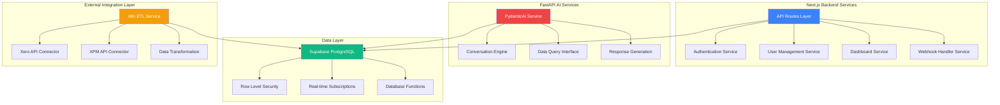

# Backend Architecture

### Service Architecture Overview

XeroPulse implements a hybrid backend architecture combining Next.js API routes for core application logic with specialized FastAPI microservices for AI-enhanced features. This approach balances development velocity (unified TypeScript stack) with performance optimization (Python for AI workloads) while maintaining clear service boundaries.



### Next.js API Routes Architecture

**Route Structure & Organization**
```
src/app/api/
├── auth/                         # Authentication endpoints
│   ├── login/route.ts            # POST: User authentication
│   ├── logout/route.ts           # POST: Session termination
│   ├── refresh/route.ts          # POST: Token refresh
│   └── callback/route.ts         # GET: OAuth callbacks
├── users/                        # User management CRUD
│   ├── route.ts                  # GET: List users, POST: Create user
│   ├── [userId]/                 # User-specific operations
│   │   ├── route.ts              # GET: User details, PUT: Update, DELETE: Remove
│   │   └── dashboards/route.ts   # GET: User's accessible dashboards
│   └── invite/route.ts           # POST: Send user invitation
├── dashboards/                   # Dashboard management
│   ├── route.ts                  # GET: List available dashboards
│   ├── [dashboardId]/            # Dashboard-specific operations
│   │   ├── embed/route.ts        # POST: Generate embed URL
│   │   ├── access/route.ts       # GET: Check access permissions
│   │   └── refresh/route.ts      # POST: Trigger dashboard refresh
│   └── config/route.ts           # GET: Dashboard configurations
├── sync/                         # Data synchronization endpoints
│   ├── status/route.ts           # GET: Current sync status
│   ├── trigger/route.ts          # POST: Manual sync trigger
│   ├── history/route.ts          # GET: Sync history and logs
│   └── health/route.ts           # GET: Integration health checks
├── webhooks/                     # External webhook handlers
│   ├── xero/route.ts             # POST: Xero webhook notifications
│   ├── xpm/route.ts              # POST: XPM webhook notifications
│   └── n8n/route.ts              # POST: n8n workflow callbacks
├── trpc/                         # tRPC API handler
│   └── [trpc]/route.ts           # All tRPC procedures
└── health/                       # System health monitoring
    ├── route.ts                  # GET: Basic health check
    └── detailed/route.ts         # GET: Detailed system status
```

**Service Layer Implementation**
```typescript
// Authentication service with Supabase integration
export class AuthenticationService {
  constructor(
    private supabase: SupabaseClient,
    private logger: Logger
  ) {}

  async authenticateUser(email: string, password: string): Promise<AuthResult> {
    try {
      const { data, error } = await this.supabase.auth.signInWithPassword({
        email,
        password
      });

      if (error) {
        this.logger.warn('Authentication failed', { email, error: error.message });
        throw new AuthenticationError('Invalid credentials');
      }

      const user = await this.getUserWithRole(data.user.id);
      
      await this.logUserActivity(user.id, 'login', {
        ip: this.getClientIP(),
        userAgent: this.getUserAgent()
      });

      return {
        user,
        session: data.session,
        accessToken: data.session.access_token
      };
    } catch (error) {
      this.logger.error('Authentication service error', { email, error });
      throw error;
    }
  }

  async refreshSession(refreshToken: string): Promise<TokenPair> {
    const { data, error } = await this.supabase.auth.refreshSession({
      refresh_token: refreshToken
    });

    if (error) {
      throw new AuthenticationError('Invalid refresh token');
    }

    return {
      accessToken: data.session.access_token,
      refreshToken: data.session.refresh_token,
      expiresAt: new Date(data.session.expires_at * 1000)
    };
  }

  private async getUserWithRole(userId: string): Promise<UserWithRole> {
    const { data, error } = await this.supabase
      .from('users')
      .select('*, organizations(*)')
      .eq('id', userId)
      .single();

    if (error || !data) {
      throw new NotFoundError('User not found');
    }

    return data;
  }
}
```

**Dashboard Service Implementation**
```typescript
// Dashboard management and embedding service
export class DashboardService {
  constructor(
    private metabaseClient: MetabaseClient,
    private supabase: SupabaseClient,
    private logger: Logger
  ) {}

  async generateEmbedUrl(
    dashboardId: string, 
    user: UserWithRole,
    params?: Record<string, any>
  ): Promise<EmbedUrlResult> {
    // Verify user has access to dashboard
    const hasAccess = await this.checkDashboardAccess(user, dashboardId);
    if (!hasAccess) {
      throw new ForbiddenError('User does not have access to this dashboard');
    }

    // Generate signed embed URL with user context
    const payload = {
      resource: { dashboard: parseInt(dashboardId) },
      params: {
        organization_id: user.organization_id,
        user_role: user.role,
        ...params
      },
      exp: Math.round(Date.now() / 1000) + (60 * 60) // 1 hour expiry
    };

    const token = jwt.sign(payload, process.env.METABASE_SECRET_KEY);
    const embedUrl = `${process.env.METABASE_SITE_URL}/embed/dashboard/${token}#bordered=true&titled=true`;

    // Log dashboard access for analytics
    await this.logDashboardAccess(user.id, dashboardId);

    return {
      embedUrl,
      expiresAt: new Date(payload.exp * 1000),
      dashboardId
    };
  }

  async checkDashboardAccess(user: UserWithRole, dashboardId: string): Promise<boolean> {
    const { data } = await this.supabase
      .from('dashboard_configs')
      .select('allowed_roles')
      .eq('id', dashboardId)
      .single();

    return data?.allowed_roles?.includes(user.role) || false;
  }

  private async logDashboardAccess(userId: string, dashboardId: string): Promise<void> {
    await this.supabase
      .from('dashboard_access')
      .insert({
        user_id: userId,
        dashboard_id: dashboardId,
        accessed_at: new Date().toISOString()
      });
  }
}
```

**User Management Service**
```typescript
// User CRUD operations and role management
export class UserManagementService {
  constructor(
    private supabase: SupabaseClient,
    private emailService: EmailService,
    private logger: Logger
  ) {}

  async createUser(userData: CreateUserRequest, adminUser: UserWithRole): Promise<User> {
    // Verify admin has permission to create users
    if (!['admin', 'executive'].includes(adminUser.role)) {
      throw new ForbiddenError('Insufficient permissions to create users');
    }

    // Create user in Supabase Auth
    const tempPassword = this.generateTemporaryPassword();
    const { data: authUser, error: authError } = await this.supabase.auth.admin.createUser({
      email: userData.email,
      password: tempPassword,
      email_confirm: true
    });

    if (authError) {
      throw new ValidationError(`Failed to create user: ${authError.message}`);
    }

    // Create user profile record
    const { data: user, error: profileError } = await this.supabase
      .from('users')
      .insert({
        id: authUser.user.id,
        email: userData.email,
        role: userData.role,
        organization_id: adminUser.organization_id,
        active: true
      })
      .select()
      .single();

    if (profileError) {
      // Cleanup auth user if profile creation fails
      await this.supabase.auth.admin.deleteUser(authUser.user.id);
      throw new DatabaseError('Failed to create user profile');
    }

    // Send invitation email if requested
    if (userData.sendInvitation) {
      await this.emailService.sendInvitationEmail(user, tempPassword);
    }

    // Log admin action
    await this.logAdminAction(adminUser.id, 'create_user', {
      target_user_id: user.id,
      target_email: userData.email,
      assigned_role: userData.role
    });

    this.logger.info('User created successfully', {
      userId: user.id,
      email: userData.email,
      role: userData.role,
      adminId: adminUser.id
    });

    return user;
  }

  async updateUserRole(
    userId: string, 
    newRole: UserRole, 
    adminUser: UserWithRole
  ): Promise<User> {
    // Verify admin permissions
    if (!['admin', 'executive'].includes(adminUser.role)) {
      throw new ForbiddenError('Insufficient permissions to update user roles');
    }

    // Get current user data
    const { data: currentUser } = await this.supabase
      .from('users')
      .select('*')
      .eq('id', userId)
      .eq('organization_id', adminUser.organization_id)
      .single();

    if (!currentUser) {
      throw new NotFoundError('User not found in organization');
    }

    // Update user role
    const { data: updatedUser, error } = await this.supabase
      .from('users')
      .update({ role: newRole, updated_at: new Date().toISOString() })
      .eq('id', userId)
      .select()
      .single();

    if (error) {
      throw new DatabaseError('Failed to update user role');
    }

    // Log admin action
    await this.logAdminAction(adminUser.id, 'update_user_role', {
      target_user_id: userId,
      old_role: currentUser.role,
      new_role: newRole
    });

    return updatedUser;
  }

  private generateTemporaryPassword(): string {
    return crypto.randomBytes(12).toString('base64').slice(0, 12);
  }

  private async logAdminAction(
    adminId: string, 
    action: string, 
    metadata: Record<string, any>
  ): Promise<void> {
    await this.supabase
      .from('admin_actions')
      .insert({
        admin_id: adminId,
        action_type: action,
        metadata,
        timestamp: new Date().toISOString()
      });
  }
}
```

### FastAPI AI Service Architecture

**Service Structure**
```python
# FastAPI service for conversational AI features
from fastapi import FastAPI, Depends, HTTPException
from pydantic import BaseModel
from typing import List, Optional
import asyncio
from datetime import datetime

app = FastAPI(title="XeroPulse AI Service", version="1.0.0")

class ConversationRequest(BaseModel):
    query: str
    user_id: str
    organization_id: str
    context: Optional[dict] = None

class ConversationResponse(BaseModel):
    response: str
    data_visualizations: Optional[List[dict]] = None
    suggested_followups: Optional[List[str]] = None
    confidence_score: float
    processing_time_ms: int

class AIConversationService:
    def __init__(self, database_client, ai_model):
        self.db = database_client
        self.ai = ai_model
        
    async def process_query(self, request: ConversationRequest) -> ConversationResponse:
        start_time = datetime.now()
        
        # Retrieve user's financial data context
        financial_context = await self.get_financial_context(
            request.organization_id,
            request.user_id
        )
        
        # Process query with AI model
        ai_response = await self.ai.generate_response(
            query=request.query,
            context=financial_context,
            user_context=request.context
        )
        
        # Generate follow-up suggestions
        followups = await self.generate_followups(
            request.query,
            ai_response,
            financial_context
        )
        
        # Log conversation for analytics
        await self.log_conversation(request, ai_response)
        
        processing_time = (datetime.now() - start_time).total_seconds() * 1000
        
        return ConversationResponse(
            response=ai_response.text,
            data_visualizations=ai_response.visualizations,
            suggested_followups=followups,
            confidence_score=ai_response.confidence,
            processing_time_ms=int(processing_time)
        )

    async def get_financial_context(self, org_id: str, user_id: str) -> dict:
        # Retrieve relevant financial data based on user role and recent activity
        query = """
        SELECT fd.*, pd.client_name, pd.project_status
        FROM financial_data fd
        LEFT JOIN project_data pd ON fd.client_id = pd.client_id
        WHERE fd.organization_id = $1
        AND fd.transaction_date >= CURRENT_DATE - INTERVAL '90 days'
        ORDER BY fd.transaction_date DESC
        LIMIT 1000
        """
        
        results = await self.db.fetch(query, org_id)
        
        return {
            'recent_transactions': [dict(row) for row in results],
            'summary_metrics': await self.calculate_summary_metrics(org_id),
            'user_preferences': await self.get_user_preferences(user_id)
        }

@app.post("/conversation", response_model=ConversationResponse)
async def process_conversation(
    request: ConversationRequest,
    service: AIConversationService = Depends()
):
    try:
        response = await service.process_query(request)
        return response
    except Exception as e:
        raise HTTPException(status_code=500, detail=str(e))

@app.get("/health")
async def health_check():
    return {"status": "healthy", "timestamp": datetime.now().isoformat()}
```

### Middleware & Cross-Cutting Concerns

**Authentication Middleware**
```typescript
// Middleware for API route authentication
export async function authMiddleware(request: Request): Promise<AuthContext> {
  const authHeader = request.headers.get('authorization');
  
  if (!authHeader?.startsWith('Bearer ')) {
    throw new UnauthorizedError('Missing or invalid authorization header');
  }

  const token = authHeader.substring(7);
  
  try {
    const { data: { user }, error } = await supabase.auth.getUser(token);
    
    if (error || !user) {
      throw new UnauthorizedError('Invalid token');
    }

    // Get user profile with organization info
    const { data: profile } = await supabase
      .from('users')
      .select('*, organizations(*)')
      .eq('id', user.id)
      .single();

    return {
      user: profile,
      session: { access_token: token }
    };
  } catch (error) {
    throw new UnauthorizedError('Token validation failed');
  }
}
```

**Error Handling Middleware**
```typescript
// Global error handling for API routes
export function errorHandler(error: Error): Response {
  const logger = getLogger();
  
  // Log error details
  logger.error('API Error', {
    error: error.message,
    stack: error.stack,
    timestamp: new Date().toISOString()
  });

  // Map error types to HTTP responses
  if (error instanceof ValidationError) {
    return NextResponse.json(
      { error: 'Validation failed', details: error.details },
      { status: 400 }
    );
  }

  if (error instanceof UnauthorizedError) {
    return NextResponse.json(
      { error: 'Authentication required' },
      { status: 401 }
    );
  }

  if (error instanceof ForbiddenError) {
    return NextResponse.json(
      { error: 'Insufficient permissions' },
      { status: 403 }
    );
  }

  if (error instanceof NotFoundError) {
    return NextResponse.json(
      { error: 'Resource not found' },
      { status: 404 }
    );
  }

  // Default to 500 for unexpected errors
  return NextResponse.json(
    { error: 'Internal server error' },
    { status: 500 }
  );
}
```

### Database Connection & Connection Pooling

**Supabase Client Configuration**
```typescript
// Production-optimized Supabase client setup
export const supabaseAdmin = createClient(
  process.env.SUPABASE_URL,
  process.env.SUPABASE_SERVICE_ROLE_KEY,
  {
    auth: {
      autoRefreshToken: false,
      persistSession: false
    },
    db: {
      schema: 'public'
    },
    global: {
      fetch: fetch
    }
  }
);

// Connection pool configuration for high-throughput operations
export class DatabasePool {
  private pool: Pool;

  constructor() {
    this.pool = new Pool({
      connectionString: process.env.DATABASE_URL,
      max: 20, // Maximum connections
      min: 5,  // Minimum connections
      acquireTimeoutMillis: 30000,
      createTimeoutMillis: 30000,
      destroyTimeoutMillis: 5000,
      idleTimeoutMillis: 30000,
      reapIntervalMillis: 1000,
      createRetryIntervalMillis: 200
    });
  }

  async query(text: string, params?: any[]): Promise<QueryResult> {
    const client = await this.pool.connect();
    try {
      return await client.query(text, params);
    } finally {
      client.release();
    }
  }
}
```

---

**Detailed Rationale:**

**Hybrid Architecture Choice**: Next.js API routes handle CRUD operations and dashboard management leveraging TypeScript's type safety and unified development experience. FastAPI microservice handles AI workloads where Python's ecosystem (PydanticAI, data science libraries) provides performance advantages.

**Service Layer Design**: Each service class encapsulates specific business logic with dependency injection for database clients and external services. This enables easy testing with mocked dependencies and supports different configurations across environments.

**Authentication Strategy**: Supabase Auth provides session management with automatic token refresh, while custom middleware adds role-based authorization. This balances security with developer experience.

**Error Handling Philosophy**: Centralized error handling with structured logging enables debugging while providing consistent API responses. Error types map to appropriate HTTP status codes for client error handling.

**Database Connection Strategy**: Supabase client for most operations provides automatic connection management and real-time features. Direct PostgreSQL pool for high-throughput analytics queries bypasses Supabase overhead when needed.

**Key Assumptions**: Vercel serverless functions provide sufficient execution time for dashboard embed URL generation. FastAPI AI service can be deployed independently and scaled based on conversation volume. Database connection pooling works effectively with Supabase PostgreSQL instance.

**Validation Needs**: Load testing of API routes under realistic user concurrency. Performance testing of embed URL generation with complex user permission scenarios. Integration testing between Next.js API routes and FastAPI AI service.

Perfect! I can see you're continuing with the architecture document creation. Let me proceed to the next section - **Deployment Architecture**.

---

