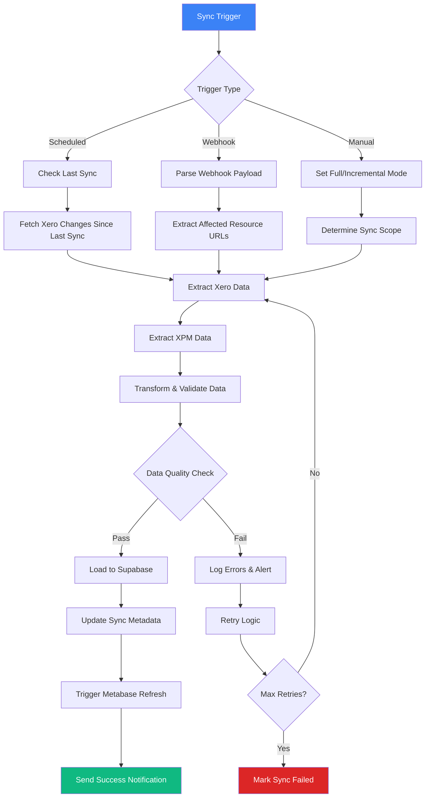
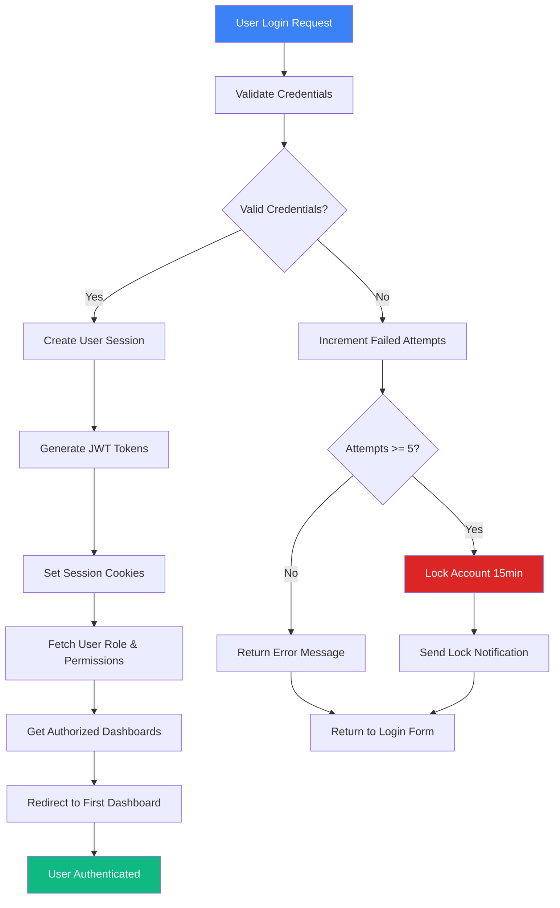
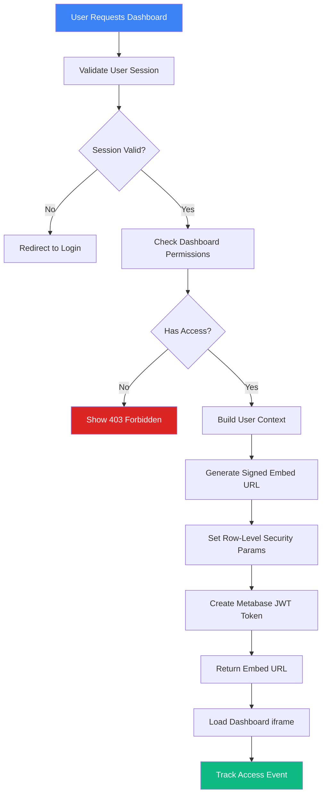
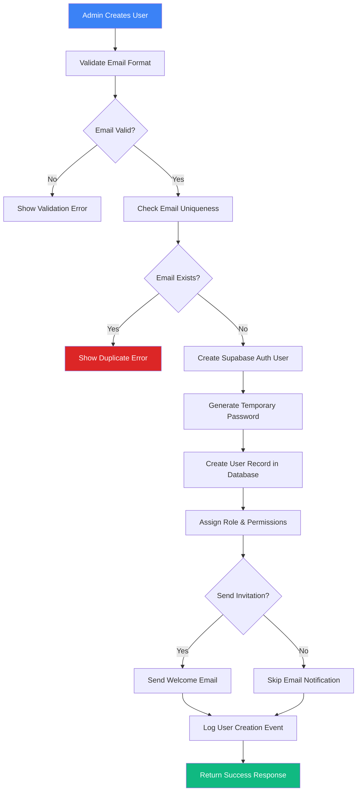

# Core Workflows

### Overview

XeroPulse implements four primary workflows that orchestrate data movement, user interactions, and system operations. These workflows ensure reliable financial data delivery while maintaining security, performance, and user experience standards across the platform.

### Workflow 1: Data Synchronization & ETL Pipeline

**Purpose**: Automated extraction, transformation, and loading of financial data from Xero and XPM into the analytics-ready data warehouse.

**Trigger Mechanisms**
- Scheduled execution: Every 2 hours during business hours (8 AM - 6 PM AEST)
- Webhook triggers: Real-time sync on Xero data changes
- Manual triggers: Admin-initiated full refresh or incremental sync
- Startup sync: Initial data population for new organization onboarding

**Workflow Steps**



**Detailed Implementation**

```python
# n8n workflow implementation
class DataSyncWorkflow:
    async def execute_sync(self, trigger_type: str, payload: dict = None):
        """Main sync orchestration workflow"""
        
        sync_session = await self.create_sync_session(trigger_type)
        
        try:
            # Phase 1: Data Extraction
            xero_data = await self.extract_xero_data(sync_session)
            xpm_data = await self.extract_xpm_data(sync_session)
            
            # Phase 2: Data Transformation
            transformed_data = await self.transform_data(xero_data, xmp_data)
            
            # Phase 3: Data Quality Validation
            validation_result = await self.validate_data_quality(transformed_data)
            if not validation_result.passed:
                raise DataQualityException(validation_result.errors)
            
            # Phase 4: Data Loading
            load_result = await self.load_to_warehouse(transformed_data)
            
            # Phase 5: Post-Load Operations
            await self.update_sync_metadata(sync_session, load_result)
            await self.trigger_dashboard_refresh()
            await self.send_success_notification(sync_session)
            
        except Exception as e:
            await self.handle_sync_failure(sync_session, e)
            
    async def extract_xero_data(self, sync_session: SyncSession) -> XeroDataset:
        """Extract financial data from Xero API"""
        
        extractors = [
            XeroInvoiceExtractor(),
            XeroPaymentExtractor(), 
            XeroBankTransactionExtractor(),
            XeroContactExtractor(),
            XeroAccountExtractor()
        ]
        
        extracted_data = XeroDataset()
        
        for extractor in extractors:
            try:
                data = await extractor.extract(
                    modified_since=sync_session.last_sync_time,
                    tenant_id=sync_session.organization.xero_tenant_id
                )
                extracted_data.add_dataset(extractor.data_type, data)
                
            except XeroAPIException as e:
                if e.is_recoverable():
                    await asyncio.sleep(e.retry_after)
                    data = await extractor.extract(modified_since, tenant_id)
                    extracted_data.add_dataset(extractor.data_type, data)
                else:
                    raise
                    
        return extracted_data
```

**Data Transformation Rules**

```python
class FinancialDataTransformer:
    """Transform raw API data into analytics-ready format"""
    
    def transform_invoices(self, raw_invoices: List[dict]) -> List[FinancialData]:
        """Transform Xero invoices to unified format"""
        
        transformed = []
        
        for invoice in raw_invoices:
            financial_record = FinancialData(
                id=self.generate_id('invoice', invoice['InvoiceID']),
                transaction_type='revenue' if invoice['Type'] == 'ACCREC' else 'expense',
                amount=Decimal(str(invoice['Total'])),
                date=datetime.fromisoformat(invoice['Date']),
                client_id=self.map_contact_id(invoice['Contact']['ContactID']),
                description=invoice.get('Reference', ''),
                status=self.map_invoice_status(invoice['Status']),
                source='xero',
                source_id=invoice['InvoiceID'],
                metadata={
                    'line_items': invoice.get('LineItems', []),
                    'due_date': invoice.get('DueDate'),
                    'invoice_number': invoice.get('InvoiceNumber')
                }
            )
            transformed.append(financial_record)
            
        return transformed
        
    def transform_time_entries(self, raw_time: List[dict]) -> List[ProjectData]:
        """Transform XPM time entries to project data"""
        
        transformed = []
        
        for entry in raw_time:
            project_record = ProjectData(
                id=self.generate_id('time', entry['ID']),
                project_id=entry['JobID'],
                user_id=self.map_staff_id(entry['StaffID']),
                hours=Decimal(str(entry['Hours'])),
                billable_rate=Decimal(str(entry.get('Rate', 0))),
                date=datetime.fromisoformat(entry['Date']),
                description=entry.get('Description', ''),
                billable=entry.get('Billable', True),
                source='xpm',
                source_id=entry['ID'],
                metadata={
                    'task_type': entry.get('TaskType'),
                    'cost_centre': entry.get('CostCentre')
                }
            )
            transformed.append(project_record)
            
        return transformed
```

**n8n Workflow Implementation Details**

**Docker Compose Configuration**:

```yaml
version: '3.8'

services:
  n8n:
    image: n8nio/n8n:latest
    container_name: xero_pulse_n8n
    restart: unless-stopped
    ports:
      - "5678:5678"
    environment:
      - N8N_BASIC_AUTH_ACTIVE=true
      - N8N_BASIC_AUTH_USER=${N8N_USER}
      - N8N_BASIC_AUTH_PASSWORD=${N8N_PASSWORD}
      - N8N_HOST=${N8N_HOST}
      - N8N_PORT=5678
      - N8N_PROTOCOL=https
      - NODE_ENV=production
      - WEBHOOK_URL=https://${N8N_HOST}/
      - GENERIC_TIMEZONE=Australia/Sydney
      - N8N_ENCRYPTION_KEY=${N8N_ENCRYPTION_KEY}
    volumes:
      - n8n_data:/home/node/.n8n
      - ./n8n/workflows:/home/node/.n8n/workflows
    networks:
      - xeropulse_network

  metabase:
    image: metabase/metabase:latest
    container_name: xero_pulse_metabase
    restart: unless-stopped
    ports:
      - "3000:3000"
    environment:
      - MB_DB_TYPE=postgres
      - MB_DB_DBNAME=${METABASE_DB_NAME}
      - MB_DB_PORT=5432
      - MB_DB_USER=${METABASE_DB_USER}
      - MB_DB_PASS=${METABASE_DB_PASSWORD}
      - MB_DB_HOST=${SUPABASE_HOST}
      - MB_ENCRYPTION_SECRET_KEY=${METABASE_ENCRYPTION_KEY}
      - MB_SITE_URL=https://${METABASE_HOST}
      - MB_EMBEDDING_SECRET_KEY=${METABASE_EMBEDDING_SECRET}
    volumes:
      - metabase_data:/metabase-data
    networks:
      - xeropulse_network
    depends_on:
      - n8n

volumes:
  n8n_data:
  metabase_data:

networks:
  xeropulse_network:
    driver: bridge
```

**n8n Workflow Node Sequences**:

**Workflow 1: Xero Payments Incremental Sync**

```json
{
  "name": "Xero Payments Incremental Sync",
  "nodes": [
    {
      "id": "schedule-trigger",
      "type": "n8n-nodes-base.scheduleTrigger",
      "parameters": {
        "rule": {
          "interval": [{ "field": "hours", "value": 2 }]
        }
      },
      "position": [250, 300]
    },
    {
      "id": "get-last-sync",
      "type": "n8n-nodes-base.supabase",
      "parameters": {
        "operation": "select",
        "table": "sync_sessions",
        "filterType": "manual",
        "filters": {
          "conditions": [
            {
              "column": "entity_type",
              "operator": "equals",
              "value": "payments"
            },
            {
              "column": "status",
              "operator": "equals",
              "value": "completed"
            }
          ]
        },
        "sort": [{ "column": "completed_at", "direction": "desc" }],
        "limit": 1
      },
      "position": [450, 300]
    },
    {
      "id": "xero-get-payments",
      "type": "n8n-nodes-base.httpRequest",
      "parameters": {
        "method": "GET",
        "url": "https://api.xero.com/api.xro/2.0/Payments",
        "authentication": "oAuth2",
        "qs": {
          "where": "Status==\"AUTHORISED\"",
          "If-Modified-Since": "={{ $node['get-last-sync'].json['completed_at'] }}",
          "order": "UpdatedDateUTC DESC",
          "page": 1
        },
        "options": {
          "pagination": {
            "paginationType": "offsetIncrement",
            "limitParameter": "page",
            "maxRequests": 100
          }
        }
      },
      "position": [650, 300]
    },
    {
      "id": "transform-payments",
      "type": "n8n-nodes-base.code",
      "parameters": {
        "code": "const items = $input.all();\nconst transformed = [];\n\nfor (const item of items) {\n  const payment = item.json;\n  \n  transformed.push({\n    id: `xero_payment_${payment.PaymentID}`,\n    organization_id: '{{ $json[\"organization_id\"] }}',\n    transaction_type: 'revenue',\n    transaction_date: payment.Date,\n    amount: parseFloat(payment.Amount),\n    source: 'xero',\n    source_id: payment.PaymentID,\n    metadata: {\n      invoice_id: payment.Invoice?.InvoiceID,\n      payment_type: payment.PaymentType,\n      reference: payment.Reference\n    },\n    created_at: payment.UpdatedDateUTC,\n    updated_at: new Date().toISOString()\n  });\n}\n\nreturn transformed.map(item => ({ json: item }));"
      },
      "position": [850, 300]
    },
    {
      "id": "upsert-to-supabase",
      "type": "n8n-nodes-base.supabase",
      "parameters": {
        "operation": "upsert",
        "table": "financial_data",
        "options": {
          "onConflict": "organization_id,source,source_id"
        }
      },
      "position": [1050, 300]
    },
    {
      "id": "update-sync-metadata",
      "type": "n8n-nodes-base.supabase",
      "parameters": {
        "operation": "insert",
        "table": "sync_sessions",
        "fields": {
          "entity_type": "payments",
          "status": "completed",
          "records_processed": "={{ $json['count'] }}",
          "completed_at": "={{ new Date().toISOString() }}"
        }
      },
      "position": [1250, 300]
    },
    {
      "id": "trigger-metabase-refresh",
      "type": "n8n-nodes-base.httpRequest",
      "parameters": {
        "method": "POST",
        "url": "https://{{ $env['METABASE_HOST'] }}/api/cache/invalidate",
        "authentication": "headerAuth",
        "headerParameters": {
          "X-Metabase-Session": "{{ $env['METABASE_SESSION_TOKEN'] }}"
        },
        "body": {
          "tables": ["financial_data"]
        }
      },
      "position": [1450, 300]
    }
  ],
  "connections": {
    "schedule-trigger": { "main": [[{ "node": "get-last-sync" }]] },
    "get-last-sync": { "main": [[{ "node": "xero-get-payments" }]] },
    "xero-get-payments": { "main": [[{ "node": "transform-payments" }]] },
    "transform-payments": { "main": [[{ "node": "upsert-to-supabase" }]] },
    "upsert-to-supabase": { "main": [[{ "node": "update-sync-metadata" }]] },
    "update-sync-metadata": { "main": [[{ "node": "trigger-metabase-refresh" }]] }
  }
}
```

**Workflow 2: XPM WIP Data Sync**

```json
{
  "name": "XPM WIP Data Sync",
  "nodes": [
    {
      "id": "schedule-trigger",
      "type": "n8n-nodes-base.scheduleTrigger",
      "parameters": {
        "rule": {
          "interval": [{ "field": "hours", "value": 2 }]
        }
      }
    },
    {
      "id": "parallel-fetch",
      "type": "n8n-nodes-base.splitInBatches",
      "parameters": {
        "batchSize": 1,
        "options": {}
      }
    },
    {
      "id": "fetch-jobs",
      "type": "n8n-nodes-base.httpRequest",
      "parameters": {
        "method": "GET",
        "url": "https://api.xero.com/practicemanager/3.1/job.api/list",
        "authentication": "oAuth2",
        "qs": {
          "status": "In Progress"
        }
      }
    },
    {
      "id": "fetch-time-entries",
      "type": "n8n-nodes-base.httpRequest",
      "parameters": {
        "method": "GET",
        "url": "https://api.xero.com/practicemanager/3.1/time.api/list",
        "qs": {
          "from": "={{ $today.minus({ days: 90 }).toFormat('yyyyMMdd') }}",
          "to": "={{ $today.toFormat('yyyyMMdd') }}"
        }
      }
    },
    {
      "id": "fetch-costs",
      "type": "n8n-nodes-base.httpRequest",
      "parameters": {
        "method": "GET",
        "url": "https://api.xero.com/practicemanager/3.1/cost.api/list"
      }
    },
    {
      "id": "merge-wip-data",
      "type": "n8n-nodes-base.code",
      "parameters": {
        "code": "// Merge jobs, time, and costs to calculate WIP\nconst jobs = $node['fetch-jobs'].json;\nconst timeEntries = $node['fetch-time-entries'].json;\nconst costs = $node['fetch-costs'].json;\n\nconst wipByJob = {};\n\n// Calculate time value per job\nfor (const time of timeEntries) {\n  if (!wipByJob[time.jobUuid]) {\n    wipByJob[time.jobUuid] = { time: 0, costs: 0, interims: 0 };\n  }\n  if (time.billable && !time.invoiced) {\n    wipByJob[time.jobUuid].time += parseFloat(time.chargeAmount || 0);\n  }\n}\n\n// Calculate costs per job\nfor (const cost of costs) {\n  if (!wipByJob[cost.jobUuid]) {\n    wipByJob[cost.jobUuid] = { time: 0, costs: 0, interims: 0 };\n  }\n  if (cost.billable && !cost.invoiced) {\n    wipByJob[cost.jobUuid].costs += parseFloat(cost.amount || 0);\n  }\n}\n\n// Calculate WIP\nconst wipRecords = [];\nfor (const [jobUuid, wip] of Object.entries(wipByJob)) {\n  const job = jobs.find(j => j.uuid === jobUuid);\n  if (!job) continue;\n  \n  const totalWip = wip.time + wip.costs - wip.interims;\n  if (totalWip > 0) {\n    wipRecords.push({\n      json: {\n        job_uuid: jobUuid,\n        client_uuid: job.clientUuid,\n        time_value: wip.time,\n        costs_value: wip.costs,\n        interims: wip.interims,\n        wip_amount: totalWip,\n        aging_days: Math.floor((new Date() - new Date(job.startDate)) / (1000 * 60 * 60 * 24)),\n        updated_at: new Date().toISOString()\n      }\n    });\n  }\n}\n\nreturn wipRecords;"
      }
    },
    {
      "id": "upsert-wip-to-supabase",
      "type": "n8n-nodes-base.supabase",
      "parameters": {
        "operation": "upsert",
        "table": "project_wip",
        "options": {
          "onConflict": "job_uuid"
        }
      }
    },
    {
      "id": "refresh-materialized-view",
      "type": "n8n-nodes-base.postgres",
      "parameters": {
        "operation": "executeQuery",
        "query": "REFRESH MATERIALIZED VIEW CONCURRENTLY vw_wip_aging;"
      }
    }
  ],
  "connections": {
    "schedule-trigger": { "main": [[{ "node": "parallel-fetch" }]] },
    "parallel-fetch": {
      "main": [
        [{ "node": "fetch-jobs" }],
        [{ "node": "fetch-time-entries" }],
        [{ "node": "fetch-costs" }]
      ]
    },
    "fetch-jobs": { "main": [[{ "node": "merge-wip-data" }]] },
    "fetch-time-entries": { "main": [[{ "node": "merge-wip-data" }]] },
    "fetch-costs": { "main": [[{ "node": "merge-wip-data" }]] },
    "merge-wip-data": { "main": [[{ "node": "upsert-wip-to-supabase" }]] },
    "upsert-wip-to-supabase": { "main": [[{ "node": "refresh-materialized-view" }]] }
  }
}
```

**Error Handling & Recovery**

```python
class SyncErrorHandler:
    async def handle_sync_failure(self, sync_session: SyncSession, error: Exception):
        """Comprehensive error handling and recovery"""
        
        error_type = self.classify_error(error)
        
        if error_type == 'rate_limit':
            # Exponential backoff retry
            retry_delay = min(300, 2 ** sync_session.retry_count * 30)
            await asyncio.sleep(retry_delay)
            await self.retry_sync(sync_session)
            
        elif error_type == 'auth_expired':
            # Refresh tokens and retry
            await self.refresh_api_tokens(sync_session.organization)
            await self.retry_sync(sync_session)
            
        elif error_type == 'data_quality':
            # Log data issues and continue with partial sync
            await self.log_data_quality_issues(sync_session, error)
            await self.attempt_partial_sync(sync_session)
            
        elif error_type == 'critical':
            # Alert administrators and halt sync
            await self.alert_administrators(sync_session, error)
            await self.mark_sync_failed(sync_session)
            
    async def retry_sync(self, sync_session: SyncSession):
        """Retry sync with incremented attempt counter"""
        
        if sync_session.retry_count >= self.max_retries:
            await self.mark_sync_failed(sync_session)
            return
            
        sync_session.retry_count += 1
        await asyncio.sleep(5)  # Brief delay before retry
        await self.execute_sync(sync_session.trigger_type)
```

### Workflow 2: User Authentication & Authorization

**Purpose**: Secure user access management with role-based dashboard authorization and session lifecycle management.

**Authentication Flow**



**Role-Based Access Control**

```typescript
// Authorization service implementation
class AuthorizationService {
    private readonly dashboardPermissions = {
        'executive': ['dashboard-1', 'dashboard-2', 'dashboard-3', 'dashboard-4', 
                     'dashboard-5', 'dashboard-6', 'dashboard-7', 'dashboard-8'],
        'manager': ['dashboard-1', 'dashboard-2', 'dashboard-3', 'dashboard-4', 
                   'dashboard-6', 'dashboard-7'],
        'staff': ['dashboard-7'],  // AR Aging only
        'admin': ['dashboard-1', 'dashboard-2', 'dashboard-3', 'dashboard-4', 
                 'dashboard-5', 'dashboard-6', 'dashboard-7', 'dashboard-8']
    };
    
    getUserAuthorizedDashboards(user: User): DashboardConfig[] {
        const userRole = user.role;
        const authorizedIds = this.dashboardPermissions[userRole] || [];
        
        return authorizedIds.map(id => this.getDashboardConfig(id));
    }
    
    canAccessDashboard(user: User, dashboardId: string): boolean {
        const authorizedIds = this.dashboardPermissions[user.role] || [];
        return authorizedIds.includes(dashboardId);
    }
    
    canAccessAdminPanel(user: User): boolean {
        return ['executive', 'admin'].includes(user.role);
    }
}
```

**Session Management**

```typescript
class SessionManager {
    private readonly sessionDuration = 8 * 60 * 60 * 1000; // 8 hours
    private readonly refreshThreshold = 30 * 60 * 1000;    // 30 minutes
    
    async createSession(user: User): Promise<SessionTokens> {
        const sessionData = {
            userId: user.id,
            organizationId: user.organizationId,
            role: user.role,
            permissions: await this.getUserPermissions(user),
            createdAt: new Date(),
            expiresAt: new Date(Date.now() + this.sessionDuration)
        };
        
        // Store session in Supabase
        const session = await this.supabase
            .from('user_sessions')
            .insert(sessionData)
            .single();
            
        // Generate JWT tokens
        const accessToken = this.generateAccessToken(session);
        const refreshToken = this.generateRefreshToken(session);
        
        return { accessToken, refreshToken, expiresAt: sessionData.expiresAt };
    }
    
    async validateSession(token: string): Promise<User | null> {
        try {
            const decoded = jwt.verify(token, process.env.JWT_SECRET);
            
            // Check if session exists and is valid
            const session = await this.supabase
                .from('user_sessions')
                .select('*')
                .eq('id', decoded.sessionId)
                .single();
                
            if (!session || new Date() > new Date(session.expires_at)) {
                return null;
            }
            
            // Auto-refresh if nearing expiration
            if (this.shouldRefreshToken(session)) {
                await this.refreshSession(session);
            }
            
            return this.getUserFromSession(session);
            
        } catch (error) {
            return null;
        }
    }
}
```

### Workflow 3: Dashboard Embedding & Access Control

**Purpose**: Secure generation and delivery of personalized Metabase dashboard embed URLs with user-specific data filtering.

**Dashboard Access Flow**



**Embed URL Generation**

```python
class DashboardEmbedService:
    def __init__(self, metabase_secret: str, metabase_url: str):
        self.metabase_secret = metabase_secret
        self.metabase_url = metabase_url
        
    async def generate_dashboard_url(self, user: User, dashboard_id: str) -> str:
        """Generate secure, personalized dashboard embed URL"""
        
        # Validate user access
        if not await self.can_access_dashboard(user, dashboard_id):
            raise PermissionDenied(f"User {user.id} cannot access {dashboard_id}")
            
        # Build dashboard configuration
        dashboard_config = await self.get_dashboard_config(dashboard_id)
        
        # Create user context for row-level security
        user_context = self.build_user_context(user, dashboard_config)
        
        # Generate signed JWT token
        payload = {
            'resource': {'dashboard': dashboard_config.metabase_id},
            'params': user_context.security_params,
            'exp': int(time.time()) + 3600,  # 1 hour expiry
            'iat': int(time.time())
        }
        
        token = jwt.encode(payload, self.metabase_secret, algorithm='HS256')
        
        # Log access for audit
        await self.log_dashboard_access(user, dashboard_id)
        
        return f"{self.metabase_url}/embed/dashboard/{token}"
        
    def build_user_context(self, user: User, config: DashboardConfig) -> UserContext:
        """Build security context for dashboard access"""
        
        security_params = {
            'organization_id': user.organization_id
        }
        
        # Role-based data filtering
        if user.role == 'staff':
            # Staff users see only their own data
            security_params['user_id'] = user.id
            security_params['assigned_clients'] = user.assigned_client_ids
            
        elif user.role == 'manager':
            # Managers see their department's data
            security_params['department'] = user.department
            security_params['team_members'] = await self.get_team_member_ids(user)
            
        elif user.role in ['executive', 'admin']:
            # Executives see all organizational data
            # No additional filtering required
            pass
            
        return UserContext(
            user_id=user.id,
            role=user.role,
            security_params=security_params
        )
```

**Dashboard Configuration Management**

```python
class DashboardConfigService:
    dashboard_configs = {
        'dashboard-1': DashboardConfig(
            id='dashboard-1',
            name='Income vs Expenses',
            metabase_id=1,
            description='Monthly revenue and expense comparison',
            refresh_interval=120,  # 2 hours
            required_data=['invoices', 'payments', 'expenses']
        ),
        'dashboard-7': DashboardConfig(
            id='dashboard-7', 
            name='Debtors/AR Aging',
            metabase_id=7,
            description='Accounts receivable aging analysis',
            refresh_interval=60,   # 1 hour (more frequent for collections)
            required_data=['invoices', 'payments', 'contacts'],
            role_restrictions={
                'staff': {
                    'filter_by_user': True,
                    'allowed_clients': 'assigned_only'
                }
            }
        )
    }
    
    async def get_dashboard_config(self, dashboard_id: str) -> DashboardConfig:
        """Retrieve dashboard configuration with validation"""
        
        config = self.dashboard_configs.get(dashboard_id)
        if not config:
            raise DashboardNotFound(f"Dashboard {dashboard_id} not found")
            
        # Validate data availability
        await self.validate_required_data(config)
        
        return config
        
    async def refresh_dashboard_cache(self, dashboard_id: str):
        """Trigger Metabase dashboard cache refresh"""
        
        config = await self.get_dashboard_config(dashboard_id)
        
        async with httpx.AsyncClient() as client:
            response = await client.post(
                f"{self.metabase_url}/api/cache/dashboard/{config.metabase_id}",
                headers=self.get_metabase_headers()
            )
            
        if response.status_code != 200:
            logger.warning(f"Failed to refresh cache for {dashboard_id}")
```

### Workflow 4: User Management & Provisioning

**Purpose**: Streamlined user lifecycle management including creation, role assignment, access provisioning, and deactivation.

**User Creation Flow**



**User Provisioning Implementation**

```python
class UserProvisioningService:
    def __init__(self, supabase_client, email_service):
        self.supabase = supabase_client
        self.email = email_service
        
    async def create_user(self, request: CreateUserRequest, admin_user: User) -> User:
        """Create new user with role-based permissions"""
        
        # Validate admin permissions
        if not self.can_manage_users(admin_user):
            raise PermissionDenied("User management requires admin privileges")
            
        # Validate email uniqueness
        existing_user = await self.find_user_by_email(request.email)
        if existing_user:
            raise UserAlreadyExists(f"User with email {request.email} already exists")
            
        # Generate secure temporary password
        temp_password = self.generate_temp_password()
        
        try:
            # Create auth user in Supabase
            auth_response = await self.supabase.auth.admin.create_user({
                'email': request.email,
                'password': temp_password,
                'email_confirm': True  # Auto-confirm for admin-created users
            })
            
            # Create user profile record
            user_data = {
                'id': auth_response.user.id,
                'email': request.email,
                'role': request.role,
                'organization_id': admin_user.organization_id,
                'created_by': admin_user.id,
                'created_at': datetime.utcnow(),
                'last_login': None,
                'active': True
            }
            
            user_record = await self.supabase.from('users').insert(user_data).single()
            
            # Send invitation email if requested
            if request.send_invitation:
                await self.send_invitation_email(
                    email=request.email,
                    temp_password=temp_password,
                    invited_by=admin_user.email
                )
                
            # Log user creation event
            await self.log_admin_action(
                admin_user=admin_user,
                action='create_user',
                target_user_id=user_record['id'],
                details={'role': request.role, 'email_sent': request.send_invitation}
            )
            
            return User.from_dict(user_record)
            
        except Exception as e:
            # Cleanup on failure
            if 'auth_response' in locals():
                await self.supabase.auth.admin.delete_user(auth_response.user.id)
            raise UserCreationFailed(f"Failed to create user: {str(e)}")
            
    async def send_invitation_email(self, email: str, temp_password: str, invited_by: str):
        """Send welcome email with login instructions"""
        
        email_template = EmailTemplate(
            to=email,
            subject="Welcome to XeroPulse - Your Account is Ready",
            template_id="user_invitation",
            variables={
                'login_url': f"{self.app_url}/login",
                'email': email,
                'temp_password': temp_password,
                'invited_by': invited_by,
                'support_email': self.support_email
            }
        )
        
        await self.email.send_template_email(email_template)
```

**Role Management & Updates**

```python
class RoleManagementService:
    async def update_user_role(self, user_id: str, new_role: str, admin_user: User):
        """Update user role and refresh permissions"""
        
        # Validate role change permissions
        if not await self.can_change_role(admin_user, new_role):
            raise PermissionDenied("Insufficient privileges for role assignment")
            
        # Update user record
        await self.supabase.from('users').update({
            'role': new_role,
            'updated_at': datetime.utcnow(),
            'updated_by': admin_user.id
        }).eq('id', user_id)
        
        # Invalidate existing sessions to force re-authentication
        await self.invalidate_user_sessions(user_id)
        
        # Log role change
        await self.log_admin_action(
            admin_user=admin_user,
            action='update_role',
            target_user_id=user_id,
            details={'new_role': new_role}
        )
        
    async def deactivate_user(self, user_id: str, admin_user: User):
        """Deactivate user account and revoke access"""
        
        # Soft delete - mark as inactive
        await self.supabase.from('users').update({
            'active': False,
            'deactivated_at': datetime.utcnow(),
            'deactivated_by': admin_user.id
        }).eq('id', user_id)
        
        # Revoke all active sessions
        await self.invalidate_user_sessions(user_id)
        
        # Disable Supabase auth
        await self.supabase.auth.admin.update_user_by_id(
            user_id, 
            {'ban_duration': 'permanent'}
        )
```

### Detailed Rationale

**Workflow Design Philosophy**: Each workflow is designed as an atomic, retryable operation with clear success/failure states. This enables reliable operation even when external dependencies (APIs, email services) are temporarily unavailable.

**Data Sync Strategy**: Two-hour sync intervals balance data freshness with API rate limits. Webhook-triggered incremental syncs provide near real-time updates for critical changes while reducing unnecessary API calls.

**Security Architecture**: Multi-layered security with authentication at the application level, authorization at the dashboard level, and row-level security at the data level. This ensures users can only access data appropriate to their role and organization.

**Error Handling Philosophy**: Graceful degradation and comprehensive retry logic prevent single points of failure. Data quality validation ensures corrupt data doesn't propagate to dashboards, maintaining user trust in the platform.

**User Management Approach**: Admin-controlled provisioning with automated email invitations streamlines onboarding while maintaining security. Soft deletion and session invalidation provide immediate access revocation when needed.

**Key Assumptions**: Metabase embedding supports JWT-based row-level security parameters. Supabase Auth provides reliable session management and user lifecycle operations. External APIs (Xero/XPM) maintain current rate limiting and authentication patterns.

**Validation Needs**: Load testing of sync workflows under realistic data volumes. Security testing of embed URL generation and row-level filtering. End-to-end testing of user provisioning and access control workflows.

---
Optimizing tool selection...Perfect! Continuing to the **Database Schema** section.

