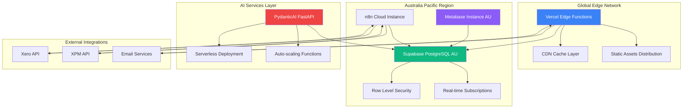

# Deployment Architecture

### Overview

XeroPulse employs a cloud-native deployment strategy leveraging Vercel's edge network for the Next.js application, Supabase for managed PostgreSQL and authentication, and strategic use of serverless functions for optimal cost and performance. The architecture is designed for the Australian market with data residency compliance while maintaining global performance through CDN distribution.

### Production Environment Architecture



### Vercel Deployment Configuration

**Next.js Application Deployment**
```javascript
// vercel.json configuration
{
  "version": 2,
  "regions": ["syd1"], // Sydney region for Australian compliance
  "builds": [
    {
      "src": "package.json",
      "use": "@vercel/next"
    }
  ],
  "functions": {
    "app/api/**": {
      "maxDuration": 30, // 30 seconds for API routes
      "memory": 1024     // 1GB memory allocation
    },
    "app/api/sync/**": {
      "maxDuration": 60, // Extended timeout for sync operations
      "memory": 2048     // Higher memory for data processing
    }
  },
  "headers": [
    {
      "source": "/(.*)",
      "headers": [
        {
          "key": "X-Frame-Options",
          "value": "SAMEORIGIN"
        },
        {
          "key": "Content-Security-Policy",
          "value": "default-src 'self'; frame-src 'self' *.metabase.com; script-src 'self' 'unsafe-eval'"
        }
      ]
    }
  ],
  "rewrites": [
    {
      "source": "/api/ai/:path*",
      "destination": "https://ai-service.xeropulse.com/:path*"
    }
  ]
}
```

**Environment Configuration Management**
```typescript
// Environment variables configuration
export const config = {
  development: {
    DATABASE_URL: process.env.SUPABASE_URL + '/rest/v1/',
    SUPABASE_ANON_KEY: process.env.SUPABASE_ANON_KEY,
    METABASE_SITE_URL: 'http://localhost:3001',
    N8N_WEBHOOK_URL: 'https://dev-n8n.xeropulse.com',
    LOG_LEVEL: 'debug'
  },
  staging: {
    DATABASE_URL: process.env.SUPABASE_URL + '/rest/v1/',
    SUPABASE_ANON_KEY: process.env.SUPABASE_ANON_KEY,
    METABASE_SITE_URL: 'https://staging-metabase.xeropulse.com',
    N8N_WEBHOOK_URL: 'https://staging-n8n.xeropulse.com',
    LOG_LEVEL: 'info'
  },
  production: {
    DATABASE_URL: process.env.SUPABASE_URL + '/rest/v1/',
    SUPABASE_ANON_KEY: process.env.SUPABASE_ANON_KEY,
    METABASE_SITE_URL: 'https://metabase.xeropulse.com',
    N8N_WEBHOOK_URL: 'https://n8n.xeropulse.com',
    LOG_LEVEL: 'warn'
  }
};
```

### Supabase Infrastructure Setup

**Database Configuration**
```sql
-- Production database configuration
-- Instance: Australia Pacific (Sydney) region
-- Tier: Pro ($25/month + usage)
-- Backup: Point-in-time recovery (7 days)
-- Compute: 4 vCPU, 8GB RAM baseline with auto-scaling

-- Connection pooling configuration
-- PgBouncer enabled with transaction pooling
-- Max connections: 200
-- Pool size: 20
-- Pool mode: Transaction

-- Performance optimization
ALTER SYSTEM SET shared_preload_libraries = 'pg_stat_statements';
ALTER SYSTEM SET log_statement = 'all';
ALTER SYSTEM SET log_min_duration_statement = 1000; -- Log slow queries > 1s
ALTER SYSTEM SET effective_cache_size = '6GB';
ALTER SYSTEM SET work_mem = '256MB';
```

**Row Level Security Policies**
```sql
-- Organization-level data isolation
CREATE POLICY "Organization data isolation" ON financial_data
    FOR ALL USING (
        organization_id IN (
            SELECT organization_id FROM users 
            WHERE id = auth.uid()
        )
    );

-- Role-based dashboard access
CREATE POLICY "Role-based dashboard access" ON dashboard_access
    FOR SELECT USING (
        EXISTS (
            SELECT 1 FROM users u
            WHERE u.id = auth.uid()
            AND u.role IN (
                SELECT unnest(string_to_array(
                    (SELECT allowed_roles FROM dashboard_configs dc 
                     WHERE dc.id = dashboard_access.dashboard_id), ','
                ))
            )
        )
    );
```

### Metabase Deployment

**Instance Configuration**
```yaml
# Docker Compose for Metabase deployment
version: '3.8'
services:
  metabase:
    image: metabase/metabase:v0.47.0
    container_name: metabase-production
    ports:
      - "3000:3000"
    environment:
      MB_DB_TYPE: postgres
      MB_DB_DBNAME: metabase_app
      MB_DB_PORT: 5432
      MB_DB_USER: metabase
      MB_DB_PASS: ${METABASE_DB_PASSWORD}
      MB_DB_HOST: ${METABASE_DB_HOST}
      MB_ENCRYPTION_SECRET_KEY: ${METABASE_SECRET_KEY}
      MB_EMBEDDING_SECRET_KEY: ${METABASE_EMBEDDING_KEY}
      MB_SITE_URL: https://metabase.xeropulse.com
      JAVA_OPTS: "-Xmx2g -Xms1g"
    volumes:
      - metabase_data:/metabase-data
    restart: always
    healthcheck:
      test: ["CMD", "curl", "-f", "http://localhost:3000/api/health"]
      interval: 30s
      timeout: 10s
      retries: 3

volumes:
  metabase_data:
```

**Dashboard Embedding Security**
```javascript
// Metabase embed URL generation with security
const generateEmbedUrl = (dashboardId, userContext) => {
  const payload = {
    resource: { dashboard: parseInt(dashboardId) },
    params: {
      organization_id: userContext.organization_id,
      user_role: userContext.role,
      // Row-level security parameters
      client_filter: userContext.role === 'staff' ? userContext.assigned_clients : null
    },
    exp: Math.round(Date.now() / 1000) + (60 * 60) // 1 hour expiry
  };

  const token = jwt.sign(payload, process.env.METABASE_SECRET_KEY);
  return `${process.env.METABASE_SITE_URL}/embed/dashboard/${token}`;
};
```

### n8n ETL Service Deployment

**Cloud Instance Configuration**
```yaml
# n8n Cloud Pro configuration
instance_type: "pro"
region: "australia-southeast"
memory: "4GB"
cpu: "2 vCPU"
storage: "50GB SSD"

# Workflow execution limits
executions_per_month: 50000
workflow_timeout: "10 minutes"
max_concurrent_executions: 10

# Security configuration
encryption_at_rest: true
vpc_isolation: true
audit_logging: enabled
```

**Workflow Version Control**
```javascript
// n8n workflow export for version control
const workflowDefinitions = {
  xero_sync: {
    name: "Xero Data Synchronization",
    nodes: [
      {
        name: "Webhook Trigger",
        type: "n8n-nodes-base.webhook",
        parameters: {
          httpMethod: "POST",
          path: "xero-webhook",
          authentication: "headerAuth"
        }
      },
      {
        name: "Xero API Extract",
        type: "n8n-nodes-base.xero",
        parameters: {
          resource: "invoice",
          operation: "getAll",
          modifiedSince: "={{ $json.timestamp }}"
        }
      },
      {
        name: "Data Transform",
        type: "n8n-nodes-base.code",
        parameters: {
          language: "javascript",
          code: `
            // Transform Xero data to internal format
            const transformedData = items.map(item => ({
              organization_id: '{{ $workflow.organization_id }}',
              source: 'xero',
              source_id: item.json.InvoiceID,
              transaction_type: item.json.Type.toLowerCase(),
              amount: parseFloat(item.json.Total),
              transaction_date: item.json.Date,
              client_id: item.json.Contact.ContactID,
              client_name: item.json.Contact.Name,
              status: item.json.Status,
              metadata: JSON.stringify(item.json)
            }));
            return transformedData;
          `
        }
      },
      {
        name: "Supabase Insert",
        type: "n8n-nodes-base.supabase",
        parameters: {
          operation: "insert",
          table: "financial_data",
          fieldsUi: {
            fieldValues: "={{ $json }}"
          }
        }
      }
    ]
  }
};
```

### PydanticAI FastAPI Service Deployment

**Serverless Function Configuration**
```python
# FastAPI deployment configuration
from fastapi import FastAPI
from mangum import Mangum
import os

app = FastAPI(
    title="XeroPulse AI Service",
    version="1.0.0",
    docs_url="/docs" if os.getenv("ENVIRONMENT") != "production" else None
)

# AWS Lambda handler for serverless deployment
handler = Mangum(app)

# Health check endpoint
@app.get("/health")
async def health_check():
    return {
        "status": "healthy",
        "version": "1.0.0",
        "environment": os.getenv("ENVIRONMENT", "development")
    }

# Memory and timeout configuration for Lambda
# Memory: 1024 MB
# Timeout: 30 seconds
# Runtime: Python 3.11
# Architecture: arm64 (Graviton2 for cost optimization)
```

**Auto-scaling Configuration**
```yaml
# AWS Lambda auto-scaling settings
provisioned_concurrency: 2  # Keep 2 instances warm
max_concurrent_executions: 50
memory_size: 1024
timeout: 30
architecture: arm64

# CloudWatch monitoring
cloudwatch_logs_retention_days: 7
monitoring_enabled: true
tracing_mode: "Active"  # X-Ray tracing enabled

# Environment variables
environment_variables:
  DATABASE_URL: ${SUPABASE_URL}
  DATABASE_KEY: ${SUPABASE_SERVICE_KEY}
  OPENAI_API_KEY: ${OPENAI_API_KEY}
  LOG_LEVEL: "INFO"
```

### CI/CD Pipeline Configuration

**GitHub Actions Workflow**
```yaml
# .github/workflows/deploy.yml
name: Deploy XeroPulse

on:
  push:
    branches: [main, staging]
  pull_request:
    branches: [main]

jobs:
  test:
    runs-on: ubuntu-latest
    steps:
      - uses: actions/checkout@v4
      - uses: actions/setup-node@v4
        with:
          node-version: '20'
          cache: 'npm'
      
      - name: Install dependencies
        run: npm ci
      
      - name: Run tests
        run: npm test
        env:
          DATABASE_URL: ${{ secrets.TEST_DATABASE_URL }}
      
      - name: Run type checking
        run: npm run type-check
      
      - name: Run linting
        run: npm run lint

  deploy-staging:
    if: github.ref == 'refs/heads/staging'
    needs: test
    runs-on: ubuntu-latest
    steps:
      - uses: actions/checkout@v4
      - uses: amondnet/vercel-action@v25
        with:
          vercel-token: ${{ secrets.VERCEL_TOKEN }}
          vercel-org-id: ${{ secrets.VERCEL_ORG_ID }}
          vercel-project-id: ${{ secrets.VERCEL_PROJECT_ID }}
          scope: ${{ secrets.VERCEL_ORG_ID }}
          alias-domains: staging.xeropulse.com

  deploy-production:
    if: github.ref == 'refs/heads/main'
    needs: test
    runs-on: ubuntu-latest
    steps:
      - uses: actions/checkout@v4
      - uses: amondnet/vercel-action@v25
        with:
          vercel-token: ${{ secrets.VERCEL_TOKEN }}
          vercel-org-id: ${{ secrets.VERCEL_ORG_ID }}
          vercel-project-id: ${{ secrets.VERCEL_PROJECT_ID }}
          vercel-args: '--prod'
          scope: ${{ secrets.VERCEL_ORG_ID }}
```

### Monitoring & Observability

**Application Performance Monitoring**
```typescript
// Sentry configuration for error tracking
import * as Sentry from "@sentry/nextjs";

Sentry.init({
  dsn: process.env.SENTRY_DSN,
  environment: process.env.VERCEL_ENV || 'development',
  tracesSampleRate: process.env.NODE_ENV === 'production' ? 0.1 : 1.0,
  beforeSend(event) {
    // Filter out sensitive information
    if (event.request?.headers?.authorization) {
      delete event.request.headers.authorization;
    }
    return event;
  }
});

// Custom performance monitoring
export const trackDashboardLoad = (dashboardId: string, loadTime: number) => {
  Sentry.addBreadcrumb({
    message: 'Dashboard loaded',
    category: 'performance',
    data: { dashboardId, loadTime }
  });
};
```

**Database Monitoring**
```sql
-- Database performance monitoring queries
-- Track slow queries
SELECT 
    query,
    mean_time,
    calls,
    total_time,
    (mean_time / calls) as avg_time_per_call
FROM pg_stat_statements 
WHERE mean_time > 1000  -- Queries taking more than 1 second
ORDER BY mean_time DESC;

-- Monitor connection usage
SELECT 
    count(*) as active_connections,
    max_conn,
    state
FROM pg_stat_activity 
WHERE state = 'active'
GROUP BY state, max_conn;

-- Track table sizes and growth
SELECT 
    schemaname,
    tablename,
    pg_size_pretty(pg_total_relation_size(tablename::regclass)) as size,
    pg_total_relation_size(tablename::regclass) as size_bytes
FROM pg_tables 
WHERE schemaname = 'public'
ORDER BY size_bytes DESC;
```

### Security Configuration

**SSL/TLS and Domain Setup**
```javascript
// Domain and certificate configuration
const domains = {
  production: {
    app: 'app.xeropulse.com',
    api: 'api.xeropulse.com',
    metabase: 'metabase.xeropulse.com',
    ai: 'ai.xeropulse.com'
  },
  staging: {
    app: 'staging.xeropulse.com',
    api: 'staging-api.xeropulse.com',
    metabase: 'staging-metabase.xeropulse.com',
    ai: 'staging-ai.xeropulse.com'
  }
};

// SSL certificate auto-renewal via Vercel
// Certificates managed automatically
// HSTS headers enforced
// HTTP to HTTPS redirects automatic
```

**Data Backup and Recovery**
```sql
-- Supabase backup configuration
-- Automatic daily backups with 7-day retention
-- Point-in-time recovery available for 7 days
-- Backup verification automated

-- Custom backup strategy for critical data
CREATE OR REPLACE FUNCTION create_backup_snapshot()
RETURNS void AS $$
BEGIN
    -- Export critical configuration data
    COPY dashboard_configs TO '/tmp/dashboard_configs_backup.csv' WITH CSV HEADER;
    COPY organizations TO '/tmp/organizations_backup.csv' WITH CSV HEADER;
    
    -- Log backup completion
    INSERT INTO admin_actions (action_type, metadata, timestamp)
    VALUES ('system_backup', '{"status": "completed"}', now());
END;
$$ LANGUAGE plpgsql;

-- Schedule daily backups
SELECT cron.schedule('daily-backup', '0 2 * * *', 'SELECT create_backup_snapshot();');
```

---

**Detailed Rationale:**

**Cloud-Native Architecture**: Vercel + Supabase combination provides optimal developer experience while maintaining enterprise-grade reliability. Serverless deployment reduces operational overhead and provides automatic scaling based on demand.

**Regional Deployment Strategy**: Australia Pacific region deployment ensures data residency compliance for financial data while Vercel's global CDN provides optimal performance for static assets and API responses worldwide.

**Multi-Environment Strategy**: Separate staging and production environments with identical configurations enable safe testing and validation. Environment-specific secrets and configurations prevent cross-environment data leakage.

**Security Implementation**: Content Security Policy headers, HTTPS enforcement, and Row Level Security policies provide defense in depth. JWT-based dashboard embedding ensures secure, user-specific data access without exposing credentials.

**Monitoring and Observability**: Comprehensive monitoring across application, database, and infrastructure layers enables proactive issue detection and resolution. Performance tracking helps maintain sub-3-second dashboard load times.

**Key Assumptions**: Vercel Australia Pacific region provides sufficient performance for local users. Supabase RLS policies scale to expected user load without performance degradation. n8n Cloud provides reliable workflow execution within SLA requirements.

**Validation Needs**: Load testing of complete deployment stack under realistic user concurrency. Security testing of cross-service authentication and authorization. Disaster recovery testing of backup and restore procedures.

Perfect! I can see you're continuing with the architecture document creation. Let me proceed to the final section - **Security Architecture**.

---

