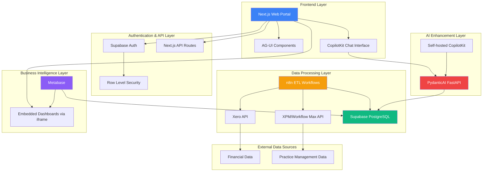

# High Level Architecture

### Technical Summary

XeroPulse employs a hybrid fullstack architecture combining Next.js frontend monolith with specialized microservices for AI and ETL processing. The platform leverages Vercel's edge network for the Next.js application, Supabase PostgreSQL for centralized data management with Row Level Security, n8n for automated ETL workflows, Metabase for embedded business intelligence, and PydanticAI for conversational analytics. This architecture achieves sub-3-second dashboard load times while maintaining enterprise-grade security and scalability for 20+ concurrent users processing daily financial data from Xero and XPM APIs.

### Platform and Infrastructure Choice

**Platform:** Vercel + Supabase Ecosystem

**Key Services:**
- **Frontend Hosting:** Vercel (Next.js optimized, global edge network)
- **Database & Auth:** Supabase (PostgreSQL with RLS, Auth, Real-time subscriptions)
- **ETL Processing:** n8n (cloud or self-hosted, workflow automation)
- **Business Intelligence:** Metabase (embedded dashboards, direct PostgreSQL connection)
- **AI Backend:** PydanticAI FastAPI (separate deployment, NFR service)

**Deployment Host and Regions:** 
- Primary: AWS Asia-Pacific (Sydney) for Australian financial compliance
- CDN: Global edge locations via Vercel network
- Database: Supabase AU region for data residency

**Rationale:** This combination provides rapid development velocity (Vercel + Next.js), enterprise-grade database capabilities (Supabase PostgreSQL), proven ETL automation (n8n), and industry-standard BI embedding (Metabase). The hybrid approach allows core functionality to remain performant while AI features operate independently as enhancement layers.

### Repository Structure

**Structure:** Monorepo with Next.js application + separate microservice repositories

**Monorepo Tool:** npm workspaces (lightweight, Next.js native)

**Package Organization:** 
- Core Next.js app contains frontend, API routes, and shared utilities
- Separate repositories for PydanticAI service and n8n workflows
- Shared TypeScript types package for API contracts between services

### High Level Architecture Diagram

### Architectural Patterns

- **Jamstack Architecture:** Static site generation with serverless API routes - _Rationale:_ Optimal performance and SEO for dashboard portal while maintaining dynamic capabilities
- **API-First Design:** All data access through well-defined API contracts - _Rationale:_ Enables independent development of frontend and backend services, supports future mobile apps
- **Database-per-Service with Shared PostgreSQL:** Logical separation via schemas and RLS policies - _Rationale:_ Maintains data consistency while enabling service autonomy
- **Event-Driven ETL:** n8n workflows triggered by webhooks and schedules - _Rationale:_ Decouples data ingestion from application logic, enables reliable retry mechanisms
- **Embedded Analytics:** Metabase dashboards integrated via secure iframe - _Rationale:_ Leverages enterprise BI capabilities without reinventing visualization engine
- **Microservice Enhancement:** PydanticAI as separate service for AI features - _Rationale:_ Isolates AI complexity, enables independent scaling and deployment
- **Progressive Enhancement:** Core functionality works without AI layer - _Rationale:_ Ensures reliability and graceful degradation if AI service unavailable

---

**Detailed Rationale:**

**Trade-offs and Key Decisions:**
- **Vercel vs. Self-hosted:** Chose Vercel for developer experience and performance over AWS/Azure for cost optimization. Vercel's Next.js integration and global CDN outweigh the higher hosting costs for a 20-user application
- **Hybrid Monolith-Microservice:** Core BI functionality in Next.js monolith for simplicity, AI features as microservice for isolation. Avoids microservice complexity while enabling AI innovation
- **Supabase vs. Custom PostgreSQL:** Supabase provides authentication, real-time features, and managed PostgreSQL with superior developer experience compared to managing separate auth + database services
- **n8n vs. Custom ETL:** n8n's visual workflow builder and extensive API connectors provide faster development than custom ETL scripts, with better maintainability for non-developers

**Key Assumptions:**
- 20 concurrent users don't require horizontal scaling (single Vercel deployment sufficient)
- Australian data residency requirements met by Supabase AU region
- Metabase embedding licensing suitable for internal use (not customer-facing)
- n8n cloud tier provides sufficient workflow execution for daily ETL requirements

**Areas Needing Validation:**
- Confirm Metabase licensing model for embedded dashboards in commercial application
- Validate n8n workflow execution limits align with expected data volumes
- Verify Supabase Row Level Security performance with complex role-based access patterns

Perfect! I notice there's a discrepancy I need to address. Your front-end spec mentions "Apache Superset dashboards" but our unified PRD and architecture conversation established **Metabase** as the BI platform. Let me proceed to the next section - **Tech Stack** - and align everything with our agreed architecture.

---

