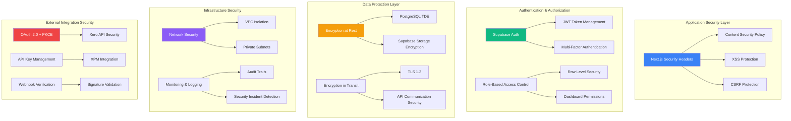

# Security Architecture

### Overview

XeroPulse implements a comprehensive defense-in-depth security strategy addressing authentication, authorization, data protection, and compliance requirements for Australian financial data. The architecture balances security rigor with operational efficiency, ensuring financial information remains protected while enabling seamless user experiences and AI-driven insights.

### Security Layers & Controls



### Authentication & Identity Management

**Supabase Auth Implementation**
```typescript
// Comprehensive authentication configuration
export const authConfig = {
  providers: {
    email: {
      enabled: true,
      confirmEmailChangeEnabled: true,
      securePasswordChangeEnabled: true
    }
  },
  security: {
    jwtSecret: process.env.SUPABASE_JWT_SECRET,
    jwtExpiry: 3600, // 1 hour
    refreshTokenRotation: true,
    reuseInterval: 10, // 10 seconds
    sessionTimeout: 28800 // 8 hours
  },
  passwordPolicy: {
    minLength: 12,
    requireUppercase: true,
    requireLowercase: true,
    requireNumbers: true,
    requireSpecialChars: true,
    preventCommonPasswords: true,
    preventUserInfoInPassword: true
  },
  rateLimiting: {
    loginAttempts: 5,
    lockoutDuration: 900, // 15 minutes
    passwordResetAttempts: 3,
    resetLockoutDuration: 3600 // 1 hour
  }
};

// Multi-factor authentication setup
export const mfaConfig = {
  enabled: true,
  methods: ['totp', 'sms'], // TOTP preferred, SMS fallback
  gracePeriod: 7200, // 2 hours for trusted devices
  backupCodes: {
    enabled: true,
    count: 10,
    singleUse: true
  }
};
```

**Session Management Security**
```typescript
// Secure session handling with automatic cleanup
export class SecureSessionManager {
  private readonly sessionConfig = {
    httpOnly: true,
    secure: process.env.NODE_ENV === 'production',
    sameSite: 'strict' as const,
    maxAge: 28800, // 8 hours
    domain: process.env.COOKIE_DOMAIN
  };

  async createSession(user: User): Promise<SecureSession> {
    const sessionId = this.generateSecureSessionId();
    const session = {
      id: sessionId,
      userId: user.id,
      organizationId: user.organization_id,
      role: user.role,
      createdAt: new Date(),
      lastActivity: new Date(),
      ipAddress: this.getClientIP(),
      userAgent: this.getUserAgent(),
      isActive: true
    };

    // Store session with automatic expiration
    await this.sessionStore.setWithExpiry(
      sessionId, 
      session, 
      this.sessionConfig.maxAge
    );

    // Log session creation for audit
    await this.auditLogger.logEvent({
      event: 'session_created',
      userId: user.id,
      metadata: {
        sessionId,
        ipAddress: session.ipAddress,
        userAgent: session.userAgent
      }
    });

    return session;
  }

  async validateSession(sessionId: string): Promise<SecureSession | null> {
    const session = await this.sessionStore.get(sessionId);
    
    if (!session) {
      return null;
    }

    // Check for session hijacking indicators
    const currentIP = this.getClientIP();
    const currentUserAgent = this.getUserAgent();

    if (session.ipAddress !== currentIP || session.userAgent !== currentUserAgent) {
      await this.invalidateSession(sessionId, 'security_violation');
      throw new SecurityError('Session security violation detected');
    }

    // Update last activity
    session.lastActivity = new Date();
    await this.sessionStore.setWithExpiry(
      sessionId, 
      session, 
      this.sessionConfig.maxAge
    );

    return session;
  }

  private generateSecureSessionId(): string {
    return crypto.randomBytes(32).toString('base64url');
  }
}
```

### Authorization & Access Control

**Role-Based Access Control (RBAC)**
```typescript
// Comprehensive permission matrix
export const permissionMatrix = {
  executive: {
    dashboards: ['financial_overview', 'management_summary', 'executive_kpis', 'client_profitability'],
    actions: ['view_all_data', 'export_reports', 'manage_users', 'configure_dashboards'],
    dataAccess: 'organization_wide',
    adminFunctions: ['user_management', 'system_configuration']
  },
  manager: {
    dashboards: ['team_performance', 'project_status', 'client_profitability', 'financial_summary'],
    actions: ['view_team_data', 'export_reports', 'manage_team_users'],
    dataAccess: 'team_and_assigned_clients',
    adminFunctions: ['team_user_management']
  },
  staff: {
    dashboards: ['personal_performance', 'assigned_projects', 'time_tracking'],
    actions: ['view_own_data', 'limited_export'],
    dataAccess: 'own_data_and_assigned_clients',
    adminFunctions: []
  },
  admin: {
    dashboards: ['system_health', 'audit_logs', 'sync_monitoring', 'user_activity'],
    actions: ['manage_all_users', 'system_configuration', 'security_monitoring'],
    dataAccess: 'system_wide',
    adminFunctions: ['full_system_administration']
  }
};

// Row Level Security policy generator
export class RLSPolicyManager {
  generateUserDataPolicy(tableName: string): string {
    return `
      CREATE POLICY "${tableName}_user_access" ON ${tableName}
      FOR ALL USING (
        CASE 
          WHEN auth.jwt() ->> 'role' = 'executive' THEN
            organization_id = (auth.jwt() ->> 'organization_id')::uuid
          WHEN auth.jwt() ->> 'role' = 'manager' THEN
            organization_id = (auth.jwt() ->> 'organization_id')::uuid
            AND (
              assigned_manager_id = (auth.jwt() ->> 'sub')::uuid
              OR client_id IN (
                SELECT client_id FROM user_client_assignments 
                WHERE user_id = (auth.jwt() ->> 'sub')::uuid
              )
            )
          WHEN auth.jwt() ->> 'role' = 'staff' THEN
            organization_id = (auth.jwt() ->> 'organization_id')::uuid
            AND (
              created_by = (auth.jwt() ->> 'sub')::uuid
              OR client_id IN (
                SELECT client_id FROM user_client_assignments 
                WHERE user_id = (auth.jwt() ->> 'sub')::uuid
              )
            )
          WHEN auth.jwt() ->> 'role' = 'admin' THEN
            organization_id = (auth.jwt() ->> 'organization_id')::uuid
          ELSE false
        END
      );
    `;
  }
}
```

### Data Protection & Encryption

**Encryption Strategy**
```typescript
// Comprehensive encryption configuration
export const encryptionConfig = {
  atRest: {
    database: {
      provider: 'supabase_managed',
      algorithm: 'AES-256-GCM',
      keyRotation: '90_days',
      backupEncryption: true
    },
    fileStorage: {
      provider: 'supabase_storage',
      algorithm: 'AES-256-GCM',
      clientSideEncryption: true
    },
    sessions: {
      provider: 'redis_encryption',
      algorithm: 'AES-256-GCM',
      keyDerivation: 'PBKDF2'
    }
  },
  inTransit: {
    apiCommunication: {
      protocol: 'TLS_1.3',
      certificateValidation: true,
      hsts: true,
      certificatePinning: false // Vercel managed
    },
    databaseConnections: {
      protocol: 'TLS_1.3',
      sslMode: 'require',
      certificateVerification: true
    },
    externalAPIs: {
      xero: 'TLS_1.3_with_certificate_validation',
      xpm: 'TLS_1.3_with_certificate_validation',
      metabase: 'TLS_1.3_internal_communication'
    }
  }
};

// Field-level encryption for sensitive data
export class FieldEncryption {
  private readonly encryptionKey: string;
  
  constructor() {
    this.encryptionKey = process.env.FIELD_ENCRYPTION_KEY;
  }

  async encryptSensitiveField(data: string): Promise<string> {
    const iv = crypto.randomBytes(16);
    const cipher = crypto.createCipher('aes-256-gcm', this.encryptionKey);
    cipher.setAAD(Buffer.from('additional_authenticated_data'));
    
    let encrypted = cipher.update(data, 'utf8', 'hex');
    encrypted += cipher.final('hex');
    
    const authTag = cipher.getAuthTag();
    
    return JSON.stringify({
      encrypted,
      iv: iv.toString('hex'),
      authTag: authTag.toString('hex')
    });
  }

  async decryptSensitiveField(encryptedData: string): Promise<string> {
    const { encrypted, iv, authTag } = JSON.parse(encryptedData);
    
    const decipher = crypto.createDecipher('aes-256-gcm', this.encryptionKey);
    decipher.setAAD(Buffer.from('additional_authenticated_data'));
    decipher.setAuthTag(Buffer.from(authTag, 'hex'));
    
    let decrypted = decipher.update(encrypted, 'hex', 'utf8');
    decrypted += decipher.final('utf8');
    
    return decrypted;
  }
}
```

### Network Security & Infrastructure Protection

**Application Security Headers**
```typescript
// Comprehensive security headers configuration
export const securityHeaders = {
  'Content-Security-Policy': [
    "default-src 'self'",
    "script-src 'self' 'unsafe-eval' https://metabase.xeropulse.com",
    "style-src 'self' 'unsafe-inline' https://fonts.googleapis.com",
    "font-src 'self' https://fonts.gstatic.com",
    "img-src 'self' data: blob: https://supabase.xeropulse.com",
    "connect-src 'self' https://supabase.xeropulse.com https://api.xeropulse.com wss://supabase.xeropulse.com",
    "frame-src 'self' https://metabase.xeropulse.com",
    "frame-ancestors 'none'",
    "base-uri 'self'",
    "form-action 'self'",
    "upgrade-insecure-requests"
  ].join('; '),
  
  'Strict-Transport-Security': 'max-age=63072000; includeSubDomains; preload',
  'X-Frame-Options': 'SAMEORIGIN',
  'X-Content-Type-Options': 'nosniff',
  'X-XSS-Protection': '1; mode=block',
  'Referrer-Policy': 'strict-origin-when-cross-origin',
  'Permissions-Policy': [
    'camera=()',
    'microphone=()',
    'geolocation=()',
    'payment=()',
    'usb=()',
    'magnetometer=()',
    'accelerometer=()',
    'gyroscope=()'
  ].join(', '),
  
  'Cross-Origin-Embedder-Policy': 'require-corp',
  'Cross-Origin-Opener-Policy': 'same-origin',
  'Cross-Origin-Resource-Policy': 'same-origin'
};

// CORS configuration for API security
export const corsConfig = {
  origin: [
    'https://app.xeropulse.com',
    'https://staging.xeropulse.com',
    ...(process.env.NODE_ENV === 'development' ? ['http://localhost:3000'] : [])
  ],
  credentials: true,
  methods: ['GET', 'POST', 'PUT', 'DELETE', 'OPTIONS'],
  allowedHeaders: [
    'Content-Type',
    'Authorization',
    'X-Requested-With',
    'X-CSRF-Token'
  ],
  exposedHeaders: ['X-Total-Count', 'X-Rate-Limit-Remaining'],
  maxAge: 86400 // 24 hours
};
```

### Security Monitoring & Incident Response

**Security Event Logging**
```typescript
// Comprehensive security audit logging
export class SecurityAuditLogger {
  private readonly sensitiveEvents = [
    'authentication_failure',
    'authorization_violation',
    'data_access_attempt',
    'configuration_change',
    'user_privilege_escalation',
    'suspicious_activity',
    'session_anomaly'
  ];

  async logSecurityEvent(event: SecurityEvent): Promise<void> {
    const auditEntry = {
      timestamp: new Date().toISOString(),
      eventType: event.type,
      severity: this.calculateSeverity(event),
      userId: event.userId,
      organizationId: event.organizationId,
      ipAddress: event.ipAddress,
      userAgent: event.userAgent,
      sessionId: event.sessionId,
      resource: event.resource,
      action: event.action,
      outcome: event.outcome,
      metadata: event.metadata,
      riskScore: this.calculateRiskScore(event)
    };

    // Store in secure audit log
    await this.auditStore.store(auditEntry);

    // Alert on high-severity events
    if (auditEntry.severity === 'HIGH' || auditEntry.riskScore > 80) {
      await this.securityAlertService.sendAlert(auditEntry);
    }

    // Check for patterns indicating potential threats
    await this.threatDetectionService.analyzeEvent(auditEntry);
  }

  private calculateRiskScore(event: SecurityEvent): number {
    let score = 0;

    // Failed authentication attempts
    if (event.type === 'authentication_failure') {
      score += 20;
    }

    // Access to sensitive data
    if (event.resource?.includes('financial_data')) {
      score += 30;
    }

    // Administrative actions
    if (event.action?.includes('admin')) {
      score += 25;
    }

    // Unusual access patterns
    if (event.metadata?.unusual_time || event.metadata?.unusual_location) {
      score += 35;
    }

    return Math.min(score, 100);
  }
}
```

**Threat Detection & Response**
```typescript
// Automated threat detection and response
export class ThreatDetectionService {
  private readonly suspiciousPatterns = [
    {
      name: 'brute_force_attack',
      condition: 'failed_login_attempts > 10 in 5 minutes',
      response: 'lock_account_and_alert'
    },
    {
      name: 'data_exfiltration_attempt',
      condition: 'large_data_export + unusual_access_time',
      response: 'block_action_and_alert'
    },
    {
      name: 'privilege_escalation',
      condition: 'role_change + immediate_sensitive_access',
      response: 'revert_and_alert'
    },
    {
      name: 'session_hijacking',
      condition: 'ip_change + user_agent_change + concurrent_sessions',
      response: 'invalidate_sessions_and_alert'
    }
  ];

  async analyzeEvent(auditEntry: AuditEntry): Promise<void> {
    // Analyze current event against known threat patterns
    const threats = await this.detectThreats(auditEntry);

    for (const threat of threats) {
      await this.respondToThreat(threat, auditEntry);
    }

    // Update user risk profile
    await this.updateUserRiskProfile(auditEntry.userId, auditEntry.riskScore);
  }

  private async respondToThreat(threat: ThreatPattern, event: AuditEntry): Promise<void> {
    switch (threat.response) {
      case 'lock_account_and_alert':
        await this.userService.lockAccount(event.userId, threat.name);
        await this.alertService.sendSecurityAlert('account_locked', event);
        break;

      case 'block_action_and_alert':
        await this.sessionService.blockCurrentAction(event.sessionId);
        await this.alertService.sendSecurityAlert('action_blocked', event);
        break;

      case 'revert_and_alert':
        await this.auditService.revertLastAction(event);
        await this.alertService.sendSecurityAlert('action_reverted', event);
        break;

      case 'invalidate_sessions_and_alert':
        await this.sessionService.invalidateAllUserSessions(event.userId);
        await this.alertService.sendSecurityAlert('sessions_invalidated', event);
        break;
    }
  }
}
```

### Compliance & Data Governance

**Australian Privacy Act Compliance**
```typescript
// Privacy and data protection compliance
export const privacyCompliance = {
  dataRetention: {
    userSessions: '90_days',
    auditLogs: '7_years', // Australian financial record keeping requirements
    financialData: '7_years',
    conversationHistory: '2_years',
    systemLogs: '1_year'
  },
  
  dataProcessing: {
    consentRequired: ['conversational_ai', 'analytics', 'marketing'],
    lawfulBasis: 'legitimate_interest', // For financial reporting
    dataMinimization: true,
    purposeLimitation: true,
    accuracyEnsurance: true
  },
  
  userRights: {
    accessRequest: {
      enabled: true,
      responseTime: '30_days',
      format: 'structured_data'
    },
    rectification: {
      enabled: true,
      automated: false, // Manual review for financial data
      auditTrail: true
    },
    erasure: {
      enabled: true,
      exceptions: ['financial_records', 'audit_requirements'],
      softDelete: true
    },
    portability: {
      enabled: true,
      format: 'csv_export',
      scope: 'user_generated_content'
    }
  }
};

// Data classification and handling
export class DataClassificationService {
  private readonly classificationLevels = {
    PUBLIC: {
      description: 'Information that can be freely shared',
      handling: 'standard_security',
      retention: 'unlimited'
    },
    INTERNAL: {
      description: 'Information for internal business use',
      handling: 'access_control_required',
      retention: 'business_requirements'
    },
    CONFIDENTIAL: {
      description: 'Sensitive business information',
      handling: 'restricted_access_encryption',
      retention: 'regulatory_minimum'
    },
    HIGHLY_CONFIDENTIAL: {
      description: 'Financial data and personal information',
      handling: 'strict_access_control_field_encryption',
      retention: '7_years_minimum'
    }
  };

  classifyData(dataType: string, content: any): DataClassification {
    if (this.isFinancialData(dataType, content)) {
      return 'HIGHLY_CONFIDENTIAL';
    }
    
    if (this.isPersonalData(dataType, content)) {
      return 'CONFIDENTIAL';
    }
    
    if (this.isBusinessData(dataType, content)) {
      return 'INTERNAL';
    }
    
    return 'PUBLIC';
  }
}
```

### Security Testing & Validation

**Automated Security Testing**
```typescript
// Security testing configuration
export const securityTestingConfig = {
  staticAnalysis: {
    tools: ['eslint-security', 'semgrep', 'snyk'],
    schedule: 'on_every_commit',
    failBuild: true
  },
  
  dependencyScanning: {
    tools: ['npm-audit', 'snyk', 'github-security-advisories'],
    schedule: 'daily',
    autoFix: 'minor_updates_only'
  },
  
  dynamicTesting: {
    tools: ['owasp-zap', 'burp-suite-enterprise'],
    schedule: 'weekly',
    scope: ['authentication', 'authorization', 'data_access']
  },
  
  penetrationTesting: {
    frequency: 'quarterly',
    scope: 'full_application',
    compliance: ['owasp_top_10', 'australian_privacy_act']
  }
};
`

---

**Detailed Rationale:**

**Defense-in-Depth Strategy**: Multiple security layers ensure that if one control fails, others provide protection. Application security headers prevent common web attacks, authentication provides identity verification, authorization controls data access, and encryption protects data confidentiality.

**Zero-Trust Architecture**: Every request is authenticated and authorized regardless of source. Row Level Security policies ensure database-level access control that cannot be bypassed by application vulnerabilities.

**Australian Compliance Focus**: Data retention policies, audit trails, and privacy controls specifically address Australian Privacy Act and financial record-keeping requirements. Data residency through Supabase AU region ensures compliance with local regulations.

**Automated Threat Detection**: Real-time security monitoring with automated response capabilities reduces incident response time and limits damage from security breaches. Risk scoring helps prioritize security alerts and responses.

**Security by Design**: Security controls are integrated into the architecture from the beginning rather than added as an afterthought. This ensures comprehensive protection without performance degradation.

**Key Assumptions**: Supabase provides enterprise-grade security controls and compliance certifications. Vercel's security infrastructure meets Australian hosting requirements. External APIs (Xero/XPM) maintain current security standards and practices.

**Validation Needs**: Penetration testing of complete application stack to validate security controls. Compliance audit against Australian Privacy Act requirements. Security performance testing to ensure controls don't impact user experience. Incident response testing to validate detection and response procedures.

---

# Document Summary

This comprehensive fullstack architecture document provides complete technical guidance for building XeroPulse, covering:

- **Platform Architecture**: Hybrid Next.js monolith with AI microservices on Vercel + Supabase ecosystem
- **Technology Stack**: Next.js 14+, AG-UI Enterprise, TypeScript, Supabase PostgreSQL, Metabase, n8n, PydanticAI
- **Data Architecture**: Normalized schema with RLS policies, optimized indexes, and audit trails
- **API Design**: Hybrid tRPC + REST approach with end-to-end type safety
- **Component Structure**: Atomic design patterns with clear separation of concerns
- **External Integrations**: Xero, XPM, and Metabase with secure authentication patterns
- **Core Workflows**: Data synchronization, authentication, dashboard embedding, and user management
- **Deployment Strategy**: Multi-environment cloud-native architecture with Australian data residency
- **Security Framework**: Defense-in-depth with authentication, authorization, encryption, and threat detection
- **Compliance**: Australian Privacy Act and financial record-keeping requirements

This architecture serves as the single source of truth for AI-driven development, ensuring consistency, security, and performance across the entire XeroPulse platform.
