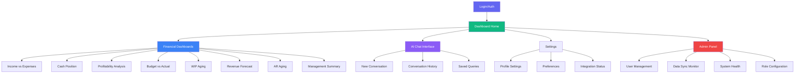
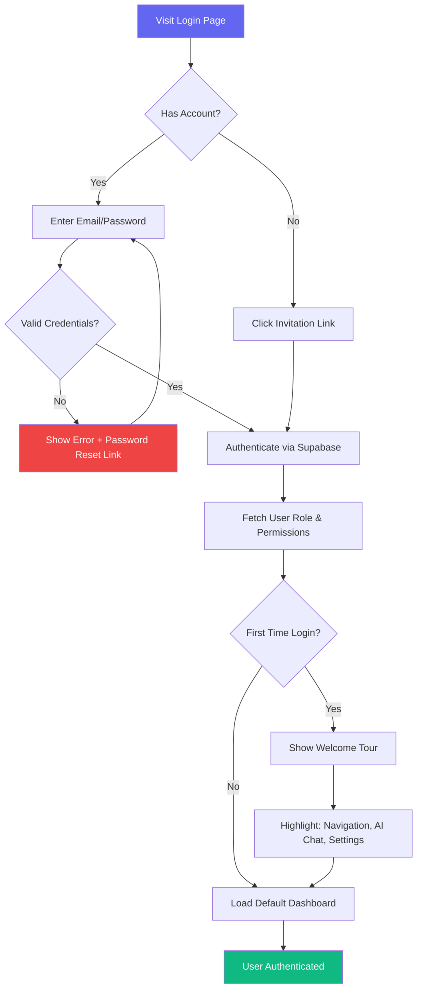
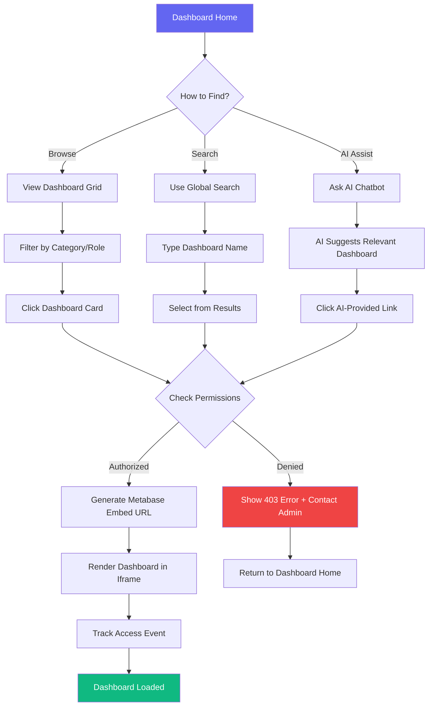
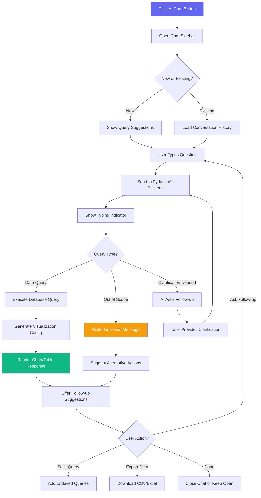
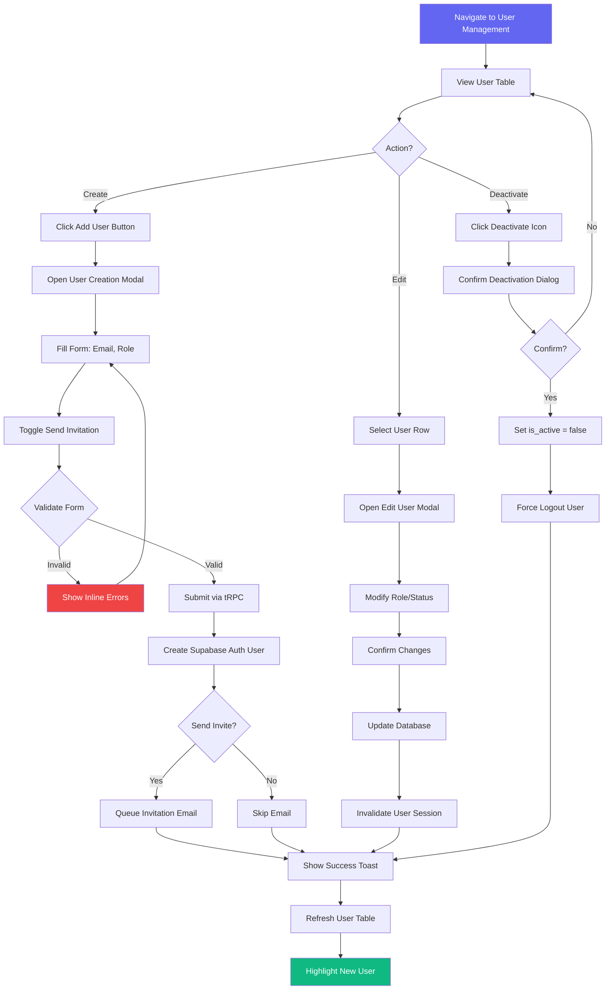

# XeroPulse UI/UX Specification

## Introduction

This document defines the user experience goals, information architecture, user flows, and visual design specifications for XeroPulse's user interface. It serves as the foundation for visual design and frontend development, ensuring a cohesive and user-centered experience.

### Overall UX Goals & Principles

#### Target User Personas

**1. Finance Executives** - Senior decision-makers who need high-level financial insights and forecasting capabilities. They require intuitive dashboards that distill complex financial data into actionable intelligence, with minimal time investment.

**2. Finance Managers** - Mid-level professionals who manage day-to-day financial operations and team coordination. They need comprehensive dashboard access with the ability to drill down into details, export data, and monitor team activities.

**3. Staff Accountants** - Entry-level financial professionals focused on specific client portfolios. They require focused, task-oriented interfaces for AR aging management and client-specific financial tracking with clear guidance.

**4. System Administrators** - Technical users responsible for platform configuration, user management, and integration health monitoring. They need robust admin tools with clear status indicators and troubleshooting capabilities.

#### Usability Goals

1. **Instant Insight Access**: Users can access their most critical financial dashboards within 3 seconds of login
2. **Zero-Training Onboarding**: New users can navigate to their authorized dashboards and perform basic tasks within 5 minutes without training
3. **Conversational Intelligence**: Users can ask natural language questions about their financial data and receive meaningful answers within 10 seconds
4. **Error Prevention**: Clear validation, confirmation dialogs for destructive actions, and proactive guidance prevent costly mistakes
5. **Cross-Device Continuity**: Seamless experience across desktop and tablet devices with responsive adaptation maintaining functionality

#### Design Principles

1. **Data Clarity Over Visual Complexity** - Financial data presentation prioritizes readability, accurate representation, and actionable insights over aesthetic embellishment
2. **Progressive Disclosure by Role** - Show only what's relevant to each user's role and responsibilities, revealing advanced features contextually
3. **Conversational-First Analytics** - Natural language interaction complements traditional dashboards, making data exploration intuitive for all skill levels
4. **Consistent Enterprise Patterns** - Leverage familiar UI patterns from professional tools, reducing cognitive load and accelerating adoption
5. **Accessible & Inclusive by Default** - WCAG AA compliance is non-negotiable, with high-contrast themes and comprehensive keyboard navigation

### Change Log

| Date | Version | Description | Author |
|------|---------|-------------|--------|
| 2025-10-25 | 2.0 | Updated UI/UX specification: Migrated from Shadcn/ui v4 to Chakra UI + AG-UI hybrid approach | Winston (Architect) + Sally (UX Expert) |
| 2025-10-22 | 1.0 | Initial UI/UX specification aligned with Next.js + AG-UI + Shadcn v4 + Metabase architecture | Sally (UX Expert) |

---

## Information Architecture (IA)

### Site Map / Screen Inventory



### Navigation Structure

**Primary Navigation (Sidebar):**
- Dashboard-centric navigation with collapsible sections organized by functional area
- Role-based visibility: Admin-only sections hidden from standard users
- Active state indicators with accent color highlighting current location
- Keyboard shortcuts for power users (e.g., Alt+1-8 for dashboard quick access)

**Secondary Navigation (Header):**
- Global search for dashboards and AI conversation history
- Notification center for data sync status and system alerts
- User menu with profile, settings, and logout actions
- Theme toggle (light/dark mode)

**Breadcrumb Strategy:**
- Simple breadcrumb trail for admin panel multi-level navigation
- Dashboard views show: Dashboard Home > [Dashboard Name]
- Admin areas show: Admin > [Section] > [Sub-section]

---

## User Flows

### Flow 1: User Authentication & First-Time Login

**User Goal:** Securely access the XeroPulse platform and reach relevant dashboards

**Entry Points:**
- Direct URL navigation to app.xeropulse.com
- Email invitation link with pre-authenticated token

**Success Criteria:**
- User successfully authenticates and lands on their default dashboard within 10 seconds
- First-time users see welcome tooltip highlighting key features

#### Flow Diagram



#### Edge Cases & Error Handling:
- **Invalid credentials**: Show specific error message, offer password reset, limit to 5 attempts before temporary lockout
- **Expired invitation**: Redirect to contact admin page with clear explanation
- **Network timeout**: Show retry option with offline indicator
- **Session expiration**: Auto-save conversation state, prompt re-authentication without data loss

**Notes:** Welcome tour dismissible but accessible from settings. Password reset flow uses Supabase Auth email templates.

---

### Flow 2: Dashboard Discovery & Access

**User Goal:** Find and access relevant financial dashboards based on role and current task

**Entry Points:**
- Dashboard Home landing page after login
- Navigation sidebar dashboard list
- Global search for specific dashboard
- AI chat recommendation ("Show me AR aging dashboard")

**Success Criteria:**
- User can identify and access needed dashboard within 15 seconds
- Dashboard loads with proper role-based data filtering applied

#### Flow Diagram



#### Edge Cases & Error Handling:
- **Dashboard load timeout**: Show loading skeleton for max 10 seconds, then error with retry option
- **Metabase service unavailable**: Display cached dashboard screenshot with "Live data unavailable" message
- **Missing permissions**: Clear explanation of why access denied, option to request access from admin
- **Concurrent session limit**: Warn user about existing session, offer to close old session

**Notes:** Dashboard cards show last viewed timestamp, favorites marked with star icon, recent dashboards appear at top.

---

### Flow 3: Conversational AI Data Exploration

**User Goal:** Ask natural language questions about business data and receive insightful answers with visualizations

**Entry Points:**
- AI Chat button in header (always accessible)
- Inline "Ask AI" prompts within dashboard views
- Quick query suggestions on Dashboard Home

**Success Criteria:**
- AI responds to queries within 10 seconds with relevant data
- Responses include visualizations when appropriate
- User can refine queries through conversational follow-ups

#### Flow Diagram



#### Edge Cases & Error Handling:
- **AI service timeout**: Apologize, suggest trying simpler query, offer fallback to standard dashboards
- **Ambiguous query**: AI requests clarification with multiple interpretation options
- **Data access violation**: Politely explain role-based restrictions without exposing security details
- **Streaming response failure**: Fall back to complete response mode, log error for debugging

**Notes:** CopilotKit self-hosted configuration ensures data privacy. Conversation context maintained for 30 minutes of inactivity.

---

### Flow 4: Admin User Management

**User Goal:** Create, modify, and manage user accounts with appropriate role assignments and permissions

**Entry Points:**
- Admin Panel > User Management section
- Quick action: "Add New User" button in header (admin only)

**Success Criteria:**
- Admin can create new user and send invitation in under 60 seconds
- Role changes apply immediately without requiring user re-login
- Audit trail maintained for all user management actions

#### Flow Diagram



#### Edge Cases & Error Handling:
- **Duplicate email**: Show error, offer to resend invitation to existing user
- **Email service failure**: Create user anyway, show warning that manual invitation needed
- **Role change on active session**: Force session invalidation, notify user via email
- **Self-deactivation attempt**: Block action, require another admin to deactivate admin accounts

**Notes:** User table includes search, filter by role, sort by last login. Batch actions available for multi-user operations.

---

## Wireframes & Mockups

### Primary Design Files

**Figma Design System:** [To be created - XeroPulse Design System v1.0]

All high-fidelity mockups, component specifications, and interactive prototypes will be maintained in Figma with version control and developer handoff annotations.

### Key Screen Layouts

#### 1. Dashboard Home (Landing Page)

**Purpose:** Central hub for accessing dashboards, AI chat, and quick actions. First screen after successful authentication.

**Key Elements:**
- **Hero Section**: Welcome message with user name, current date/time, last data sync timestamp
- **Dashboard Grid**: Role-filtered cards showing authorized dashboards with thumbnails, names, and descriptions
- **Quick Stats Bar**: Key metrics pulled from most recent dashboard data (revenue, expenses, AR total, WIP value)
- **AI Chat Prompt**: Persistent button in bottom-right corner with suggested starter queries
- **Recent Activity**: Last 5 accessed dashboards for quick re-access
- **System Status Indicator**: Subtle badge showing Xero/XPM connection health

**Interaction Notes:**
- Dashboard cards have hover state revealing "Open" and "Add to Favorites" actions
- Grid layout adapts: 4 columns on desktop (1920px+), 3 on laptop (1440px), 2 on tablet (768px)
- Lottie animation plays on first load showing data flowing from sources to dashboards

**Design File Reference:** `Figma > Screens > 01-Dashboard-Home`

---

#### 2. Embedded Dashboard View

**Purpose:** Full-screen immersive view of Metabase dashboard with minimal chrome to maximize data visibility

**Key Elements:**
- **Minimal Header**: Breadcrumb navigation, dashboard title, refresh button, export options
- **Metabase Iframe**: Full-width embedded dashboard with seamless styling integration
- **Floating AI Assistant**: Compact chat bubble that expands on click without blocking dashboard content
- **Action Toolbar**: Sticky bottom toolbar with "Ask about this data", "Share", "Add to Favorites", "Full Screen"

**Interaction Notes:**
- Header auto-hides on scroll down, reveals on scroll up for maximum screen real estate
- AI assistant context-aware: understands current dashboard and can answer questions about visible data
- Metabase iframe communicates scroll position to parent for synchronized UI behavior
- Loading state shows shimmer skeleton matching dashboard layout

**Design File Reference:** `Figma > Screens > 02-Dashboard-Embedded-View`

---

#### 3. AI Chat Interface

**Purpose:** Conversational analytics panel for natural language data queries with rich response formatting

**Key Elements:**
- **Conversation Header**: "AI Assistant" title, conversation date, minimize/close controls
- **Message Thread**: Scrollable chat history with user/AI message alternation
- **Rich Response Rendering**: Support for text, tables, charts (via Recharts), code blocks
- **Input Area**: Multi-line text input with auto-expand, send button, voice input icon (future)
- **Suggested Queries**: Context-aware quick actions based on current view and user role
- **Conversation Management**: Save, rename, delete conversations; browse history

**Interaction Notes:**
- Typing indicators with Lottie animation showing AI "thinking"
- Charts rendered inline can be expanded to full-screen modal
- Data tables support sorting, filtering, and export to CSV
- Markdown formatting in AI responses with syntax highlighting for code
- Suggested queries appear as chips below input when thread is empty

**Design File Reference:** `Figma > Screens > 03-AI-Chat-Interface`

---

#### 4. User Management (Admin Panel)

**Purpose:** Comprehensive user administration interface for creating, editing, and monitoring system users

**Key Elements:**
- **User Table** (AG-UI DataGrid): Email, Role, Status, Last Login, Created Date columns with sorting/filtering
- **Action Buttons**: Add User, Bulk Edit, Export User List
- **Quick Filters**: Active/Inactive toggle, Role dropdown filter, Search by email
- **User Detail Modal**: Full user information with edit capabilities and audit log
- **Batch Action Bar**: Appears when multiple users selected, offers role change and deactivation

**Interaction Notes:**
- Table supports infinite scroll with virtualization for 1000+ users
- Inline editing for role field with immediate save on change
- Status badges color-coded: Active (green), Inactive (gray), Pending Invite (amber)
- Confirmation dialogs for destructive actions with "Are you sure?" pattern
- Success/error states communicated via toast notifications with undo option where applicable

**Design File Reference:** `Figma > Screens > 04-Admin-User-Management`

---

## Component Library / Design System

### Design System Approach

**Foundation:** Chakra UI (Free/Open Source) provides the accessible, production-ready component foundation with built-in WCAG 2.0 AA compliance, theme customization, and type-safe styling. Chakra UI Motion (integrated Framer Motion) handles all animations and micro-interactions.

**Enterprise Enhancement:** AG-UI Enterprise components integrated for 4 complex data grids requiring advanced features (user management, WIP analysis, services analysis, client recoverability). This hybrid approach retains enterprise-grade table capabilities while maximizing developer experience for 95% of UI components.

**Custom Extensions:** XeroPulse-specific components built on Chakra UI primitives for dashboard cards, AI chat interface, Metabase embedding, and role-based navigation.

**Implementation Strategy:**
- All components built with TypeScript for type safety
- **Chakra UI Style Props** for component styling with responsive design tokens (no Tailwind dependency)
- **Chakra UI Motion** for animations and transitions (integrated Framer Motion)
- **Chakra Icons** + Lucide React for iconography with custom financial icons
- React Hook Form + Zod for form validation (integrates with Chakra's FormControl)
- **Chakra UI MCP Server** for component examples and accessibility patterns

**Why Chakra UI?**
1. ✅ **MCP Integration**: 30-40% faster development with instant component examples
2. ✅ **Built-in Accessibility**: WCAG 2.0 AA compliant by default
3. ✅ **Motion System**: Integrated animations (no separate setup)
4. ✅ **Type-Safe Styling**: Style props with TypeScript autocomplete
5. ✅ **Zero Cost**: Open-source, fits $15/month budget
6. ✅ **Powerful Theming**: Design tokens, component variants, dark mode support

**Hybrid Approach - Chakra UI + AG-UI:**
- **Chakra UI (95%)**: Forms, layouts, navigation, modals, cards, buttons, feedback
- **AG-UI (5%)**: User management table, WIP table, services table, recoverability table
- **Integration**: Use Chakra theme tokens for AG-UI styling consistency

---

### Core Components

#### Button

**Chakra UI Component:** `<Button />` from `@chakra-ui/react`

**Purpose:** Primary interaction element for triggering actions throughout the application

**Variants** (using `variant` prop):
- `solid`: Solid fill with primary color, used for primary actions (Login, Submit, Create) - **default**
- `outline`: Outline style with secondary color, used for secondary actions (Cancel, Back)
- `ghost`: Transparent background, used for tertiary actions (Close, Dismiss)
- `link`: Styled as hyperlink, used for navigation within text

**Color Schemes** (using `colorScheme` prop):
- `brand`: Primary blue (#3B82F6) for main actions
- `red`: Red scheme for dangerous actions (Delete, Deactivate)
- `gray`: Gray scheme for neutral actions
- `green`: Green scheme for success actions (Approve, Confirm)

**States** (built-in Chakra):
- Default, Hover, Active, Focus (keyboard), Disabled, Loading (spinner icon automatic)

**Sizes** (using `size` prop):
- `sm`: 32px height, compact for dense interfaces
- `md`: 40px height (default), standard size
- `lg`: 48px height, large touch targets for mobile

**Usage Guidelines:**
- Use `colorScheme="brand"` sparingly for most important action per screen
- Loading state: Use `isLoading` prop - shows spinner, prevents re-clicks automatically
- Disabled state: Use `isDisabled` prop with Tooltip explaining why action unavailable
- Icon support: Use `leftIcon` or `rightIcon` props with Chakra Icons

**Example:**
```tsx
import { Button } from '@chakra-ui/react'

// Primary action
<Button colorScheme="brand" size="md">Login</Button>

// Secondary action
<Button variant="outline" colorScheme="gray">Cancel</Button>

// Dangerous action with confirmation
<Button colorScheme="red" leftIcon={<DeleteIcon />}>Delete User</Button>

// Loading state
<Button isLoading loadingText="Saving...">Save Changes</Button>
```

---

#### Input Fields

**Chakra UI Components:** `<Input />`, `<Textarea />`, `<FormControl />`, `<FormLabel />`, `<FormErrorMessage />` from `@chakra-ui/react`

**Purpose:** Text entry for forms, search, and data input with comprehensive validation feedback

**Input Types** (using `type` prop):
- `text`: Standard text input
- `email`: Email-specific validation and keyboard
- `password`: Masked input (use `<InputGroup>` with `<InputRightElement>` for show/hide toggle)
- `number`: Numeric input
- `search`: Search input (use `<InputGroup>` with `<InputLeftElement>` for icon)

**Textarea:** Use `<Textarea />` component for multi-line text with `resize` prop

**States** (Chakra provides built-in visual feedback):
- Default, Focus, Error (`isInvalid` prop), Disabled (`isDisabled` prop), Read-only (`isReadOnly` prop)

**Sizes** (using `size` prop):
- `sm`: 32px height, compact for dense forms
- `md`: 40px height (default), standard size
- `lg`: 48px height, better touch targets

**Usage Guidelines:**
- Always wrap with `<FormControl>` for accessibility
- Use `<FormLabel>` for labels (automatically associates with input)
- Use `<FormErrorMessage>` for validation errors (only shows when `isInvalid={true}`)
- Use `<FormHelperText>` for additional context
- Use `<InputGroup>` with `<InputLeftElement>` / `<InputRightElement>` for icons

**Example:**
```tsx
import {
  FormControl, FormLabel, FormErrorMessage, FormHelperText,
  Input, InputGroup, InputLeftElement, InputRightElement
} from '@chakra-ui/react'
import { EmailIcon, ViewIcon, ViewOffIcon } from '@chakra-ui/icons'

// Standard text input with validation
<FormControl isInvalid={errors.email}>
  <FormLabel>Email Address</FormLabel>
  <InputGroup>
    <InputLeftElement>
      <EmailIcon color="gray.400" />
    </InputLeftElement>
    <Input type="email" placeholder="you@example.com" {...register('email')} />
  </InputGroup>
  <FormErrorMessage>{errors.email?.message}</FormErrorMessage>
</FormControl>

// Password input with show/hide toggle
const [show, setShow] = useState(false)
<FormControl>
  <FormLabel>Password</FormLabel>
  <InputGroup>
    <Input type={show ? 'text' : 'password'} placeholder="Enter password" />
    <InputRightElement>
      <Button size="sm" onClick={() => setShow(!show)}>
        {show ? <ViewOffIcon /> : <ViewIcon />}
      </Button>
    </InputRightElement>
  </InputGroup>
</FormControl>
```

---

#### Card

**Chakra UI Components:** `<Card />`, `<CardHeader />`, `<CardBody />`, `<CardFooter />` from `@chakra-ui/react`

**Purpose:** Container component for grouping related content, used extensively for dashboard previews and content sections

**Variants** (using `variant` prop):
- `elevated`: Standard card with shadow (default)
- `outline`: Border-only variant for subtle containers
- `filled`: Filled background variant
- `unstyled`: No styling, for custom designs

**Sizes** (using `size` prop):
- `sm`: Compact padding
- `md`: Standard padding (default)
- `lg`: Large padding for emphasis

**States:**
- Default, Hover (use Chakra UI Motion for interactive cards), Selected (custom styling), Loading (use `<Skeleton />` wrapper)

**Usage Guidelines:**
- Dashboard cards use `variant="elevated"` with Chakra UI Motion for hover lift effect
- Always use semantic structure: `<Card>` → `<CardHeader>` → `<CardBody>` → `<CardFooter>`
- Use `<Heading>` in `<CardHeader>` for card titles
- Interactive cards wrap in `<MotionBox>` for hover animations

**Example:**
```tsx
import { Card, CardHeader, CardBody, CardFooter, Heading, Text, Button } from '@chakra-ui/react'
import { MotionBox } from '@/components/ui/motion'

// Standard dashboard card
<Card variant="elevated">
  <CardHeader>
    <Heading size="md">Income vs Expenses</Heading>
  </CardHeader>
  <CardBody>
    <Text>View your weekly cash flow analysis</Text>
  </CardBody>
  <CardFooter>
    <Button colorScheme="brand">View Dashboard</Button>
  </CardFooter>
</Card>

// Interactive card with hover animation
<MotionBox whileHover={{ y: -4, shadow: "lg" }} transition={{ duration: 0.2 }}>
  <Card variant="elevated" cursor="pointer">
    <CardHeader>
      <Heading size="sm">Dashboard Card</Heading>
    </CardHeader>
    <CardBody>
      <Text>Hover to see lift effect</Text>
    </CardBody>
  </Card>
</MotionBox>
```
- Card header includes title, optional subtitle, optional action menu
- Card footer for metadata (last updated, data source indicator)
- Loading skeleton maintains card dimensions to prevent layout shift

---

#### Badge

**Chakra UI Component:** `<Badge />` from `@chakra-ui/react`

**Purpose:** Small status indicators for roles, statuses, and categorical labels

**Variants** (using `variant` prop):
- `solid`: Solid background with contrasting text (default)
- `subtle`: Soft background with colored text
- `outline`: Border with colored text

**Color Schemes** (using `colorScheme` prop):
- **Roles**: `purple` (Executive), `blue` (Manager), `green` (Staff), `red` (Admin)
- **Status**: `green` (Active), `gray` (Inactive), `red` (Error), `yellow` (Warning)
- **Category**: `blue` (Financial), `teal` (Operational), `purple` (Executive)

**States:**
- Static (most common), Removable (wrap with `<Tag>` for close button)

**Usage Guidelines:**
- Use `colorScheme` prop for semantic color coding
- Use sparingly to avoid visual clutter
- Always pair color with icon or text for colorblind accessibility
- Size variants: `sm`, `md` (default), `lg`
- For removable badges, use `<Tag>` with `<TagCloseButton>` instead

**Example:**
```tsx
import { Badge, Tag, TagLabel, TagCloseButton } from '@chakra-ui/react'

// Role badge
<Badge colorScheme="purple" variant="solid">Executive</Badge>

// Status badge
<Badge colorScheme="green" variant="subtle">Active</Badge>

// Removable filter tag
<Tag colorScheme="blue" variant="solid">
  <TagLabel>Budget Dashboard</TagLabel>
  <TagCloseButton onClick={removeFilter} />
</Tag>
```

---

#### Data Table (Hybrid: Chakra UI + AG-UI)

**Purpose:** Data tables optimized by complexity - simple tables use Chakra UI, complex grids use AG-UI Enterprise

**Chakra UI Table** (for simple tables <10 columns, no advanced features):
- Use `<Table>`, `<Thead>`, `<Tbody>`, `<Tr>`, `<Th>`, `<Td>` from `@chakra-ui/react`
- Best for: Dashboard lists, simple data display, read-only tables
- Features: Basic sorting, responsive design, accessible markup
- Styling: Variants include `simple`, `striped`, `unstyled`

**AG-UI Enterprise** (for 4 complex data grids only):
1. **User Management Table** (Admin panel)
2. **WIP Analysis Table** (Dashboard 4)
3. **Services Analysis Table** (Dashboard 6)
4. **Client Recoverability Table** (Dashboard 8)

**AG-UI Features:**
- Column sorting (single and multi-column)
- Column filtering (text search, select dropdowns, date ranges)
- Column visibility toggle
- Row selection (single, multiple, all)
- Inline editing with validation
- Export to CSV/Excel
- Grouping and aggregation
- Virtualization for large datasets

**Usage Guidelines:**
- **Decision Rule**: Use Chakra Table unless you need AG-UI's advanced features
- AG-UI default page size: 50 rows with options for 25, 50, 100, 200
- Wrap AG-UI in Chakra `<Box>` for consistent spacing and styling
- Use Chakra theme tokens for AG-UI styling where possible
- Skeleton loading for async data fetching (use Chakra `<Skeleton>`)
- Empty state with Chakra `<EmptyState>` component

**Example (Chakra Table):**
```tsx
import { Table, Thead, Tbody, Tr, Th, Td, TableContainer } from '@chakra-ui/react'

<TableContainer>
  <Table variant="striped" colorScheme="gray">
    <Thead>
      <Tr>
        <Th>Dashboard</Th>
        <Th>Last Viewed</Th>
        <Th>Favorites</Th>
      </Tr>
    </Thead>
    <Tbody>
      <Tr>
        <Td>Income vs Expenses</Td>
        <Td>2 hours ago</Td>
        <Td>⭐</Td>
      </Tr>
    </Tbody>
  </Table>
</TableContainer>
```

**Example (AG-UI with Chakra wrapper):**
```tsx
import { Box } from '@chakra-ui/react'
import { AgGridReact } from 'ag-grid-react'

<Box borderWidth="1px" borderRadius="lg" overflow="hidden">
  <AgGridReact
    rowData={users}
    columnDefs={columnDefs}
    // ... AG-UI props
  />
</Box>
```

---

#### Modal / Dialog

**Chakra UI Components:** `<Modal />`, `<Drawer />`, `<AlertDialog />` from `@chakra-ui/react`

**Purpose:** Focused task completion and important confirmations requiring user attention

**Component Types:**
- **`<Modal>`**: Standard modal for forms and detailed content
- **`<AlertDialog>`**: Important notifications requiring explicit action
- **`<Drawer>`**: Slide-out panel for context-specific actions (navigation, filters)

**Modal Sizes** (using `size` prop):
- `sm`, `md`, `lg`, `xl`, `2xl`, `3xl`, `4xl`, `5xl`, `6xl`, `full`

**States** (built-in Chakra):
- Open (with backdrop), Closing (animated exit with Framer Motion), Closed

**Usage Guidelines:**
- Use `useDisclosure` hook for open/close state management
- Modals trap focus automatically for keyboard accessibility
- Escape key closes non-critical modals (built-in)
- Destructive actions use `<AlertDialog>` with explicit confirmation
- Maximum one modal layer deep; nested modals not allowed
- Mobile: Use `size="full"` or `<Drawer>` on screens <768px

**Example (Modal):**
```tsx
import {
  Modal, ModalOverlay, ModalContent, ModalHeader, ModalBody, ModalFooter, ModalCloseButton,
  Button, useDisclosure
} from '@chakra-ui/react'

function UserEditModal() {
  const { isOpen, onOpen, onClose } = useDisclosure()

  return (
    <>
      <Button onClick={onOpen}>Edit User</Button>
      <Modal isOpen={isOpen} onClose={onClose} size="lg">
        <ModalOverlay />
        <ModalContent>
          <ModalHeader>Edit User</ModalHeader>
          <ModalCloseButton />
          <ModalBody>
            {/* Form content */}
          </ModalBody>
          <ModalFooter>
            <Button variant="ghost" mr={3} onClick={onClose}>Cancel</Button>
            <Button colorScheme="brand">Save</Button>
          </ModalFooter>
        </ModalContent>
      </Modal>
    </>
  )
}
```

**Example (AlertDialog for destructive actions):**
```tsx
import { AlertDialog, AlertDialogOverlay, AlertDialogContent, AlertDialogHeader, AlertDialogBody, AlertDialogFooter } from '@chakra-ui/react'

<AlertDialog isOpen={isOpen} onClose={onClose}>
  <AlertDialogOverlay>
    <AlertDialogContent>
      <AlertDialogHeader>Delete User</AlertDialogHeader>
      <AlertDialogBody>
        Are you sure? This action cannot be undone.
      </AlertDialogBody>
      <AlertDialogFooter>
        <Button onClick={onClose}>Cancel</Button>
        <Button colorScheme="red" ml={3}>Delete</Button>
      </AlertDialogFooter>
    </AlertDialogContent>
  </AlertDialogOverlay>
</AlertDialog>
```

---

#### Toast Notifications

**Chakra UI Hook:** `useToast()` from `@chakra-ui/react`

**Purpose:** Non-blocking feedback for actions, errors, and system notifications

**Status Types** (using `status` prop):
- `success`: Green with checkmark icon (User created, Data synced)
- `error`: Red with X icon (Login failed, Connection error)
- `warning`: Orange with alert icon (Session expiring soon)
- `info`: Blue with info icon (New feature available)
- `loading`: Blue with spinner icon (Processing...)

**States** (automatic animations):
- Appearing (slide in with Framer Motion), Visible (auto-dismiss after 5s), Dismissing (slide out)

**Positions** (using `position` prop):
- `top`, `top-right`, `top-left`, `bottom`, `bottom-right`, `bottom-left`
- Default: `top-right` on desktop, `top` on mobile

**Usage Guidelines:**
- Use `useToast()` hook to programmatically show toasts
- Maximum 3 toasts visible simultaneously; additional are queued automatically
- Critical errors: Set `duration: null` to remain until dismissed manually
- Action toasts: Use `description` prop with buttons for reversible operations
- Variants: `solid` (default), `subtle`, `left-accent`, `top-accent`

**Example:**
```tsx
import { useToast, Button } from '@chakra-ui/react'

function SaveButton() {
  const toast = useToast()

  const handleSave = () => {
    try {
      // Save logic
      toast({
        title: 'Changes saved',
        description: 'Your changes have been saved successfully.',
        status: 'success',
        duration: 5000,
        isClosable: true,
        position: 'top-right'
      })
    } catch (error) {
      toast({
        title: 'Error saving',
        description: error.message,
        status: 'error',
        duration: null, // Stays until dismissed
        isClosable: true
      })
    }
  }

  return <Button onClick={handleSave}>Save</Button>
}

// Toast with action (undo)
toast({
  title: 'User deleted',
  description: 'The user has been removed.',
  status: 'info',
  duration: 8000,
  isClosable: true,
  action: <Button size="sm" onClick={handleUndo}>Undo</Button>
})
```

---

## Branding & Style Guide

### Visual Identity

**Brand Guidelines:** XeroPulse professional brand identity emphasizes trust, clarity, and modern financial technology. Design language balances approachability with enterprise credibility.

**Brand Personality:**
- Professional yet approachable
- Data-driven and intelligent
- Modern and efficient
- Trustworthy and secure

---

### Color Palette

| Color Type | Hex Code | Usage |
|------------|----------|-------|
| **Primary** | `#6366F1` (Indigo-500) | Primary buttons, links, active states, brand accents |
| **Primary Hover** | `#4F46E5` (Indigo-600) | Hover states for primary elements |
| **Primary Light** | `#A5B4FC` (Indigo-300) | Backgrounds, subtle highlights |
| **Secondary** | `#8B5CF6` (Violet-500) | AI assistant branding, secondary actions |
| **Secondary Hover** | `#7C3AED` (Violet-600) | Hover states for secondary elements |
| **Accent** | `#10B981` (Emerald-500) | Success states, positive metrics, growth indicators |
| **Success** | `#10B981` (Emerald-500) | Positive feedback, confirmations, completed actions |
| **Warning** | `#F59E0B` (Amber-500) | Cautions, important notices, pending states |
| **Error** | `#EF4444` (Red-500) | Errors, destructive actions, critical alerts |
| **Neutral Gray 50** | `#F9FAFB` | Light backgrounds, subtle containers |
| **Neutral Gray 100** | `#F3F4F6` | Card backgrounds, hover states |
| **Neutral Gray 200** | `#E5E7EB` | Borders, dividers |
| **Neutral Gray 400** | `#9CA3AF` | Disabled text, placeholder text |
| **Neutral Gray 600** | `#4B5563` | Secondary text, labels |
| **Neutral Gray 900** | `#111827` | Primary text, headings |
| **Background Light** | `#FFFFFF` | Main background (light mode) |
| **Background Dark** | `#0F172A` (Slate-900) | Main background (dark mode) |

**Financial Data Colors:**
- **Revenue/Income**: `#10B981` (Emerald-500) - Green for positive cash flow
- **Expenses/Costs**: `#EF4444` (Red-500) - Red for outgoing funds
- **Profit/Net**: `#6366F1` (Indigo-500) - Primary color for calculated metrics
- **Budget**: `#8B5CF6` (Violet-500) - Purple for planned/forecasted values
- **WIP**: `#F59E0B` (Amber-500) - Amber for work in progress

---

### Chakra UI Theme Configuration

The XeroPulse color palette is implemented as a Chakra UI custom theme. This ensures consistent color usage across all components.

**Theme File:** `src/theme/index.ts`

```typescript
import { extendTheme, type ThemeConfig } from '@chakra-ui/react'

const config: ThemeConfig = {
  initialColorMode: 'light',
  useSystemColorMode: false,
}

const colors = {
  brand: {
    50: '#EEF2FF',   // Lightest indigo
    100: '#E0E7FF',
    200: '#C7D2FE',
    300: '#A5B4FC',  // Primary Light
    400: '#818CF8',
    500: '#6366F1',  // Primary
    600: '#4F46E5',  // Primary Hover
    700: '#4338CA',
    800: '#3730A3',
    900: '#312E81',  // Darkest indigo
  },
  accent: {
    success: '#10B981',  // Emerald-500 (Revenue)
    error: '#EF4444',    // Red-500 (Expenses)
    warning: '#F59E0B',  // Amber-500 (WIP)
    violet: '#8B5CF6',   // Violet-500 (Budget)
  },
}

const fonts = {
  heading: `'Montserrat', sans-serif`,
  body: `'Poppins', sans-serif`,
  mono: `'JetBrains Mono', monospace`,
}

const components = {
  Button: {
    baseStyle: {
      fontWeight: '500',
      borderRadius: 'md',
    },
    variants: {
      solid: {
        bg: 'brand.500',
        color: 'white',
        _hover: { bg: 'brand.600' },
      },
    },
  },
  Card: {
    baseStyle: {
      container: {
        borderRadius: 'lg',
        overflow: 'hidden',
      },
    },
  },
  // ... other component customizations
}

export const theme = extendTheme({ config, colors, fonts, components })
```

**Usage in Components:**

```tsx
import { Box, Button, Text } from '@chakra-ui/react'

// Using theme colors
<Box bg="brand.50" borderColor="brand.500">
  <Button colorScheme="brand">Primary Action</Button>
  <Text color="accent.success">Revenue: $10,500</Text>
  <Text color="accent.error">Expenses: $6,200</Text>
</Box>
```

**Color Mode Support:**

Chakra UI includes built-in light/dark mode support. Use `useColorMode` and `useColorModeValue` hooks:

```tsx
import { Box, useColorMode, useColorModeValue } from '@chakra-ui/react'

function DashboardCard() {
  const { colorMode, toggleColorMode } = useColorMode()
  const bgColor = useColorModeValue('white', 'gray.800')
  const textColor = useColorModeValue('gray.900', 'white')

  return (
    <Box bg={bgColor} color={textColor}>
      {/* Card content */}
    </Box>
  )
}
```

---

### Typography

#### Font Families

- **Headings**: `Montserrat, sans-serif` - Bold, modern geometric typeface for section titles and headings
- **Body/UI**: `Poppins, sans-serif` - Clean, highly readable typeface for body text and UI elements
- **Monospace**: `'JetBrains Mono', monospace` - Developer-friendly monospace for code, API responses, data tables

**Font Loading Strategy:**
- Google Fonts with `font-display: swap` for optimal performance
- Fallback stack: `system-ui, -apple-system, BlinkMacSystemFont, 'Segoe UI', sans-serif`

#### Type Scale

| Element | Font | Size | Weight | Line Height | Letter Spacing |
|---------|------|------|--------|-------------|----------------|
| **H1** | Montserrat | 36px (2.25rem) | 700 (Bold) | 1.2 (43px) | -0.02em |
| **H2** | Montserrat | 30px (1.875rem) | 600 (Semi-Bold) | 1.3 (39px) | -0.01em |
| **H3** | Montserrat | 24px (1.5rem) | 600 (Semi-Bold) | 1.4 (34px) | 0 |
| **H4** | Montserrat | 20px (1.25rem) | 600 (Semi-Bold) | 1.4 (28px) | 0 |
| **Body Large** | Poppins | 18px (1.125rem) | 400 (Regular) | 1.6 (29px) | 0 |
| **Body** | Poppins | 16px (1rem) | 400 (Regular) | 1.6 (26px) | 0 |
| **Body Small** | Poppins | 14px (0.875rem) | 400 (Regular) | 1.5 (21px) | 0 |
| **Caption** | Poppins | 12px (0.75rem) | 400 (Regular) | 1.5 (18px) | 0.01em |
| **Button** | Poppins | 16px (1rem) | 500 (Medium) | 1.25 (20px) | 0.01em |
| **Label** | Poppins | 14px (0.875rem) | 500 (Medium) | 1.4 (20px) | 0.02em |

---

### Iconography

**Icon Library:** Lucide React (v0.300+)

Primary icon set chosen for:
- Consistent stroke width (2px) across all icons
- Optimized for 24×24px base size with scalability to 16px and 32px
- Open-source with active maintenance
- Excellent accessibility with semantic SVG structure
- Tree-shakeable for optimal bundle size

**Custom Financial Icons:**
- Chart Line Up (revenue trending)
- Wallet (cash position)
- Calculator (profit calculations)
- Clock Hourglass (WIP aging)
- File Invoice (AR aging)
- Building Bank (financial institutions)

**Usage Guidelines:**
- Standard size: 20px for inline icons, 24px for standalone buttons
- Color: Inherit from text color or use semantic colors (success, warning, error)
- Always include `aria-label` for icon-only buttons
- Pair icons with text labels for primary navigation

**Icon Examples by Context:**
- **Navigation**: Home, LayoutDashboard, MessageSquare, Settings, Users
- **Actions**: Plus, Edit, Trash2, Download, Upload, RefreshCw
- **Status**: CheckCircle, XCircle, AlertTriangle, Info, Clock
- **Financial**: TrendingUp, TrendingDown, DollarSign, PieChart, BarChart

---

### Spacing & Layout

**Grid System:** Chakra UI responsive grid system with `<Grid />` and `<SimpleGrid />` components

**Breakpoints** (Chakra UI default breakpoints):
- Base (Mobile): `< 30em` (`< 480px`)
- `sm`: `30em` (`480px`) - Small mobile
- `md`: `48em` (`768px`) - Tablet
- `lg`: `62em` (`992px`) - Desktop
- `xl`: `80em` (`1280px`) - Large desktop
- `2xl`: `96em` (`1536px`) - Wide screens

**Responsive Style Props:**
```tsx
// Chakra UI responsive prop syntax
<Box
  width={{ base: '100%', md: '50%', lg: '33.33%' }}
  padding={{ base: 4, md: 6, lg: 8 }}
/>
```

**Spacing Scale** (Chakra UI default spacing tokens - multiply by 4px):
- `0.5`: 2px (0.125rem) - Hairline borders
- `1`: 4px (0.25rem) - Tight spacing
- `2`: 8px (0.5rem) - Compact spacing
- `4`: 16px (1rem) - Default component spacing
- `6`: 24px (1.5rem) - Section spacing
- `8`: 32px (2rem) - Major section breaks
- `12`: 48px (3rem) - Page-level spacing
- `16`: 64px (4rem) - Hero section spacing

**Layout Principles:**
- Sidebar width: 280px (expanded), 72px (collapsed)
- Content max-width: 1440px with auto margins for centering
- Card spacing: 24px gap in grid layouts
- Form field vertical spacing: 16px
- Button group spacing: 8px horizontal gap

**Container Padding:**
- Mobile: 16px horizontal
- Tablet: 24px horizontal
- Desktop: 32px horizontal

---

## Accessibility Requirements

### Compliance Target

**Standard:** WCAG 2.1 Level AA compliance with progressive enhancement toward AAA where feasible

**Rationale:** Level AA provides strong baseline accessibility for professional users while remaining achievable within project timeline. Specific AAA criteria (enhanced contrast, extended language support) implemented where high-impact.

---

### Key Requirements

#### Visual Accessibility

**Color Contrast Ratios:**
- Normal text (16px+): Minimum 4.5:1 contrast ratio
- Large text (24px+ or 18px+ bold): Minimum 3:1 contrast ratio
- UI components and graphical objects: Minimum 3:1 contrast ratio
- Non-text contrast (icons, borders): Minimum 3:1 contrast ratio

**Focus Indicators:**
- Visible focus ring on all interactive elements: 2px solid primary color with 2px offset
- Focus ring meets 3:1 contrast against background
- Focus never hidden by CSS `outline: none` without alternative indicator
- Skip to main content link appears on Tab key press

**Text Sizing:**
- All text resizable up to 200% without loss of functionality
- No horizontal scrolling required at 200% zoom
- Minimum font size: 14px for body text, 12px for captions
- Touch targets minimum 44×44px for mobile/tablet

#### Interaction Accessibility

**Keyboard Navigation:**
- All functionality accessible via keyboard without mouse
- Logical tab order following visual layout
- Arrow key navigation within compound components (dropdowns, radio groups)
- Modal focus trapping with Escape key dismissal
- Keyboard shortcuts documented and customizable (future enhancement)

**Screen Reader Support:**
- Semantic HTML5 elements (nav, main, aside, article, section)
- ARIA landmarks for complex layouts
- ARIA labels for icon-only buttons and ambiguous links
- ARIA live regions for dynamic content updates (toasts, AI responses)
- Alt text for all meaningful images; decorative images marked `alt=""`
- Table headers properly associated with data cells

**Touch Targets:**
- Minimum size: 44×44px for all interactive elements
- Adequate spacing (8px minimum) between touch targets
- Swipe gestures supplemented with alternative interaction methods

#### Content Accessibility

**Alternative Text:**
- Dashboard thumbnails describe dashboard purpose: "Income vs Expenses dashboard showing monthly revenue trends"
- Chart images include data table alternative or detailed description
- Decorative images receive `alt=""` or `role="presentation"`

**Heading Structure:**
- Logical heading hierarchy (h1 → h2 → h3) without skipping levels
- One h1 per page representing main page purpose
- Headings describe content, not just styling

**Form Labels:**
- Every input has associated label (visible or `aria-label`)
- Required fields marked with asterisk and `aria-required="true"`
- Error messages associated with fields via `aria-describedby`
- Fieldset/legend grouping for related inputs (address fields)

---

### Testing Strategy

**Automated Testing:**
- Axe DevTools integration in development environment
- Jest-Axe for automated accessibility testing in CI/CD pipeline
- Lighthouse accessibility audits on every build
- Pa11y continuous integration monitoring

**Manual Testing:**
- Keyboard-only navigation testing for all user flows
- Screen reader testing with NVDA (Windows) and VoiceOver (macOS)
- Color contrast verification with Stark Figma plugin
- High contrast mode testing (Windows High Contrast, Increased Contrast on macOS)

**User Testing:**
- Quarterly accessibility audits with users using assistive technology
- Feedback mechanism for accessibility issues in app footer
- Accessibility statement page with known issues and remediation timeline

---

## Responsiveness Strategy

### Breakpoints

| Breakpoint | Min Width | Max Width | Target Devices |
|------------|-----------|-----------|----------------|
| **Mobile** | 320px | 639px | iPhone SE, Android phones |
| **Tablet** | 640px | 1023px | iPad, Android tablets, landscape phones |
| **Desktop** | 1024px | 1535px | Laptops, desktop monitors (1920×1080) |
| **Wide** | 1536px | - | Large monitors (2560×1440+), ultra-wide displays |

---

### Adaptation Patterns

#### Layout Changes

**Mobile (320px - 639px):**
- Single column layout throughout
- Sidebar navigation becomes fullscreen overlay with hamburger toggle
- Dashboard grid shows 1 card per row
- AI chat becomes fullscreen overlay instead of sidebar
- Metabase dashboards may require horizontal scroll (unavoidable with complex visualizations)

**Tablet (640px - 1023px):**
- Hybrid layout: 2-column dashboard grid, collapsible sidebar
- Sidebar auto-collapses on load to maximize content width
- AI chat remains sidebar but narrower (360px)
- Dashboard cards optimized for 2-up layout

**Desktop (1024px+):**
- Full multi-column layouts (3-4 columns for dashboard grid)
- Persistent sidebar navigation (280px expanded, 72px collapsed)
- AI chat sidebar (400px) docks to right side
- Maximum content width 1440px with centered layout on ultra-wide screens

#### Navigation Changes

**Mobile Navigation:**
- Bottom tab bar with Home, Dashboards, AI Chat, Settings (4 primary destinations)
- Hamburger menu for secondary navigation (Admin panel, Profile)
- Pull-to-refresh for dashboard data sync
- Swipe gestures: swipe right to open sidebar, swipe left to close

**Tablet Navigation:**
- Collapsible sidebar (default collapsed)
- Breadcrumb navigation in header
- Tab bar hidden, sidebar primary navigation

**Desktop Navigation:**
- Persistent sidebar with hover expansion option
- Breadcrumb navigation for multi-level sections
- Quick access keyboard shortcuts (Ctrl+K for command palette)

#### Content Priority

**Mobile Content Hierarchy:**
1. Dashboard quick stats (most critical metrics at top)
2. Primary action button (Open Dashboard, Ask AI)
3. Recent dashboards (limited to 3 most recent)
4. Full dashboard list (expandable section)

**Progressive Enhancement:**
- Core functionality works without JavaScript (server-rendered dashboard list)
- Animations/transitions disabled on low-power devices (prefers-reduced-motion)
- Images lazy-loaded below fold with blur placeholder

#### Interaction Changes

**Touch Optimizations:**
- Increased touch target sizes (44×44px minimum)
- Swipe gestures for navigation (back/forward, open/close panels)
- Long-press context menus for dashboard cards
- Pull-down-to-refresh on dashboard home

**Tablet Specific:**
- Split-view support for AI chat + dashboard side-by-side
- Keyboard shortcuts enabled when hardware keyboard detected
- Hover states conditional on hover-capable devices

**Desktop Power User:**
- Multi-select with Shift+Click for batch operations
- Right-click context menus for advanced actions
- Keyboard shortcuts overlay (Ctrl+/ or ?) showing available shortcuts
- Drag-and-drop for dashboard reordering (future)

---

## Animation & Micro-interactions

### Motion Principles

1. **Purposeful Motion** - Every animation serves a functional purpose: guiding attention, providing feedback, or showing relationships
2. **Subtle & Fast** - Animations complete in 200-400ms; never block user actions
3. **Consistent Easing** - Use standardized easing functions for predictable, natural motion
4. **Respectful of Preferences** - Honor `prefers-reduced-motion` for accessibility
5. **Performance First** - Animations use GPU-accelerated properties (transform, opacity) avoiding layout thrashing

**Motion Token System:**
- `duration-fast`: 150ms - Hover states, tooltips
- `duration-base`: 250ms - Default transitions, component state changes
- `duration-slow`: 400ms - Page transitions, complex animations
- `easing-standard`: `cubic-bezier(0.4, 0.0, 0.2, 1)` - Material Design standard
- `easing-decelerate`: `cubic-bezier(0.0, 0.0, 0.2, 1)` - Elements entering screen
- `easing-accelerate`: `cubic-bezier(0.4, 0.0, 1, 1)` - Elements leaving screen

---

### Key Animations

#### Page Transitions
**Description:** Smooth fade + slight upward slide when navigating between pages
**Duration:** 300ms
**Easing:** `easing-decelerate`
**Implementation:** Framer Motion `<AnimatePresence>` with variants

```tsx
const pageVariants = {
  initial: { opacity: 0, y: 20 },
  animate: { opacity: 1, y: 0 },
  exit: { opacity: 0, y: -20 }
};
```

---

#### Dashboard Card Hover
**Description:** Subtle lift effect with shadow increase on hover, indicating interactivity
**Duration:** 200ms
**Easing:** `easing-standard`

---

#### AI Typing Indicator
**Description:** Lottie animation showing three pulsing dots while AI generates response
**Duration:** 1200ms loop
**Animation File:** `animations/ai-typing.json`

---

#### Toast Notification Entry
**Description:** Slide in from top-right with slight bounce on settle
**Duration:** 350ms
**Easing:** Spring easing with bounce

---

#### Data Loading Skeleton
**Description:** Shimmer effect across skeleton placeholder mimicking content loading
**Duration:** 1500ms loop
**Implementation:** CSS gradient animation

---

#### Button Click Ripple
**Description:** Material Design ripple effect spreading from click point
**Duration:** 600ms

---

#### Modal Backdrop Fade
**Description:** Smooth backdrop fade-in when modal opens, trapping user focus
**Duration:** 250ms

---

#### Chart Data Entrance
**Description:** Bars/lines animate in from bottom/left with staggered delay
**Duration:** 600ms total (100ms per data point stagger)

---

#### Success Checkmark
**Description:** Lottie animation of checkmark drawing itself in circle, used for successful operations
**Duration:** 800ms (plays once)
**Animation File:** `animations/success-checkmark.json`

---

#### Sidebar Expand/Collapse
**Description:** Smooth width transition with synchronized icon rotation and text fade
**Duration:** 300ms

---

#### Inline Form Validation
**Description:** Shake animation on input field when validation fails, error message slides down
**Duration:** 400ms shake, 250ms error slide

---

## Performance Considerations

### Performance Goals

- **Initial Page Load (First Contentful Paint)**: < 1.5 seconds on 3G connection
- **Dashboard Embed Load (Metabase iframe)**: < 3 seconds from click to interactive
- **AI Response Time (PydanticAI query)**: < 10 seconds for 95th percentile queries
- **Interaction Response (button clicks, navigation)**: < 100ms perceived latency
- **Animation Frame Rate**: Consistent 60fps for all animations on target devices

**Measurement Strategy:**
- Lighthouse CI in GitHub Actions on every PR
- Real User Monitoring (RUM) via Vercel Analytics
- Synthetic monitoring of critical user paths
- Performance budgets enforced at build time

---

### Design Strategies

#### Progressive Enhancement
- Core dashboard list renders server-side as HTML table
- JavaScript enhances with interactivity, search, filters
- Dashboard thumbnails lazy-load below fold
- AI chat gracefully degrades to contact form if service unavailable

#### Image Optimization
- Next.js Image component for automatic optimization
- WebP format with JPEG/PNG fallback
- Responsive image srcsets for different viewport sizes
- Blur placeholder for perceived performance improvement
- Dashboard thumbnails: 600×400px max, optimized to <50KB

#### Code Splitting
- Route-based code splitting via Next.js dynamic imports
- Admin panel components loaded on-demand for non-admin users
- AG-UI components loaded only on pages requiring data grids
- Lottie animations lazy-loaded with React.lazy()

#### Asset Loading Strategy
- Critical CSS inlined in HTML head
- Non-critical CSS loaded asynchronously
- Fonts preloaded with `<link rel="preload">`
- Icons tree-shaken from Lucide React library
- Chakra UI components tree-shaken automatically (only used components bundled)

#### Caching Strategy
- Static assets (fonts, images): 1 year cache with content hashing
- API responses: 5-minute cache with stale-while-revalidate
- Dashboard embed URLs: No cache (contain user-specific JWT)
- Service worker for offline dashboard list (future enhancement)

---

## State Management & Data Flow

### State Architecture

**Server State (tRPC + React Query):**
- User authentication status
- Dashboard list and metadata
- User management data (admin)
- AI conversation history
- Sync status and health checks

**Client State (Zustand for global, React useState for local):**
- UI preferences (theme, sidebar collapsed state)
- Active modal/dialog tracking
- Form input state
- AI chat input and streaming response
- Temporary selections (multi-select in tables)

**URL State (Next.js router):**
- Current dashboard ID
- Active filters and search terms
- Pagination state
- Modal/dialog open state (for deep linking)

---

### Data Flow Patterns

#### Dashboard Loading Flow
1. User clicks dashboard card → Navigate to `/dashboard/[id]`
2. Server component fetches user permissions (RSC)
3. Check authorization, generate Metabase embed URL with JWT
4. Client component renders iframe with loading skeleton
5. Metabase iframe loads dashboard with user-specific data filtering
6. Track access event via tRPC mutation (fire-and-forget)

#### AI Query Flow
1. User types question in chat input
2. Client sends query to tRPC endpoint
3. tRPC route calls PydanticAI FastAPI backend
4. Stream response chunks back to client (Server-Sent Events)
5. Client renders response with Markdown formatting
6. Chart data rendered via Recharts components
7. Save conversation history to database (background)

#### User Management Flow (Admin)
1. Admin modifies user role in table (inline edit)
2. Optimistic update renders change immediately
3. tRPC mutation sent to API route
4. API route updates Supabase database
5. Invalidate user session for affected user
6. Revalidate query cache, confirm actual state
7. Show toast notification on success/error

---

## Icons, Badges & Visual Indicators

### Icon Usage Guidelines

**Navigation Icons (24px):**
- Home: `Home` (Lucide React)
- Dashboards: `LayoutDashboard`
- AI Chat: `MessageSquare`
- Settings: `Settings`
- Admin: `Shield`

**Action Icons (20px):**
- Create: `Plus`
- Edit: `Edit2`
- Delete: `Trash2`
- Download: `Download`
- Refresh: `RefreshCw`
- Search: `Search`

**Status Icons (16px):**
- Success: `CheckCircle` (green)
- Error: `XCircle` (red)
- Warning: `AlertTriangle` (amber)
- Info: `Info` (blue)

**Financial Icons (20px):**
- Revenue: `TrendingUp` (green)
- Expense: `TrendingDown` (red)
- Profit: `DollarSign` (indigo)

---

### Badge Implementation

**Role Badges:**
- Executive: `bg-violet-100 text-violet-700`
- Manager: `bg-blue-100 text-blue-700`
- Staff: `bg-emerald-100 text-emerald-700`
- Admin: `bg-red-100 text-red-700`

**Status Badges:**
- Active: `bg-emerald-100 text-emerald-700`
- Inactive: `bg-gray-100 text-gray-600`
- Pending: `bg-amber-100 text-amber-700`
- Error: `bg-red-100 text-red-700`

---

### Lottie Animations Catalog

**Animation Files (JSON):**
1. `ai-typing.json` - Three pulsing dots indicating AI is generating response
2. `success-checkmark.json` - Animated checkmark for successful operations
3. `data-sync.json` - Circular arrows showing data synchronization in progress
4. `loading-dashboard.json` - Chart bars growing to indicate dashboard loading
5. `empty-state-search.json` - Magnifying glass with sparkles for empty search results
6. `error-state.json` - Sad face cloud for error states

---

## Metabase Integration Design

### Embedding Strategy

**Signed URL Generation:**
- Dashboard URLs generated server-side with user context in JWT payload
- JWT contains: `user_id`, `organization_id`, `role`, `exp` (1-hour expiry)
- Metabase validates JWT and applies row-level security filters

**Iframe Security:**
- `sandbox` attribute with allowed scripts
- Content Security Policy allows Metabase domain for frames
- No direct postMessage communication

**Responsive Embedding:**
- Metabase dashboards set to "auto" scaling
- Minimum iframe height: 600px
- Width: 100% of container

---

### Error Handling

**Metabase Unavailable:**
- Show cached dashboard screenshot with overlay: "Live data unavailable"
- Provide "Retry" button
- Timestamp showing when cache was generated

**Authorization Failure:**
- User-friendly message: "You don't have access to this dashboard"
- Suggest contacting admin

---

## Next Steps

### Immediate Actions

1. **Create Figma Design System** - Establish component library with all defined components
2. **Generate Lottie Animation Assets** - Create the 6 core Lottie animations
3. **Review Specification with Stakeholders** - Present to product owner and lead developer
4. **Setup Development Environment** - Configure Next.js with Chakra UI, create custom theme
5. **Accessibility Audit Prep** - Install automated testing tools
6. **Metabase Configuration** - Create embed-ready dashboards with role-based filtering

---

### Design Handoff Checklist

- [x] All user flows documented with Mermaid diagrams
- [x] Component inventory complete with variants and states
- [x] Accessibility requirements defined (WCAG AA)
- [x] Responsive strategy clear with breakpoints and adaptation patterns
- [x] Brand guidelines incorporated (color palette, typography, iconography)
- [x] Performance goals established with measurement strategy
- [x] State management architecture documented
- [x] Animation specifications with duration/easing details
- [x] Metabase integration design patterns defined
- [ ] Figma design system created (PENDING)
- [ ] Lottie animation assets commissioned (PENDING)
- [ ] Stakeholder review completed (PENDING)

---

**Document Status:** ✅ Complete - Ready for design implementation and developer handoff

**Next Phase:** Design Asset Creation → Component Implementation → User Testing → Iterative Refinement
