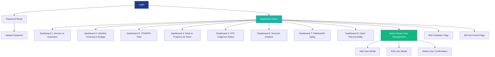
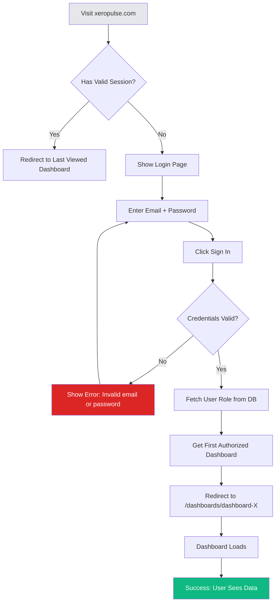
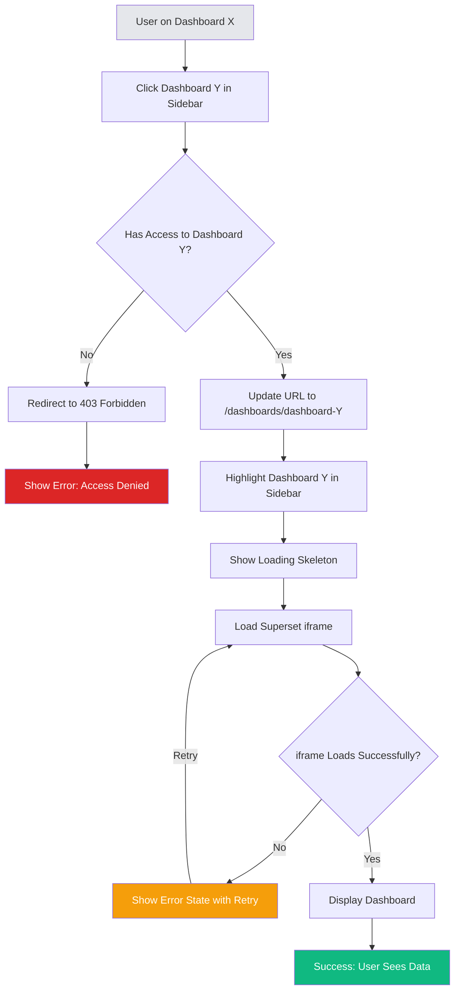
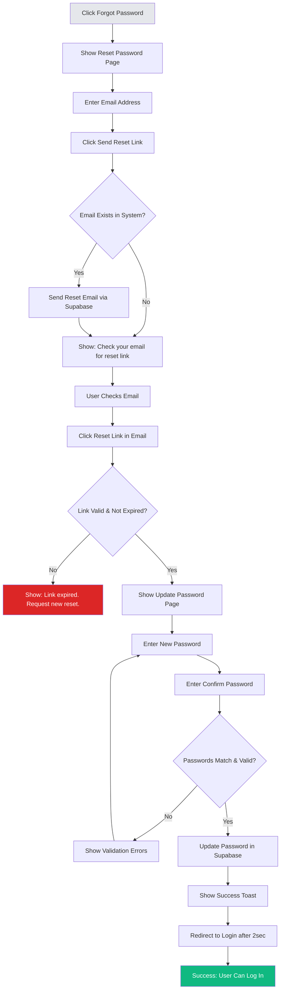
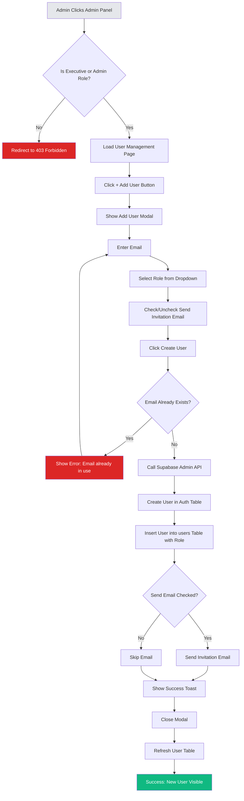

# XeroPulse UI/UX Specification

**Version:** 1.0
**Date:** October 15, 2025
**Status:** Ready for Development

---

## Introduction

This document defines the user experience goals, information architecture, user flows, and visual design specifications for XeroPulse's user interface. It serves as the foundation for visual design and frontend development, ensuring a cohesive and user-centered experience.

XeroPulse is a professional financial intelligence platform that delivers automated dashboards for professional services firms using Xero accounting software. This specification covers the **web portal container** that houses embedded Apache Superset dashboards with secure authentication, role-based access control, and professional financial software aesthetics.

### Document Scope

This specification covers:
- ✅ Platform UI/UX (authentication, navigation, layout, user management)
- ✅ User flows for platform interactions
- ✅ Component library for the portal shell
- ✅ Branding and visual design system
- ✅ Accessibility and responsive design requirements

This specification explicitly **does not** cover:
- ❌ Dashboard visualizations (handled by embedded Apache Superset)
- ❌ ETL workflows (handled by n8n)
- ❌ Backend API design (handled by architecture specification)

---

## Overall UX Goals & Principles

### Target User Personas

**1. Executive User (C-Suite, Partners)**
- **Demographics:** 45-65 years old, senior leadership in professional services firms
- **Technical Proficiency:** Moderate (comfortable with standard business software)
- **Goals:** Quick access to high-level financial insights, strategic decision-making data
- **Pain Points:** Too much data noise, slow report generation, lack of mobile access
- **Dashboard Access:** All 8 dashboards
- **Key Behaviors:** Checks dashboards 2-3x per week, primarily on desktop during business hours

**2. Manager User (Finance Managers, Practice Managers)**
- **Demographics:** 30-50 years old, mid-level management
- **Technical Proficiency:** High (uses multiple business tools daily)
- **Goals:** Monitor team performance, track operational metrics, identify bottlenecks
- **Pain Points:** Manual data aggregation, outdated reports, difficulty tracking WIP
- **Dashboard Access:** 6 dashboards (subset focused on operations)
- **Key Behaviors:** Daily dashboard usage, frequently toggles between dashboards

**3. Staff User (Accounting Staff, Bookkeepers)**
- **Demographics:** 22-45 years old, operational roles
- **Technical Proficiency:** Moderate to high (daily Xero users)
- **Goals:** Track AR aging, manage collections, ensure timely invoicing
- **Pain Points:** Chasing down data in Xero, lack of consolidated views
- **Dashboard Access:** 1 dashboard (AR Aging only)
- **Key Behaviors:** Checks dashboard daily during collection periods

**4. Administrator (IT Manager, System Admin)**
- **Demographics:** 25-50 years old, technical staff
- **Technical Proficiency:** Very high
- **Goals:** User provisioning, access control management, system monitoring
- **Pain Points:** Manual user onboarding, lack of audit logs
- **Special Access:** Admin panel for user management
- **Key Behaviors:** Periodic user management tasks, onboarding cycles

### Usability Goals

1. **Immediate Value Delivery:** Users see their first authorized dashboard within 3 seconds of login (no empty state or "select a dashboard" friction)

2. **Zero-Click Insights:** Post-login, users land directly on a dashboard without additional navigation required

3. **Role-Aware Personalization:** Users never see dashboards they can't access, reducing cognitive load and confusion

4. **Sub-60-Second Insight Access:** Any user can answer a financial question within 60 seconds of accessing the portal (measured from login to finding answer)

5. **Error Prevention:** Destructive actions (user deletion) require explicit confirmation; form validation is real-time with clear error messages

6. **Memorability:** Infrequent users (login once per month) can navigate without relearning the interface

### Design Principles

1. **Clarity Over Cleverness**
   Prioritize clear communication and familiar patterns over aesthetic innovation. Financial data requires trust—users should never feel uncertain about what they're seeing.

2. **Data-First, Chrome-Minimal**
   The dashboard content is the star. Portal UI elements (header, sidebar) should recede into the background, letting financial insights take center stage.

3. **Progressive Disclosure**
   Show only what's needed, when it's needed. Executives see 8 dashboards, staff see 1. Admin features are hidden behind role gates.

4. **Performance Transparency**
   Users always know data freshness. "Last updated" timestamps build trust around the 2-hour sync interval. Loading states manage expectations.

5. **Professional Trust**
   Visual design conveys authority and reliability. This is financial data—the aesthetic must inspire confidence, not playfulness.

### Change Log

| Date | Version | Description | Author |
|------|---------|-------------|--------|
| 2025-10-15 | 1.0 | Initial UI/UX specification created from PRD analysis | UX Expert (Sally) |

---

## Information Architecture (IA)

### Site Map / Screen Inventory



**Screen Count:**
- **Authentication:** 3 screens (Login, Reset Password, Update Password)
- **Main Application:** 1 layout shell (Header + Sidebar + Content)
- **Dashboards:** 8 dashboard pages (dynamic route)
- **Admin:** 1 user management page + 3 modals
- **Error States:** 2 pages (404, 403)

**Total:** ~18 unique screens/components

### Navigation Structure

**Primary Navigation:** Vertical sidebar listing authorized dashboards
- Location: Left side, 256px width, white background
- Behavior: Always visible on desktop (≥1024px), collapsible on mobile (<1024px)
- Content: Role-filtered dashboard list with icons, active state highlighting
- Grouping: No sub-menus or categories (flat structure with 8 items)

**Secondary Navigation:** User menu dropdown (header right)
- Trigger: User email + chevron icon
- Items: Admin Panel (role-gated), Logout
- Behavior: Click to open, click outside to close

**Breadcrumb Strategy:** Not used
- Rationale: Flat navigation structure (only 2 levels: home → dashboard) doesn't warrant breadcrumbs
- Users can always see sidebar context

**Mobile Navigation:** Hamburger menu (mobile only)
- Location: Header left on <1024px screens
- Behavior: Slides sidebar in from left with overlay backdrop
- Closes: On dashboard selection or clicking outside

---

## User Flows

### Flow 1: User Login

**User Goal:** Authenticate and access authorized dashboards

**Entry Points:**
- Direct URL: `xeropulse.com` (redirects to `/login`)
- Expired session redirect from protected route

**Success Criteria:**
- Valid credentials → Redirect to first authorized dashboard within 3 seconds
- Dashboard loads with data visible (no extended waiting)

#### Flow Diagram



#### Edge Cases & Error Handling

- **Account Locked:** After 5 failed login attempts, show "Account locked for 15 minutes. Contact support if you need immediate access."
- **Network Failure:** Show "Unable to connect. Please check your internet connection." with Retry button
- **Session Expired:** Redirect to login with message "Your session has expired. Please log in again."
- **Slow Database Query:** Show loading state (spinner) for up to 10 seconds, then timeout error
- **No Authorized Dashboards:** Show "Your account has no dashboard access. Contact your administrator." (edge case: misconfigured role)

**Notes:** Login page should show "Forgot Password?" link for password reset flow. Auto-focus email field on page load for keyboard accessibility.

---

### Flow 2: Dashboard Navigation

**User Goal:** Switch between authorized dashboards to find specific insights

**Entry Points:**
- Click dashboard name in sidebar
- Direct URL navigation (`/dashboards/dashboard-2`)

**Success Criteria:**
- Dashboard switches within 1 second (portal shell, not iframe content)
- Active dashboard visually highlighted in sidebar
- Previous dashboard unloaded from memory (if applicable)

#### Flow Diagram



#### Edge Cases & Error Handling

- **Unauthorized Access:** User manually types dashboard URL they don't have access to → Redirect to `/forbidden` page
- **iframe Load Failure:** Superset server down or network error → Show error state with "Retry" button
- **Slow iframe Load:** Show loading skeleton for up to 10 seconds, then show "Taking longer than usual. Please wait or try refreshing."
- **Mobile Sidebar:** On mobile, sidebar auto-closes after dashboard selection

**Notes:** Sidebar active state must update immediately (< 100ms) to provide instant feedback. Dashboard name displayed in page title for browser tab context.

---

### Flow 3: Password Reset

**User Goal:** Regain account access after forgetting password

**Entry Points:**
- "Forgot Password?" link on login page

**Success Criteria:**
- Reset email sent within 30 seconds
- New password meets requirements (10+ chars, uppercase, lowercase, number, special char)
- Successful reset redirects to login with confirmation

#### Flow Diagram



#### Edge Cases & Error Handling

- **Email Not Found:** Still show "Check your email" to prevent account enumeration attacks
- **Expired Link:** Show "This link has expired. Please request a new password reset."
- **Password Requirements Not Met:** Show real-time validation with red X / green checkmark next to each requirement
- **Network Failure During Update:** Show "Unable to update password. Please try again." with Retry button
- **Rate Limiting:** After 3 reset requests in 10 minutes, show "Too many requests. Please wait 10 minutes and try again."

**Notes:** Reset link expires in 1 hour (Supabase default). Password requirements displayed prominently before user starts typing.

---

### Flow 4: User Management (Admin)

**User Goal:** Add new users to the system with appropriate role assignment

**Entry Points:**
- Header dropdown → Admin Panel (only visible to executives/admins)
- Direct URL: `/admin/users` (redirects to 403 if unauthorized)

**Success Criteria:**
- New user created in <5 seconds
- Invitation email sent (if checkbox selected)
- User appears in table immediately after creation

#### Flow Diagram



#### Edge Cases & Error Handling

- **Duplicate Email:** Show "A user with this email already exists."
- **Network Failure:** Show "Unable to create user. Please try again." with Retry option
- **Email Delivery Failure:** User created successfully but email fails → Show warning "User created but invitation email failed to send. You may need to manually provide login credentials."
- **Invalid Email Format:** Real-time validation prevents submission until valid format entered
- **Permission Denied:** Non-admin tries to access `/admin/users` → 403 page

**Notes:** Temporary password auto-generated by Supabase (users must reset on first login). Admin can see list of all users with last login timestamp to identify inactive accounts.

---

## Wireframes & Mockups

**Primary Design Files:** UI mockups will be created in Figma (link TBD)

For MVP, the following low-fidelity layouts define key screen structures:

### Key Screen Layouts

#### 1. Login Page

**Purpose:** Authenticate users to access the platform

**Key Elements:**
- Centered card (max-width: 400px) on off-white background (#F8FAFC)
- XeroPulse logo + icon at top of card
- Email input field (autofocus)
- Password input field (show/hide toggle optional for Phase 2)
- "Forgot Password?" link (right-aligned, small text)
- "Sign In" button (full width, primary blue, prominent)
- Error message area (below button, red text, only visible when error exists)

**Interaction Notes:**
- Enter key submits form from any input field
- Loading state: Button shows spinner + "Signing in..." text
- Error state: Inline message below button, red background (#FEE2E2)

**Wireframe:**
```
┌─────────────────────────────────────┐
│                                     │
│          🔵 XeroPulse              │
│                                     │
│      Welcome Back                   │
│   Sign in to your account          │
│                                     │
│   ┌─────────────────────────┐      │
│   │ Email                   │      │
│   └─────────────────────────┘      │
│                                     │
│   ┌─────────────────────────┐      │
│   │ Password                │      │
│   └─────────────────────────┘      │
│                                     │
│               Forgot Password? ───→ │
│                                     │
│   ┌─────────────────────────┐      │
│   │      Sign In            │      │
│   └─────────────────────────┘      │
│                                     │
└─────────────────────────────────────┘
```

**Design File Reference:** `figma.com/xeropulse/login-screen` (placeholder)

---

#### 2. Dashboard Layout (Main Application Shell)

**Purpose:** Container for all dashboard views with navigation

**Key Elements:**
- Fixed header (64px height, primary blue #1E3A8A)
  - Logo + icon (left)
  - User menu dropdown (right)
- Fixed sidebar (256px width, white background)
  - Dashboard list (role-filtered)
  - Active state: blue background (#EFF6FF), left border (#1E3A8A 4px)
- Main content area (flex-1, padding 24px, off-white background #F8FAFC)
  - Dashboard title (text-2xl, font-semibold)
  - "Last updated" timestamp (text-sm, gray)
  - Dashboard iframe container (white, rounded, border)

**Interaction Notes:**
- Sidebar items highlight on hover (gray background)
- Active dashboard has persistent blue highlight
- Mobile: Hamburger menu replaces visible sidebar

**Wireframe:**
```
┌────────────────────────────────────────────────────┐
│ 🔵 XeroPulse              user@email.com ▼       │ Header
├──────────┬─────────────────────────────────────────┤
│          │ Dashboard Name             Last updated │
│ Nav Item │                                         │
│ Nav Item │ ┌───────────────────────────────────┐  │
│ Nav Item │ │                                   │  │
│ Nav Item │ │                                   │  │
│▶Active   │ │     [Superset Dashboard iframe]  │  │
│ Nav Item │ │                                   │  │
│ Nav Item │ │                                   │  │
│          │ └───────────────────────────────────┘  │
└──────────┴─────────────────────────────────────────┘
```

**Design File Reference:** `figma.com/xeropulse/main-layout` (placeholder)

---

#### 3. User Management Page

**Purpose:** Admin interface for CRUD operations on users

**Key Elements:**
- Page title "User Management" (left)
- "+ Add User" button (right, primary blue)
- Search input (left, placeholder: "Search users...")
- Role filter dropdown (right of search)
- Users table with columns: Email, Role, Last Login, Created, Actions
- Role badges (color-coded: Executive=blue, Manager=green, Staff=gray)
- Edit/Delete action buttons per row

**Interaction Notes:**
- Search filters table in real-time as user types
- Role filter dropdown updates table instantly
- Edit button opens modal with pre-filled data
- Delete button opens confirmation dialog
- Table shows "Showing X of Y users" footer

**Wireframe:**
```
┌──────────────────────────────────────────────────┐
│ User Management            [+ Add User]          │
├──────────────────────────────────────────────────┤
│ [🔍 Search...]  [Role Filter ▼]                  │
├──────────────────────────────────────────────────┤
│ EMAIL          ROLE       LAST LOGIN    ACTIONS  │
│ ────────────────────────────────────────────────│
│ john@co.com    [Exec]     Oct 15, 2pm   [✏️][🗑️]│
│ jane@co.com    [Mgr]      Oct 14, 10am  [✏️][🗑️]│
│ bob@co.com     [Staff]    Never         [✏️][🗑️]│
│                                                  │
│ Showing 3 of 20 users                            │
└──────────────────────────────────────────────────┘
```

**Design File Reference:** `figma.com/xeropulse/admin-panel` (placeholder)

---

## Component Library / Design System

**Design System Approach:** Custom component library built with shadcn/ui (headless, accessible components styled with Tailwind CSS)

**Rationale:**
- Avoids external dependencies (UI library lock-in)
- Tailwind CSS for rapid iteration and consistency
- shadcn/ui provides WCAG AA accessible foundations
- Components are copy-pasteable and fully customizable

### Core Components

#### 1. Button

**Purpose:** Primary interaction element for actions

**Variants:**
- `default`: Primary blue background (#1E3A8A), white text
- `outline`: White background, blue border, blue text
- `destructive`: Red background (#DC2626), white text
- `ghost`: Transparent, gray text, hover shows gray background
- `link`: Text only, underline on hover

**States:**
- Default: Base styling
- Hover: Darker background (hover:bg-blue-800)
- Focus: Blue ring (ring-2 ring-primary ring-offset-2)
- Active: Pressed appearance (active:scale-95)
- Disabled: Reduced opacity (opacity-50), no pointer events
- Loading: Spinner icon + "Loading..." text

**Usage Guidelines:**
- Use `default` for primary actions (Sign In, Save, Create)
- Use `outline` for secondary actions (Cancel)
- Use `destructive` for dangerous actions (Delete User)
- Minimum width: 88px for text buttons, 44x44px for icon buttons (WCAG touch target)

---

#### 2. Input

**Purpose:** Text entry fields for forms

**Variants:**
- Text input (type="text")
- Email input (type="email", validation)
- Password input (type="password", show/hide toggle optional)
- Search input (with magnifying glass icon)

**States:**
- Default: Gray border (border-gray-300)
- Focus: Blue border (border-primary), blue ring
- Error: Red border (border-red-500), red ring
- Disabled: Gray background (bg-gray-100), no interaction

**Usage Guidelines:**
- Always pair with `<Label>` for accessibility
- Show error message below input (red text, text-sm)
- Use placeholder text for examples, not instructions
- Real-time validation for email format, password strength

---

#### 3. Dropdown Menu

**Purpose:** Context menus and action lists

**Variants:**
- User menu (header)
- Table row actions (Edit/Delete)
- Filter dropdowns (Role filter)

**States:**
- Closed: Trigger button visible
- Open: Menu overlay appears (shadow-lg, z-50)
- Hover: Item background changes (bg-gray-100)
- Focus: Keyboard navigation highlights item

**Usage Guidelines:**
- Trigger must have clear visual affordance (chevron icon, "..." icon)
- Menu aligns to trigger (left, right, center)
- Clicking outside closes menu
- Escape key closes menu

---

#### 4. Modal / Dialog

**Purpose:** Focused tasks requiring user input (Add User, Edit User)

**Variants:**
- Standard modal (white background, centered, max-width: 500px)
- Alert dialog (confirmation for destructive actions)

**States:**
- Closed: Not rendered
- Open: Overlay backdrop (bg-black/50), modal animates in
- Loading: Buttons show spinner, form disabled

**Usage Guidelines:**
- Always include Close button (X icon, top-right)
- Escape key closes modal
- Click outside closes modal (unless form has unsaved changes)
- Focus traps inside modal (keyboard navigation cycles within modal)

---

#### 5. Table

**Purpose:** Display structured data (User Management)

**Variants:**
- Standard table with striped rows (optional)
- Table with actions column (Edit/Delete buttons)

**States:**
- Default: White background, gray borders
- Hover: Row background changes (bg-gray-50)

**Usage Guidelines:**
- Use for 5+ data items; cards for <5 items on mobile
- Column headers: Bold, uppercase, small text (text-xs)
- Actions column: Right-aligned
- Empty state: "No data found" message when table is empty

---

#### 6. Badge

**Purpose:** Display status or role labels

**Variants:**
- Executive: Blue background (#1E3A8A), white text
- Manager: Green background (#10B981), white text
- Staff: Gray background (#6B7280), white text
- Success: Green background (#10B981)
- Error: Red background (#DC2626)

**States:**
- Static (no interactive states)

**Usage Guidelines:**
- Use for role indicators in user tables
- Use for status indicators (Active/Inactive)
- Keep text short (1-2 words)

---

#### 7. Toast Notification

**Purpose:** Feedback for user actions (success/error messages)

**Variants:**
- Success toast: Green background, checkmark icon
- Error toast: Red background, X icon
- Info toast: Blue background, info icon

**States:**
- Appear: Slides in from top-right
- Display: Visible for 5 seconds (configurable)
- Dismiss: Fades out, or user clicks X to dismiss immediately

**Usage Guidelines:**
- Use for non-blocking feedback (User created successfully, Error saving changes)
- Auto-dismiss after 5 seconds
- Allow manual dismiss with X button
- Stack multiple toasts if multiple actions occur

---

## Branding & Style Guide

**Brand Guidelines:** XeroPulse brand identity is being developed alongside this specification. Core elements defined below.

### Color Palette

| Color Type | Hex Code | Usage |
|------------|----------|-------|
| Primary | #1E3A8A | Headers, primary buttons, active nav states, links |
| Secondary | #64748B | Body text, borders, inactive states |
| Accent | #14B8A6 | Success states, positive metrics, highlights |
| Success | #10B981 | Positive feedback, confirmations, success toasts |
| Warning | #F59E0B | Cautions, important notices, warnings |
| Error | #DC2626 | Errors, destructive actions, error toasts |
| Neutral | #F8FAFC (bg), #E5E7EB (borders), #111827 (text) | Text, borders, backgrounds, layout structure |

**Accessibility Check:**
- Primary (#1E3A8A) on white: 10.5:1 contrast ✅
- Secondary (#64748B) on white: 5.8:1 contrast ✅
- All colors meet WCAG AA requirements (4.5:1 for text, 3:1 for UI)

### Typography

#### Font Families
- **Primary:** Inter (Google Fonts) - Headings, UI elements, buttons
- **Secondary:** System font stack (-apple-system, BlinkMacSystemFont, "Segoe UI", Roboto, Oxygen, Ubuntu, Cantarell, sans-serif) - Body text for performance
- **Monospace:** JetBrains Mono - Code snippets, technical displays (if needed)

#### Type Scale

| Element | Size | Weight | Line Height | Tailwind Class |
|---------|------|--------|-------------|----------------|
| H1 | 30px (1.875rem) | 600 (Semibold) | 1.2 | text-3xl font-semibold |
| H2 | 24px (1.5rem) | 600 (Semibold) | 1.3 | text-2xl font-semibold |
| H3 | 20px (1.25rem) | 600 (Semibold) | 1.4 | text-xl font-semibold |
| Body | 14px (0.875rem) | 400 (Regular) | 1.5 | text-sm |
| Small | 12px (0.75rem) | 400 (Regular) | 1.5 | text-xs |
| Button | 14px (0.875rem) | 500 (Medium) | 1 | text-sm font-medium |

**Notes:**
- Use rem units for accessibility (users can adjust browser font size)
- Inter font loaded from Google Fonts CDN for headings; system fonts for body text (performance)

### Iconography

**Icon Library:** lucide-react (MIT licensed, tree-shakeable, consistent 24x24px stroke-based icons)

**Usage Guidelines:**
- Default size: 20px (w-5 h-5) for UI elements
- Large size: 24px (w-6 h-6) for header/logo
- Icon-only buttons: 20px icon inside 44x44px touch target
- Icon + text buttons: 16px icon (w-4 h-4) + text
- Decorative icons: `aria-hidden="true"` (screen readers ignore)

**Common Icons:**
- Activity (pulse icon) - Logo
- Menu - Hamburger menu
- X - Close buttons
- ChevronDown - Dropdown indicators
- User - User avatar
- Settings - Admin settings
- LogOut - Logout action
- Search - Search inputs
- Loader2 - Loading spinner

### Spacing & Layout

**Grid System:** 12-column grid for desktop layouts (using Tailwind CSS grid utilities)

**Spacing Scale:** Tailwind default (4px increments)
- `space-1` = 4px
- `space-2` = 8px
- `space-3` = 12px
- `space-4` = 16px (most common spacing)
- `space-6` = 24px (section spacing)
- `space-8` = 32px (large gaps)

**Layout Constraints:**
- Max content width: 1440px (centered, responsive)
- Sidebar width: 256px (fixed)
- Header height: 64px (fixed)
- Container padding: 24px (p-6)

---

## Accessibility Requirements

### Compliance Target

**Standard:** WCAG 2.1 Level AA compliance

**Rationale:** Professional services firms may have diverse user needs (aging executives, staff with disabilities). AA compliance ensures accessibility without the implementation burden of AAA (which requires 7:1 contrast, sign language videos, etc.).

**Assumption:** Superset dashboards inherit accessibility from Superset's default rendering; custom accessibility work limited to Next.js portal UI.

### Key Requirements

**Visual:**
- Color contrast ratios: 4.5:1 minimum for text, 3:1 for UI components (verified via browser DevTools)
- Focus indicators: 2px blue ring (ring-2 ring-primary ring-offset-2) on all interactive elements
- Text sizing: Users can zoom to 200% without breaking layouts (use rem units, test responsive)

**Interaction:**
- Keyboard navigation: Tab order is logical (header → sidebar → content), all interactive elements focusable, no keyboard traps
- Screen reader support: ARIA labels for icon-only buttons, `role="alert"` for error messages, landmark elements (nav, main, header)
- Touch targets: Minimum 44x44px for all tappable elements (WCAG 2.5.5, Apple HIG)

**Content:**
- Alternative text: All images have descriptive alt text (e.g., `alt="XeroPulse logo"`)
- Heading structure: Logical hierarchy (H1 → H2 → H3), no skipping levels
- Form labels: Every input has associated `<label>` or `aria-label`, required fields indicated

### Testing Strategy

**Manual Testing:**
- Keyboard-only navigation test (disconnect mouse, navigate with Tab/Enter/Escape)
- Screen reader test (NVDA on Windows, VoiceOver on Mac)
- Color contrast check (browser DevTools color picker)
- Zoom test (browser zoom to 200%, check for horizontal scroll or broken layouts)

**Automated Testing:**
- Lighthouse accessibility audit (target score: 90+)
- axe DevTools browser extension (fix all critical and serious issues)

**User Testing:**
- UAT with 1+ users who rely on assistive technology (screen reader, keyboard-only) during Week 4

---

## Responsiveness Strategy

### Breakpoints

| Breakpoint | Min Width | Max Width | Target Devices |
|------------|-----------|-----------|----------------|
| Mobile | 0px | 767px | iPhone SE (375px), iPhone 14 (390px), Android phones (360px+) |
| Tablet | 768px | 1023px | iPad (768px), Android tablets (800px+), iPad Pro (1024px portrait) |
| Desktop | 1024px | 1279px | Laptops, small desktops (1366x768, 1440x900) |
| Wide | 1280px | - | Large desktops (1920x1080+), external monitors |

**Primary Optimization:** Desktop (1920px) - most users work on desktop during business hours

**Secondary Optimization:** Tablet (1024px) - executives checking dashboards on iPad

**Degraded Experience:** Mobile (<768px) - basic rendering without layout breaks, but suboptimal (small charts, horizontal scrolling possible for complex dashboards)

### Adaptation Patterns

**Layout Changes:**
- Desktop (≥1024px): Sidebar (256px) + main content (flex-1), multi-column dashboard layouts
- Tablet (768-1023px): Collapsible sidebar (overlay on content), single-column layouts
- Mobile (<768px): Hidden sidebar (hamburger menu), single-column stacked layouts, reduced padding (p-4 instead of p-6)

**Navigation Changes:**
- Desktop: Sidebar always visible
- Tablet/Mobile: Sidebar hidden by default, slides in from left when hamburger clicked, overlay backdrop (bg-black/50)

**Content Priority:**
- Desktop: Dashboard title (text-2xl) + timestamp visible
- Mobile: Dashboard title (text-xl), timestamp hidden on very small screens (<640px)

**Interaction Changes:**
- Desktop: Hover states for navigation items, buttons
- Mobile: Active states (press highlights) instead of hover, tap targets minimum 44x44px

---

## Animation & Micro-interactions

### Motion Principles

**Purpose:** Animations should provide feedback and guide attention, not decorate.

1. **Purposeful Motion:** Every animation serves a functional purpose (loading indication, state transition, attention guidance)

2. **Performance First:** Animations use CSS transforms (translate, scale, opacity) for GPU acceleration—avoid animating layout properties

3. **Respectful of User Preferences:** Respect `prefers-reduced-motion` media query (disable animations for users with motion sensitivity)

4. **Subtle and Professional:** Financial software should feel calm and trustworthy—no bouncing, spinning, or playful animations

### Key Animations

- **Sidebar Slide-In (Mobile):** Sidebar translates from left (-100%) to visible (0%) over 300ms with ease-in-out easing
- **Button Press:** Scale down to 95% (active:scale-95) over 100ms for tactile feedback
- **Modal Fade-In:** Backdrop fades in (opacity 0 → 0.5) and modal scales up (scale-95 → scale-100) over 200ms
- **Toast Notification:** Slides in from top-right over 300ms, holds for 5 seconds, fades out over 200ms
- **Loading Spinner:** Continuous rotate animation (animate-spin) using Tailwind utility
- **Skeleton Loader:** Shimmer effect (gradient animation left to right) over 1500ms infinite loop

---

## Performance Considerations

### Performance Goals

- **Page Load:** Portal shell (header + sidebar + empty content) loads in <500ms time-to-interactive (excluding dashboard iframe)
- **Interaction Response:** Button clicks, sidebar navigation respond within 100ms (perceived as instant)
- **Animation FPS:** All animations maintain 60 FPS (16.67ms per frame)

### Design Strategies

**1. Progressive Loading:**
- Load portal shell first (header, sidebar, auth)
- Lazy-load dashboard iframes (only load when navigated to)
- Use skeleton loaders to show immediate feedback while content loads

**2. Minimize JavaScript Bundle:**
- Code-split admin panel (only load when admin accesses)
- Tree-shake unused icons from lucide-react (import only used icons)
- Dynamic imports for modals (load when opened)

**3. Optimize Fonts:**
- System fonts for body text (zero load time)
- Inter font for headings only (load via Google Fonts with `display=swap`)

**4. Preconnect to External Resources:**
- Add `<link rel="preconnect" href="SUPERSET_URL">` in `<head>` to speed up iframe connections

**5. Image Optimization:**
- Use SVG for logo/icons (scalable, small file size)
- No raster images in portal UI (dashboards handled by Superset)

---

## Next Steps

### Immediate Actions

1. **Review with Stakeholders:** Present this UI/UX specification to project stakeholders for feedback and approval (estimated: 1-hour review meeting)

2. **Create High-Fidelity Mockups:** Design visual mockups in Figma for key screens (Login, Dashboard Layout, Admin Panel) incorporating branding and color palette (estimated: 2-3 days)

3. **Validate with Users:** Conduct brief user interviews (1-2 finance team members) to validate pain points and design assumptions (estimated: 2-3 hours)

4. **Handoff to Frontend Development:** Provide this specification, AI prompts, and Figma files to frontend developer or AI UI generation tool (v0.dev, Lovable.ai)

5. **Define Supabase Database Schema:** Work with architect to finalize `users` table schema (id, email, role, created_at, last_login) and Row-Level Security (RLS) policies

### Design Handoff Checklist

- ✅ All user flows documented (Login, Dashboard Navigation, Password Reset, User Management)
- ✅ Component inventory complete (Button, Input, Modal, Table, Badge, Toast, Dropdown)
- ✅ Accessibility requirements defined (WCAG AA, keyboard navigation, screen reader support)
- ✅ Responsive strategy clear (Mobile <768px, Tablet 768-1023px, Desktop ≥1024px)
- ✅ Brand guidelines incorporated (Color palette, typography, iconography)
- ✅ Performance goals established (<500ms shell load, <3s dashboard load, 60 FPS animations)

---

## Additional Resources

**Related Documents:**
- **Product Requirements Document (PRD):** `docs/prd.md` - Functional requirements, user stories, technical constraints
- **AI Prompts:**
  - **Master Platform Prompt:** `docs/ai-prompts/platform-ui-master-prompt.md` - Comprehensive prompt for full platform UI
  - **Authentication System:** `docs/ai-prompts/01-authentication-system.md` - Login, password reset
  - **Dashboard Shell:** `docs/ai-prompts/02-dashboard-shell-navigation.md` - Header, sidebar, layout
  - **Admin Panel:** `docs/ai-prompts/03-user-management-admin.md` - User CRUD operations
  - **Responsive & Accessibility:** `docs/ai-prompts/04-responsive-accessibility.md` - Mobile optimization, WCAG compliance

**External Links:**
- **Superset Documentation:** https://superset.apache.org/docs/using-superset/exploring-data/ - Understanding dashboard embedding
- **shadcn/ui Components:** https://ui.shadcn.com/ - Component library reference
- **Tailwind CSS Docs:** https://tailwindcss.com/docs - Utility class reference
- **WCAG 2.1 Guidelines:** https://www.w3.org/WAI/WCAG21/quickref/ - Accessibility reference

---

**Document Status:** ✅ READY FOR DEVELOPMENT

This specification provides comprehensive guidance for frontend implementation. Proceed with high-fidelity mockups and development using the provided AI prompts and component definitions.
